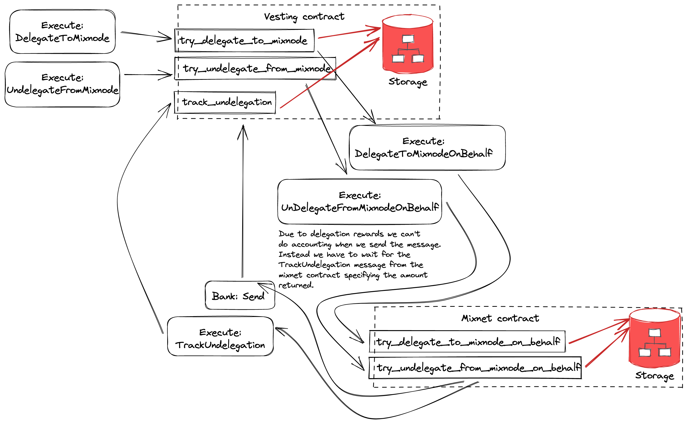

## Nym vesting contract

1. Initial vesting tokens are deposited and assigned to existing addresses via `CreatePeriodicVestingAccount`
2. Admin account can then delegate vested and unvested tokens to mixnodes on behalf of vesting accounts
3. Vesting accounts can withdraw vested and undelegated (spendable) coins to their addresses

### Glossary

| Term                    | Definition                                                                                    |
| ----------------------- | --------------------------------------------------------------------------------------------- |
| original vesting coins  | vesting amount specified at account creation                                                  |
| vested coins            | coins vested up to the current vesting period, current period excluded                        |
| vesting coins           | *original vesting* amount minus *vested coins*, claimed rewards are not part of vesting coins |
| delegated free coins    | delegated coins that have vested                                                              |
| delegated vesting coins | total delegation amount minus *delegated free* coins                                          |
| pledged free coins      | pledged coins that have vested                                                                |
| pledged vesting coins   | total pledge amount minus *pledged free* coins                                                |
| locked coins            | *vesting coins* minus *delegated vesting* and *pledged vesting* coins                         |
| spendable coins         | current vesting account balance minus *locked coins*                                          |

### Vesting coin delegation flow

