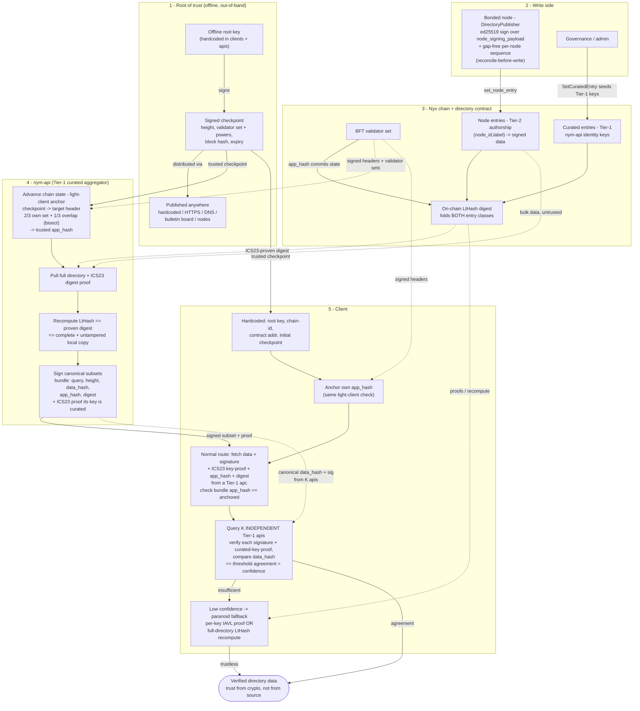

# The Verifiable Directory

A trust-minimised directory of node data (sphinx keys, addresses, wireguard/LP details, descriptions, ...). Any client can fetch the directory from anyone - a random gateway, a CDN, a hostile relay - and still end up with a copy it can prove is **complete and untampered**, because trust comes from cryptography rather than from whom it asked. This document describes the trust model and the end-to-end flow, and maps each stage to the code that implements it.

## Trust model

### Core principle

Every header, validator set, proof, and blob is fetched from an **untrusted** source and verified cryptographically. The only trust inputs baked into a client are a hardcoded root key and the BFT validator set it anchors. "Contact anyone" is always safe because responses are verified, not trusted.

### Two signer tiers (Sybil resistance)

- **Tier 1 - curated nym-apis:** governance must explicitly add them, so they are scarce and Sybil-resistant. They are the only valid cross-check / confidence voters.
- **Tier 2 - bonded nodes:** permissionless, so Sybil-prone. A node is authoritative **only for its own entry** (authorship), never a trusted voucher for anyone else's data.
- A client learns the tier for free: an ICS23-proven curated entry is Tier 1; a key derived from a bond is Tier 2. Cross-check quorums must be Tier-1 from independent operators; Tier-2 may serve bytes (verified anyway) but never counts as a confidence vote.

### Root of trust and the checkpoint

The chain itself (via a fresh checkpoint) is the actual root. The hardcoded root key's job is to authenticate **refreshed** checkpoints out-of-band (weak-subjectivity refresh) and to be a second authority independent of on-chain governance. A checkpoint is a root-signed `{ height, validator-set (keys + voting powers), block hash, expiry }`. It is self-authenticating (trust is the root signature, not the channel), so it can be published anywhere: hardcoded, an HTTPS URL, DNS, a contract bulletin board, network nodes, and so on. Checkpoints go stale past the trust/unbonding period and must be refreshed - that staleness is the entire reason the root key exists.

### Light-client anchoring

Given a trusted checkpoint within its expiry, to trust a target header and read its `app_hash` a party fetches the target signed header + its validator set from anyone (untrusted) and accepts it iff:

- (a) more than 2/3 of the **target** header's own validator set signed its commit, and `hash(set) == header.validators_hash`;
- (b) more than 1/3 of the **trusted** set's voting power is among those signers (continuity, so at least one honest voucher);
- if (b) fails over a large gap, **bisect** through intermediate headers.

Off-by-one: state as-of-height H lives in `header[H+1].app_hash`. Anchoring the `app_hash` is cheap (a couple of signature checks). Both retrieval routes anchor the same way; they differ only in how they verify the data.

### On-chain digest (LtHash)

The directory contract folds every entry into a single on-chain **LtHash** digest, over two key classes:

- **node entries** `(node_id, label) -> data`, write-auth = the bond identity key + a gap-free per-node sequence (Tier-2 authorship);
- **curated entries** = nym-api / well-known identity keys, write-auth = contract admin (Tier-1), so aggregator signers are ICS23-authenticatable.

Everything verifiable sits at known raw storage keys, plus a paginated enumeration query for the paranoid whole-directory pull. There is deliberately **no merkle tree**: its job (binding a subset to a snapshot) is covered by the canonical `data_hash` cross-check (confidence) plus per-key IAVL proofs (trustless).

### Retrieval routes

- **Paranoid route:** retrieve the entire directory at height H from anywhere, query the digest with its ICS23 proof (iavl -> wasm store -> multistore -> `app_hash`), recompute the LtHash over the retrieved set, and require it to equal the proven digest. Bulk data is untrusted; only the digest is proven, and the recompute proves completeness + integrity.
- **Normal route:** contact a Tier-1 aggregator for the desired subset + its signature + an ICS23 proof that its key is curated + the `app_hash`/digest, and check the bundle's `app_hash` equals the client's own anchored one. Then contact up to K **independent** Tier-1 aggregators for their canonical `data_hash` + signature and compare. Agreement is confidence, scaling with K and independence. Insufficient confidence falls back to the paranoid route (or per-key IAVL proofs for a small subset).

## End-to-end flow

Legend: **solid arrows** are a trusted write or a hardcoded trust input; **dotted arrows** are data fetched from an untrusted source and verified cryptographically after the fact.

## How to read it

1. **Bootstrap.** The offline root key signs a self-authenticating checkpoint (a validator set at a height, with an expiry) and it is published anywhere. Clients and nym-apis also hardcode the root key and an initial checkpoint.
2. **Write side.** Each bonded node's `DirectoryPublisher` signs its entries (Tier-2 authorship) and writes them with a gap-free sequence, only when they actually change (reconcile-before-write). Governance seeds the curated Tier-1 nym-api keys.
3. **Chain + contract.** Both entry classes are folded into a single on-chain LtHash digest; the validator set's `app_hash` commits that state.
4. **nym-api (aggregator).** Uses the checkpoint to light-client-anchor a trusted `app_hash`, pulls the whole directory plus an ICS23 proof of the digest, recomputes the LtHash to confirm its local copy is complete and untampered, then signs canonical subsets and serves them with an ICS23 proof that its own key is a curated entry.
5. **Client.** Anchors its own `app_hash` the same way, takes a signed subset from one Tier-1 api and checks its `app_hash` matches, then cross-checks K **independent** Tier-1 apis' `data_hash` + signatures for threshold confidence. If confidence is insufficient it falls back to the fully trustless paranoid route (per-key IAVL proofs, or a full-digest recompute it performs itself).

The two routes converge on the same guarantee: **verified directory data whose trust comes from cryptography, never from the source that served it.**

## Implementation map

| Stage | Code | OpenSpec capability |
|---|---|---|
| Root key + checkpoint bootstrap | `common/nym-directory-client/src/anchor/checkpoint/`; tool `tools/internal/nyx-checkpoint-updater` | `directory-checkpoint-bootstrap` |
| Light-client anchor | `common/nym-directory-client/src/anchor/light_client.rs` | `tendermint-light-client-anchor` |
| Proven / attested anchor | `common/nym-directory-client/src/anchor/proven.rs` | `directory-attested-anchor` |
| Directory contract (node + curated entries, LtHash digest) | `common/cosmwasm-smart-contracts/directory-contract` (`nym-directory-contract-common`); digest via `common/lthash` | `directory-contract` |
| Node publishing (Tier-2 write side) | `nym-node/src/node/directory_publisher/`; payload types `common/nym-directory-types` | `directory-node-publisher` |
| Attestation provider (nym-api: sign + serve canonical subsets) | `common/directory-attestation` | `directory-attestation-provider` |
| Retrieval client (paranoid + normal routes, ICS23 + LtHash recompute + threshold cross-check) | `common/nym-directory-client` (`proof.rs`, `subset.rs`, `client.rs`, `key.rs`) | `directory-retrieval-client` |

Archived change specs live under `openspec/changes/archive/` and the promoted capability specs under `openspec/specs/`.

## Status

The pipeline is complete in code. Before it is live on a network:

- **Real checkpoint source / root-key ceremony** - the genesis checkpoint must be signed by the real (offline) mainnet root key; a placeholder key is used until then.
- **Deploy-time operations** - instantiate the contract, seed the curated Tier-1 nym-api keys (admin `SetCuratedEntry`), wire the contract address into `network-defaults`, and set `[directory].enabled` per node. Publishing is opt-in and disabled by default.
