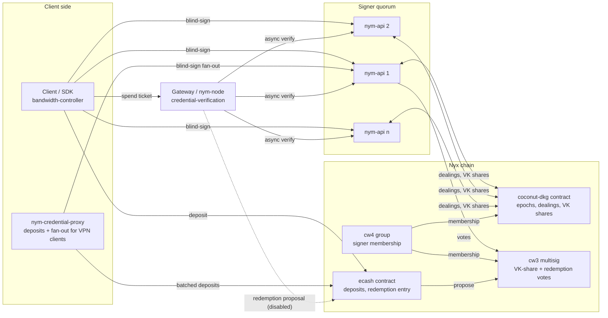
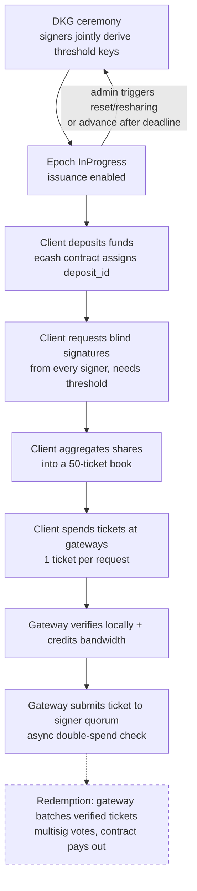

# Ecash ticketbooks

This directory documents how ecash credentials ("ticketbooks") currently work in the Nym platform: how the distributed signing keys come into existence (DKG), how ticketbooks are issued, how individual tickets are spent and verified, and what happens (and currently does not happen) when gateways try to get paid for them.

Audience: internal engineers. The underlying cryptography (the offline compact ecash scheme implemented in `common/nym_offline_compact_ecash`) is treated as a black box; this documentation describes what the protocol layers do with it, not how the pairings work.

These documents describe the code as of branch point `941f8311aa` (2026-08). Statements are derived from source, with code references given as `path` (`symbol`) so they survive line drift.

## Reading order

| Document | Covers |
|---|---|
| [dkg.md](dkg.md) | The coconut-dkg contract, the epoch state machine, epoch advancement, dealer exchange, verification key derivation, resharing, and how DKG gates issuance |
| [issuance.md](issuance.md) | Deposits, withdrawal requests, blind signing by the nym-api quorum, aggregation into a ticketbook, auxiliary global signatures, and the credential-proxy acquisition path |
| [spending.md](spending.md) | Ticket selection, the spend payload, gateway-side verification, bandwidth crediting, and the layered double-spend protection |
| [redemption.md](redemption.md) | The redemption design (gateway batching, multisig voting, payout) and its current disabled state |
| [upgrade-mode.md](upgrade-mode.md) | The ticket-free bypass used during chain upgrades: attestation, proxy-issued JWT, gateway metering shutdown |

Two further documents are maintained alongside these for internal use only: a gap analysis recording known limitations and design debt, and a remediation plan sequencing the work to address them. They are not part of this protocol description and are not distributed with it.

## Ticketbooks in principle

A ticketbook is an anonymous bandwidth credential. A client pays a fixed deposit on the Nyx chain and, in exchange, obtains a book of **50 tickets** (`TICKETBOOK_SIZE`, `common/network-defaults/src/ecash.rs`) blind-signed by a quorum of nym-api signers. Blind signing means no individual signer, nor the chain, can link the resulting tickets back to the deposit that paid for them. Each ticket can later be presented to a gateway in exchange for a fixed amount of bandwidth, and each ticket carries a deterministic serial number that makes double-spending detectable without revealing who spent it.

The scheme is a threshold construction: the signing key is *never held by any single party*. It is generated collectively by the nym-apis through a distributed key generation ceremony (DKG) coordinated on-chain, such that any `threshold = ceil(2n/3)` of the `n` participating signers can jointly issue credentials and no smaller coalition can. Verification requires only the aggregated master verification key, which anyone can reconstruct from the on-chain verification key shares.

Four ticket types exist, differing only in the bandwidth one ticket buys (`TicketTypeRepr`, `common/network-defaults/src/ecash.rs`):

| Type | Bandwidth per ticket |
|---|---|
| `V1MixnetEntry` | 200 MB |
| `V1MixnetExit` | 100 MB |
| `V1WireguardEntry` | 500 MB |
| `V1WireguardExit` | 500 MB |

A ticketbook is valid for **7 days including its issuance day** (`TICKETBOOK_VALIDITY_DAYS`); its expiration date is a signed attribute of the credential. All ecash timestamps are floored to UTC midnight (`common/ecash-time`).

## Actors and components

- **Client** (`common/bandwidth-controller`, `common/bandwidth-fetcher`, `common/credentials`): makes deposits, drives blind signing, aggregates and stores ticketbooks, spends tickets against gateways.
- **nym-credential-proxy** (`nym-credential-proxy/`, `common/credential-proxy`): a Nym-operated service that performs deposits and the blind-sign fan-out on behalf of (VPN) clients that cannot or should not talk to the chain themselves. The withdrawal request stays blind; the proxy never learns the wallet secrets.
- **ecash contract** (`contracts/ecash`): holds deposits, assigns deposit ids, exposes the redemption entry point. Fully specified in [`openspec/specs/ecash-contract/spec.md`](../../openspec/specs/ecash-contract/spec.md).
- **coconut-dkg contract** (`contracts/coconut-dkg`): coordinates the DKG ceremony: epoch state machine, dealer registration, on-chain chunked dealings, verification key shares.
- **cw3 multisig + cw4 group** (`contracts/multisig/`): the group contract defines who the signers are; the multisig validates VK shares during DKG and (by design) redemption proposals.
- **nym-api signers** (`nym-api/src/ecash`): each runs a `DkgController` participating in key generation, a blind-sign endpoint issuing partial credentials, endpoints serving aggregated global data, a ticket-verification endpoint used by gateways, and an issued-ticketbook audit trail.
- **Gateway** (`common/credential-verification`, wired in `gateway/src/node`): verifies presented tickets locally and synchronously, credits bandwidth, then asynchronously submits each ticket to the signer quorum for cross-gateway double-spend detection and (by design) later redemption.

## Lifecycle at a glance

The dashed step is **currently disabled**: since 2026-03-25 gateways no longer create redemption proposals and the contract no longer moves funds on redemption (see [redemption.md](redemption.md)).

One special mode sits outside this lifecycle: during Nyx chain upgrades, a signed attestation switches the network into **upgrade mode**, where gateways stop metering bandwidth and clients present a proxy-issued JWT instead of tickets (see [upgrade-mode.md](upgrade-mode.md)).

A critical property of the current design: **while a DKG round is running (any epoch state other than `InProgress`), every issuance and aggregation endpoint on every nym-api refuses to serve** (`ensure_dkg_not_in_progress`, `nym-api/src/ecash/state/mod.rs`). Ticketbook issuance is therefore halted network-wide for the duration of every DKG ceremony, including issuance against the previous epoch's still-valid keys. Spending is unaffected because gateways verify against cached per-epoch keys.

## Key constants

| Constant | Value | Defined in |
|---|---|---|
| `TICKETBOOK_SIZE` | 50 tickets | `common/network-defaults/src/ecash.rs` |
| `TICKETBOOK_VALIDITY_DAYS` | 7 (including issuance day) | `common/network-defaults/src/ecash.rs` |
| DKG threshold | `ceil(2/3 * registered_dealers)`, fixed per epoch when entering `DealingExchange` | `contracts/coconut-dkg/.../advance_epoch_state.rs` |
| DKG phase durations (defaults) | 600 / 300 / 300 / 60 / 60 s; `InProgress` 2 weeks | `common/cosmwasm-smart-contracts/coconut-dkg/src/types.rs` |
| Tickets per spend request | exactly 1 (hard-rejected otherwise) | `common/credential-verification/src/lib.rs` |
| Gateway PayInfo timestamp window | ±30 s | `common/credential-verification/src/ecash/mod.rs` |
| Gateway quorum for a verified ticket | ≥ 0.7 of the epoch's signers accept | `nym-node/src/config/gateway_tasks.rs` |
| Double-spend revocation penalty | 10× the ticket's bandwidth | `nym-node/src/config/gateway_tasks.rs` |
| nym-api verified-ticket retention | expiry + 8 days | `nym-api/src/support/config/mod.rs` |
| Default deposit price | on-chain config (`GetDefaultDepositAmount`), admin-updatable; per-address reduced prices exist | ecash contract spec |

## Glossary

- **Ticketbook**: the aggregated credential (`IssuedTicketBook`, `common/credentials/src/ecash/bandwidth/issued.rs`): a threshold-blind-signed wallet of 50 tickets bound to an expiration date, a ticket type, a DKG epoch id, and the client's ecash secret key.
- **Ticket**: one spendable unit of a ticketbook, addressed by its index (0..49). Not a stored object; tickets are derived from the wallet at spend time.
- **Serial number**: a value derived deterministically from the wallet secret and the ticket index, revealed on spending. The same ticket always yields the same serial number, which is what makes double-spending detectable.
- **Deposit**: an on-chain payment to the ecash contract (`DepositTicketBookFunds`) that entitles the depositor to one ticketbook. Identified by a sequential `deposit_id` and bound to a throwaway ed25519 public key whose private half later proves ownership.
- **Withdrawal request**: the blind-signing request (`WithdrawalRequest`, `common/nym_offline_compact_ecash/src/scheme/withdrawal.rs`): commitments to the client's secrets plus a zero-knowledge proof, revealing nothing about the resulting tickets.
- **Partial wallet / wallet share**: one signer's blind signature over a withdrawal request, verified against that signer's VK share and Lagrange-aggregated with others at threshold.
- **Master verification key**: the aggregated public key of a DKG epoch, reconstructible by anyone from the on-chain VK shares; used by gateways to verify spent tickets.
- **Expiration-date signatures / coin-index signatures**: auxiliary aggregated signatures over each valid date (per expiration date) and each ticket index (per epoch). Issued by the same quorum, fetched separately from the ticketbook, and required at spend time. They let the verifier check date validity and index validity without learning either.
- **PayInfo**: a 72-byte spend-binding blob (32 B randomness, 8 B unix timestamp, 32 B provider public key) that ties a payment to a specific gateway and moment (`common/credentials-interface/src/lib.rs`).
- **DKG epoch**: one generation of the threshold key, identified by `epoch_id`. Credentials embed the epoch id so verifiers know which master key applies.
- **Signer / dealer / member**: a nym-api that is a voting member of the cw4 group. "Dealer" is its role during a DKG ceremony; "signer" its role during issuance.
- **Threshold**: the minimum number of partial signatures (or VK shares) needed to aggregate: `ceil(2n/3)` where `n` is the number of dealers registered in the epoch.
