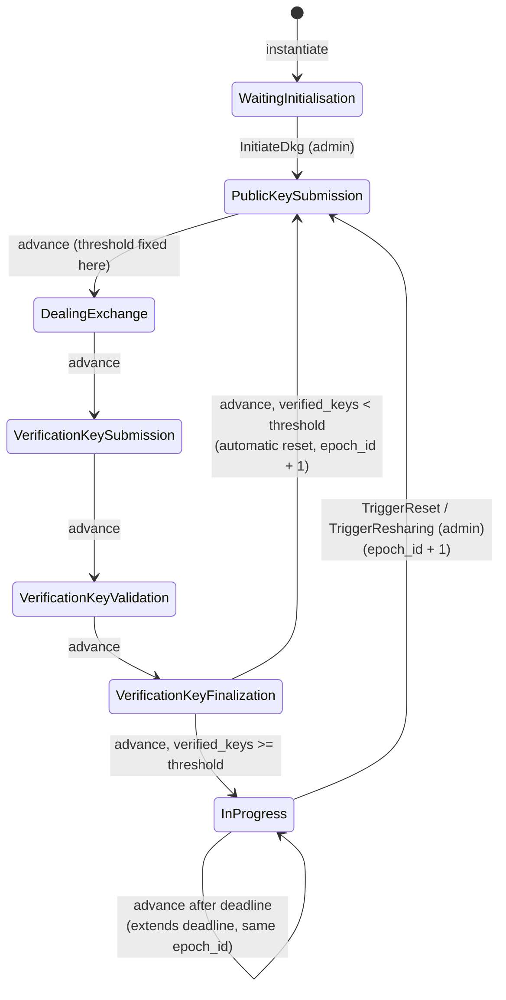
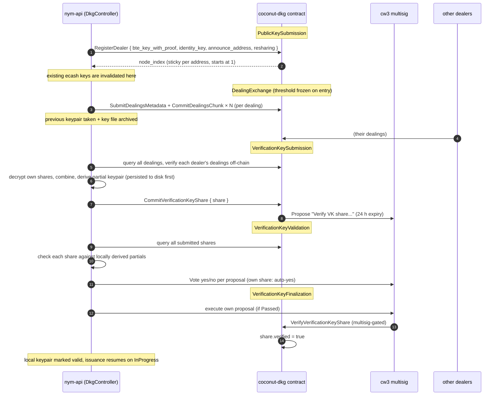

# Distributed key generation (DKG)

The ecash signing key is generated collectively by the nym-apis so that no single party ever holds it. The ceremony is coordinated by the **coconut-dkg contract** (`contracts/coconut-dkg`, shared types in `common/cosmwasm-smart-contracts/coconut-dkg`), the cryptography lives in `common/dkg`, and each nym-api drives its own participation with a `DkgController` (`nym-api/src/ecash/dkg`).

Participation is doubly gated: a nym-api must have `ecash_signer.enabled = true` in its config (default **false**, plus a minimum chain balance check and a mandatory announce address at startup, `nym-api/src/support/cli/run.rs`), and its cosmos account must be a **voting member of the cw4 group contract**. The group contract is the sole membership authority; the DKG contract checks it on every registration (`contracts/coconut-dkg/src/dealers/transactions.rs`, `ensure_group_member`).

## The epoch state machine

An *epoch* is one generation of the threshold key, identified by a monotonically increasing `epoch_id`. The contract tracks `Epoch { state, epoch_id, state_progress, time_configuration, deadline }` and snapshots it every block (`SnapshotItem`, queryable at any historical height via `GetEpochStateAtHeight`).

The enum is `EpochState` (`common/cosmwasm-smart-contracts/coconut-dkg/src/types.rs`); every mid-ceremony state carries a `resharing: bool` payload. Issuance is possible **only** in `InProgress` (see "Interaction with issuance" below).

| Phase | What happens | Default duration | Can short-circuit its deadline? |
|---|---|---|---|
| `PublicKeySubmission` | dealers register (BTE key + proof, ed25519 identity, announce address) | 600 s | no, always burns the full timer |
| `DealingExchange` | dealers commit chunked dealings on-chain | 300 s | yes, when every registered dealer submitted all dealings |
| `VerificationKeySubmission` | each dealer derives its partial keypair and commits its VK share | 300 s | yes, when shares == dealers |
| `VerificationKeyValidation` | dealers cross-verify shares and vote in the cw3 multisig | 60 s | no (voting is external to the DKG contract) |
| `VerificationKeyFinalization` | passed proposals are executed, shares flip to `verified` | 60 s | yes, when verified == submitted |
| `InProgress` | steady state, keys usable, issuance enabled | 2 weeks | n/a |

Durations come from `TimeConfiguration` (`types.rs`), set once at contract instantiation. **There is no execute message to change them afterwards.**

A full cooperative ceremony therefore takes roughly 10-22 minutes of wall clock (the two non-short-circuitable phases guarantee at least 660 s), during which issuance is down network-wide.

## Epoch advancement

`ExecuteMsg::AdvanceEpochState {}` is **permissionless**: the handler (`contracts/coconut-dkg/src/epoch_state/transactions/advance_epoch_state.rs`, `try_advance_epoch_state`) never looks at the sender. Advancement is allowed when the current phase is *complete* (per the short-circuit rules above, `epoch_state/utils.rs`, `check_state_completion`) or its `deadline` has passed; otherwise the call fails with `EarlyEpochStateAdvancement(seconds_remaining)`.

In practice nobody runs a dedicated cron: **every participating nym-api's `DkgController` polls the contract every 30 s** (`DEFAULT_DKG_CONTRACT_POLLING_RATE`, `nym-api/src/support/config/mod.rs`), does its own phase work, then queries `CanAdvanceState`; if advancement is possible it sleeps a random 0-60 s jitter (so the apis don't all race the same tx) and sends `AdvanceEpochState` (`nym-api/src/ecash/dkg/controller/mod.rs`). A nym-api that is not a group member bails out of the whole tick early (`ensure_group_member`).

Two special branches inside the advance handler:

- **Entering `DealingExchange`** computes and freezes the epoch's threshold: `threshold = ceil(2/3 * registered_dealers)`, stored both as the current `THRESHOLD` and in the historical `EPOCH_THRESHOLDS[epoch_id]` map. Both are queryable (`GetCurrentEpochThreshold` / `GetEpochThreshold`).
- **Entering `InProgress`** first checks `verified_keys >= threshold`. If too few VK shares were verified, the contract concludes no credentials could be issued anyway and **automatically resets**: `epoch_id + 1`, back to `PublicKeySubmission { resharing: false }` (this branch carries a `TODO: is this actually a desired behaviour?`). This is the only automatic epoch bump in the system.
- When the state is already `InProgress` and the (2-week) deadline lapses, advancing **does not bump the epoch or rotate keys**; it just re-saves `InProgress` with a fresh deadline. Key rotation only ever happens through the admin triggers below.

If a phase deadline lapses with incomplete participation, the state advances anyway with whatever was collected; there is no on-chain penalty for missing dealers. Under-participation only surfaces later, off-chain, as failed key derivation or an insufficient-shares error.

## A DKG round from a dealer's perspective

### Registration

`RegisterDealer` requires the matching `PublicKeySubmission { resharing }` state and cw4 voting membership. The dealer submits its BTE (bilinear threshold encryption) public key with a proof of possession, its ed25519 identity key, and the HTTP announce address other parties and clients will use to reach it. Node indices (the x-coordinates of the Shamir shares) are assigned once per address and reused across epochs, starting at 1. Re-registering in the same epoch fails with `AlreadyADealer`. On restart mid-ceremony, a nym-api re-adopts its on-chain registration instead of re-registering (`nym-api/src/ecash/dkg/public_key.rs`).

### Dealing exchange

Dealings are stored **on-chain**, chunked: a dealer first submits metadata declaring the chunk layout, then uploads chunks of at most 2048 bytes each (at most 50 chunks, 100 kB per dealing; constants in `common/cosmwasm-smart-contracts/coconut-dkg/src/dealing.rs`). The contract validates only structure (sizes, indices, no overwrites); it performs **no cryptographic validation of dealing content**. The progress counter increments when a dealer's dealing set is complete, which is what the short-circuit rule checks.

Cryptographic dealing verification happens entirely off-chain, in every receiver, during key derivation (`nym-api/src/ecash/dkg/key_derivation.rs`, `verified_dealer_dealings`): each dealing is checked for ciphertext integrity, proof of chunking, proof of sharing, and (in resharing) consistency with the dealer's previous-epoch key. A dealer with any invalid dealing is dropped entirely, but only **locally**: rejection is recorded in the api's own persisted state (`rejected_dealers`). There are no on-chain complaints, bans, or slashing; the historical complaint states were removed from the state machine (a comment block in `types.rs` documents the old machine). The only adversarial lever is voting *no* on the culprit's VK-share proposal later.

### Key derivation, submission, validation, finalization

Each receiver decrypts its share from every valid dealer's dealings, combines them into its partial signing key, derives the corresponding partial verification key, and sanity-checks the pairing between them. The keypair is persisted to disk *before* the share is submitted on-chain, so a crash between the two is recoverable (`key_derivation.rs` has explicit recovery paths for "share on chain but proposal id unknown" and "keys on disk but tx never sent").

`CommitVerificationKeyShare` stores the share (`verified: false`) and makes the DKG contract propose a cw3 multisig proposal titled "Verify VK share, as ordered by Coconut DKG Contract", expiring after 24 h (`BLOCK_TIME_FOR_VERIFICATION_SECS`, hardcoded). During validation, every dealer independently re-derives what each peer's partial VK *should* be (from the same dealings) and votes yes/no on each proposal; a dealer auto-votes yes on its own share without verification. During finalization each api executes its own passed proposal, which calls back into the DKG contract (`VerifyVerificationKeyShare`, multisig-gated) flipping the share to `verified = true` and incrementing the progress counter.

**Verification is possible only inside the finalization phase.** `try_verify_verification_key_share` begins with `check_epoch_state(.., VerificationKeyFinalization)`, so once that 60-second phase ends a share can *never* become verified. Since a signer must execute its **own** proposal, a node that is offline or simply does not tick inside that window leaves its share permanently unverified, even though the share itself is valid and the ceremony may still conclude successfully on everyone else's. This interacts sharply with discovery, below.

A rejected share does not cryptographically prevent its holder from producing partial signatures; it only means the share is excluded from discovery (see below). The code is explicit about this (`key_finalization.rs`: "technically there's nothing enforcing this...").

## Threshold

`threshold = ceil(2 * registered_dealers / 3)`, computed once per epoch when entering `DealingExchange` and never recomputed. It is both the number of partial signatures a client needs to aggregate a ticketbook and the number of VK shares needed for the epoch to conclude successfully. Note this is distinct from the cw3 multisig's own voting threshold (an `AbsolutePercentage` configured on the multisig contract), which governs proposal passage.

**Production state, as of 2026-08.** Mainnet has run exactly **one** epoch since launch, created with 17 registered dealers and a resulting threshold of `ceil(2 * 17 / 3) = 12`. Consequently **no epoch transition has ever occurred in production**: everything this document describes about resharing, reset, archived keys, multi-epoch overlap and past-epoch material is accurate to the code but unexercised on mainnet. Both ceremony types have been rehearsed on sandbox, where they surfaced the operational issues noted under "Key lifecycle" and "Interaction with issuance" below.

Note that the signer set is public on-chain data, so the count above is not privileged; the number of those signers currently *responding* is deliberately not documented here.

## Resharing vs reset

Both are **manual, admin-gated** (`DKG_ADMIN`) actions on the DKG contract, both require `InProgress`, and both start a new ceremony with `epoch_id + 1`:

- `TriggerReset` → `PublicKeySubmission { resharing: false }`: a from-scratch ceremony. The master key changes; everything issued under previous epochs remains verifiable only via the archived per-epoch material.
- `TriggerResharing` → `PublicKeySubmission { resharing: true }`: the existing master key is **preserved** while individual shares change (verified by the `reshare_preserves_master_key` test, `nym-api/src/ecash/dkg/mod.rs`). Only addresses that were dealers in `epoch - 1` may submit dealings; their dealings embed the previous secret as the polynomial constant term, and receivers verify this against the dealer's previous-epoch *verified* VK share. New group members can join a resharing epoch as receivers (they register, receive shares, and become full signers) without contributing dealings.

Nothing in the tree calls either trigger automatically; key rotation is an operational decision. The signer *set* itself changes via cw4 group membership updates, which take effect at the next ceremony.

### Why prefer one over the other

**Resharing is the routine-maintenance option.** Because the master key survives while every individual share is replaced, it delivers proactive share refresh: any sub-threshold set of shares an attacker may have accumulated from the old epoch becomes useless the moment the new epoch concludes, since old and new shares cannot be combined (shares are only meaningful within their epoch's polynomial). It is also the mechanism for graceful membership churn: joiners receive shares without the key changing, leavers simply stop being dealt to. The assumption underneath is that the master key itself was never reconstructed by an adversary; resharing refreshes *shares*, not the key.

**Resharing depends on the previous dealer set.** Only addresses that were dealers in `epoch - 1` may deal (contract-enforced), each resharing dealing must be consistent with that dealer's previous-epoch *verified* VK share, and a nym-api whose stored key is not from exactly the previous epoch skips resharing dealings entirely (`nym-api/src/ecash/dkg/dealing.rs`). If too few old dealers participate, receivers cannot derive valid keys, too few VK shares get verified, and the ceremony ends in the contract's automatic sub-threshold branch, which is a **reset**. Resharing is therefore only available while the old quorum is substantially alive and cooperative.

**Reset is the bootstrap and recovery option.** It needs no continuity with any prior epoch (any current group member deals fresh), which is why it is what `InitiateDkg` starts with, what the contract falls back to automatically, and the only choice when the old dealer set has decayed below threshold or when the master key itself must be discarded (i.e. a suspected compromise of threshold-many shares, against which resharing offers nothing).

**What a key change does and does not cost in this system.** Nothing in the codebase pins the master key across epochs: every consumer (gateways, clients, apis) resolves verification material by the epoch id embedded in each credential, so a reset does not break existing ticketbooks any more than a resharing does; both simply open a new epoch alongside the old ones. The flip side is that a reset also does **not** revoke the old key: old epochs remain fetchable, aggregatable verification anchors indefinitely, and gateways will happily build verification state for any historical epoch id a ticket claims. A reset performed *in response to* a key compromise stops future issuance under the old key but does not stop verification against it; the implications of that are gap-analysis material, not described further here.

## What happens in the rest of the system while a ceremony runs

All three ceremony kinds (initial setup, reset, resharing) run the same state machine; the `resharing` flag changes only who may deal and how dealings are constructed. From every other component's perspective they are the same kind of outage, differing only in whether the master key changes at the end (reset: yes, resharing: no; either way the epoch id changes and every consumer keys off epoch ids, so even that difference is invisible to verifiers).

- **New issuance continues**, under the epoch still in service; see "Interaction with issuance" below.
- **Global data stays fetchable, including for old epochs.** The aggregated-data endpoints (`master-verification-key`, `aggregated-coin-indices-signatures`, `aggregated-expiration-date-signatures`) and both partial-signature endpoints refuse only the epoch whose ceremony is actually running (`nym-api/src/ecash/api_routes/aggregation.rs`, `partial_signing.rs`). Everything an earlier epoch was ever asked for is settled for good, and its credentials stay spendable for days after it stops being used for issuance, so a client whose local cache is cold can still provision a valid ticketbook mid-ceremony.
- **Spending at gateways continues.** Gateways build per-epoch verification state from the *chain*, not from nym-apis, and the DKG contract never deletes per-epoch state: `reset_dkg_state` removes only the current `THRESHOLD` item, while dealings, dealer details, VK shares and the historical `EPOCH_THRESHOLDS` map are all keyed by epoch id and preserved indefinitely (`contracts/coconut-dkg/src/epoch_state/transactions/mod.rs`). Even an old-epoch ticket seen for the first time mid-ceremony is verifiable, provided the gateway can reach the chain.
- **Existing ticketbooks survive both reset and resharing.** A book is bound to the epoch id it was aggregated under; gateways look up VK material by the epoch id embedded in each spend, so books remain spendable until their natural expiration regardless of how many ceremonies happen in between. After a ceremony there is consequently an overlap window (up to the 7-day validity) during which tickets from two or more epochs circulate simultaneously, which is why the gateway's epoch cache is a map, not a single slot.
- **A past epoch's keys remain usable for what its credentials need.** Each signer archives the outgoing key file during dealing exchange and reads archives back at startup, keeping a keypair per epoch (`nym-api/src/ecash/keys`). Auxiliary signatures for a concluded epoch can therefore still be produced, which is what a circulating ticketbook from that epoch depends on. Issuing *new* books under a retired epoch is a separate capability and is deliberately not offered, except within the brief post-conclusion window described under "Interaction with issuance".
- **In-flight acquisitions carry on across the boundary.** A deposit is not epoch-bound, and issuance is no longer suspended, so a deposit made before the trigger is simply signed for during the ceremony under the epoch still in service. A client that had already collected some shares keeps collecting under the same epoch, provided it names it: shares are only handed back for the epoch asked for, and a share held for a different epoch is refused with that epoch named rather than replayed into a set it cannot be aggregated with.

## Key lifecycle on a nym-api

The local ecash keypair is wrapped in a `KeyPair { keys, valid: AtomicBool }` (`nym-api/src/ecash/keys/mod.rs`); every signing path goes through `get()` which returns nothing unless the `valid` flag is set (surfacing as `KeyPairNotDerivedYet`).

- **Invalidated** the moment the node registers for a new ceremony (`public_key_submission`), so old keys stop signing as soon as a new epoch begins.
- **Archived** during dealing exchange: the keypair is taken out of memory and the on-disk PEM (which embeds the epoch id) is renamed to `epoch-{id}-{filename}.archived` (`controller/keys.rs`, `archive_coconut_keypair`). **Nothing ever reads archived keys back**; requests requiring a past epoch's signing key fail (see issuance.md on coin-index signatures).
- **Validated** only at finalization, after the node's own VK-share proposal executed. This is the sole runtime path that sets the flag, and it lives inside a 60-second phase.
- **At startup**, a key found on disk is validated under a *more permissive* rule: issued for the current chain epoch, and the state is `InProgress` or `VerificationKeyFinalization`.

The two rules disagree, and the disagreement is load-bearing. A node that misses the finalization window, or errors on that path, keeps `valid = false` and refuses to sign **indefinitely**, while a restart of the very same process re-reads the key from disk and accepts it. This is why signers have needed manual restarts after the sandbox ceremonies. It is reachable only by running a ceremony, which is an admin-triggered operation.

Aggregated per-epoch public material (master VK, coin-index signatures, expiration-date signatures) is persisted in the api's SQL storage per epoch and continues to be served for old epochs; only the *signing* side of old epochs is archived away.

## Interaction with issuance

Exactly one epoch is issuable at a time: the most recent whose ceremony has concluded. Ordinarily that is the current epoch; while a ceremony runs it is the one before it, whose keys exist and whose credentials are still circulating. `POST /v1/ecash/blind-sign` resolves that epoch, signs with its key and records it against the issuance (`nym-api/src/ecash/state/mod.rs`, `issuable_epochs`). Nothing refuses a request merely because a ceremony is running.

Consequences worth internalising:

- During a DKG ceremony (roughly 11-22 min cooperative, up to ~21 min of pure deadlines plus multisig latency otherwise), ticketbooks continue to be issued under the previous epoch. A deposit made just before a ceremony starts is signed for during it rather than stranded until it ends.
- A request may name the epoch whose material it is collecting. A client gathering several shares for one credential should name it on each: a ceremony concluding partway through moves the default, and shares from two epochs cannot be combined.
- Issuing under an epoch that has been *superseded* is refused, with one bounded exception. For a short window after a ceremony concludes, signers still honour the epoch it replaced, because their cached views of the chain differ and some have not seen the conclusion yet. The window is measured from the conclusion time the contract records (`Epoch::ceremony_concluded_at`), so every signer computes the same one, and it is required to outlast the epoch-cache staleness below. A request naming no epoch is refused inside it rather than guessed at, since that is precisely when signers would guess differently.
- Spending and verification are unaffected: gateways verify against per-epoch VK material they fetch from the chain and cache, keyed by the epoch id embedded in each ticket.
- The nym-api caches its view of the current epoch up to a configurable ceiling (5 minutes by default, or the phase deadline, whichever is sooner, `comm.rs`), so which epoch it considers issuable can lag the chain by that much around a transition. This is the disagreement the post-conclusion window exists to absorb, which is why the window has to stay longer than it. The epoch recorded in an audit row does *not* lag: it is taken from the key that signed, not from the cached view.
- **Per-epoch caches never expire, so they are only written once an epoch's facts are settled.** `is_dkg_signer` and `ecash_clients` memoise under the epoch id in a `CachedImmutableItems` map with no TTL, on the assumption that facts about an epoch are constant once known - which holds only after its ceremony concludes. Both therefore answer an unconcluded epoch from the chain without caching, so a lookup landing mid-ceremony cannot pin an empty signer set for the process lifetime. The credential-proxy does the same for its own signer list. Note these caches store only *successful* results, so anything that errors self-heals; it was the degenerate successes (`false`, `vec![]`) that used to stick and require a restart after a ceremony.

## Signer-set and key discovery

The single source of truth for "who are the signers of epoch N and what are their keys" is the DKG contract's VK-share storage: `GetVerificationKeys { epoch_id }` returns `ContractVKShare { share, announce_address, node_index, owner, epoch_id, verified }` for every registered dealer of that epoch.

Consumers convert shares into `EcashApiClient`s (`common/client-libs/validator-client/src/coconut/mod.rs`): the conversion **fails on any unverified share**, and the collective helper `all_ecash_api_clients` propagates a single failure into an error for the whole epoch (a known sharp edge, flagged with a TODO in source). Gateways build their per-epoch verification state by fetching the epoch's threshold and all VK shares, requiring at least `threshold` clients, and Lagrange-aggregating the master key (`common/credential-verification/src/ecash/state.rs`); clients do the equivalent when aggregating ticketbooks and fetching global data.

For operational visibility (not authoritative): `GET /v1/ecash/signer-status` on each api, and the signer-liveness sweep served under `GET /v1/network/signers/status` (backed by `common/ecash-signer-check`).
