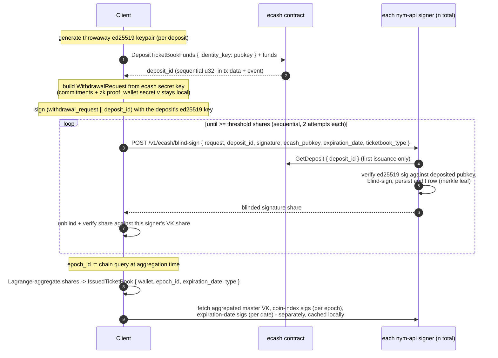
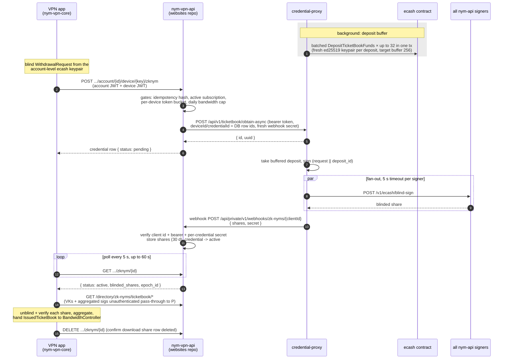

# Ticketbook issuance

Issuance turns an on-chain deposit into an anonymous 50-ticket credential. It requires the DKG epoch to be in `InProgress` (see [dkg.md](dkg.md)); every step below assumes a settled epoch with a known threshold.

Two acquisition paths exist. The **direct path** (client talks to the chain and the signers itself) is implemented across `common/bandwidth-fetcher`, `common/credentials` and `common/bandwidth-controller`. The **credential-proxy path** delegates the deposit and the fan-out to a Nym-operated service (`nym-credential-proxy`). Both converge on the same nym-api endpoint and the same cryptography; they differ in who pays and who aggregates.

The contract layer (deposits, pricing, ids, events) is authoritatively specified in [`openspec/specs/ecash-contract/spec.md`](../../openspec/specs/ecash-contract/spec.md); this document does not restate it.

## Direct path

### 1. Deposit

The client generates a **fresh random ed25519 keypair per deposit** (`common/bandwidth-fetcher/src/credentials.rs`, `make_deposit`); this is not its long-term identity. The bs58 public key is sent as the `identity_key` of `DepositTicketBookFunds`, along with funds matching the price obtained from `GetDefaultDepositAmount` (the direct path never queries the reduced/whitelisted price). The contract validates the amount, assigns the next sequential `deposit_id`, and returns it in the tx response data; the contract does **not** verify control of the ed25519 key; that proof is deferred to the signers.

The private half of the keypair is retained inside the client-side `IssuanceTicketBook` (`common/credentials/src/ecash/bandwidth/issuance.rs`) and is the only thing that proves deposit ownership from here on. Deposits are serialised behind a lock to avoid racing the account sequence number, and pending (deposited but not yet issued) books are persisted so a crash or a DKG blackout does not lose the deposit (`pending_issuance` storage).

### 2. Withdrawal request

`IssuanceTicketBook::prepare_for_signing` produces the blind-signing payload via `withdrawal_request()` (`common/nym_offline_compact_ecash/src/scheme/withdrawal.rs`). Inside the black box: a fresh random wallet secret `v` is generated; the private attributes `[sk_user, v]` are Pedersen-committed; the expiration date and ticket type are bound into the commitment hash; and a zero-knowledge proof of well-formedness is attached. The client keeps the `RequestInfo` (openings + wallet secret) needed later for unblinding and aggregation; the signers see only commitments.

The client's ecash keypair (`sk_user`) is derived deterministically from a seed (the client identity), not random, so the same identity re-derives the same ecash key.

**The credential's signed attributes.** The final wallet is a threshold signature over exactly four attributes (`common/nym_offline_compact_ecash/src/scheme/aggregation.rs`, `aggregate_wallets`); the DKG key is sized accordingly ("2 public attributes, 2 private attributes, 1 fixed", `DEFAULT_DEALINGS` in `common/cosmwasm-smart-contracts/coconut-dkg/src/dealing.rs`):

| Attribute | Visibility | Role |
|---|---|---|
| `sk_user` (ecash secret key scalar) | private, Pedersen-committed | the client's long-term ecash identity; recoverable by verifiers only from a genuine double-spend (via the identification tags), which is the designed blacklisting hook |
| `v` (wallet secret) | private, fresh random per book | seeds all 50 serial numbers and identification tags of the book |
| `expiration_date` (u32 unix timestamp, UTC midnight) | public | bounds the valid spend dates; also signed explicitly by each signer |
| `t_type` (ticket type) | public | selects the bandwidth value each ticket is worth |

Everything else a ticketbook carries is *not* a signed attribute: notably the `epoch_id` is plaintext metadata stamped client-side at aggregation, telling verifiers which master key to check against. See [spending.md](spending.md) for which of these a spent ticket reveals.

### 3. Expiration dates

All ecash dates are UTC-midnight-floored (`common/ecash-time`). The maximum expiration is `cred_exp_date()` = today + 6 days (7 valid days counting today); the direct path always requests exactly that default. The nym-api enforces only the upper bound at blind-sign time (`expiration_date > cred_exp_date()` → `ExpirationDateTooLate`); there is no lower bound on this path. The expiration date is a signed attribute of the final wallet: the signer both binds it inside the commitment verification and signs it explicitly, so it cannot be altered after issuance.

### 4. Blind signing (per signer)

`POST /v1/ecash/blind-sign` (`nym-api/src/ecash/api_routes/partial_signing.rs`, `post_blind_sign`) performs, in order:

1. `ensure_signer()`: this api is enabled as a signer and is in the current epoch's signer set.
2. Signing key available (fails with `KeyPairNotDerivedYet` otherwise).
3. Expiration upper-bound check.
4. `ensure_dkg_not_in_progress()`: the network-wide DKG gate.
5. **Idempotency**: if this deposit id was already issued, return the stored blinded share verbatim (note: this happens before any request validation; the share is unusable without the client's `RequestInfo`).
6. Blacklist check on the ecash public key (the on-chain blacklist is currently unreachable through public execute paths, so this is effectively a no-op guard; see the contract spec).
7. On-chain deposit lookup (`GetDeposit { deposit_id }`, fails with `NonExistentDeposit`).
8. **Deposit-ownership proof**: verify the request's ed25519 signature over `withdrawal_request_bytes || deposit_id_be_bytes` against the pubkey stored in the deposit (`nym-api/src/ecash/deposit.rs`, `validate_deposit`). The deposited *amount* is never re-checked here; amount enforcement happened entirely on-chain at deposit time.
9. Cryptographic issuance: `issue()` re-verifies the withdrawal request's zk-proof and commitment hash (which also catches any mismatch between the body's `expiration_date`/`ticketbook_type` and what is committed inside the request), then produces the blinded partial signature including the explicit expiration and type signatures.
10. Audit persistence: `store_issued_ticketbook` writes the `issued_ticketbook` row (see "Audit trail" below) before the share is returned.

Notably, **the request carries no epoch id and the signer never checks its key's epoch on this path**: the signer signs with whatever key it currently holds. The epoch recorded in its audit row is its own (up to 5-minute-stale) cached view of the chain epoch.

Note also that step 1 precedes step 4. During a DKG ceremony the current epoch has no verified VK shares yet, so `ensure_signer()` fails first and the caller sees `NotASigner` rather than the self-explanatory `DkgInProgress`. That answer is also memoised per epoch with no expiry, which is the caching behaviour described in [dkg.md](dkg.md).

### 5. Aggregation

`obtain_aggregate_wallet` (`common/credentials/src/ecash/utils.rs`) queries signers **sequentially** (with 2 attempts and linear backoff each), unblinding and cryptographically verifying every share against that signer's individual VK share before counting it, and stops as soon as `threshold` valid shares are collected. Fewer than threshold reachable signers fails the whole operation (`NotEnoughShares`). The shares are Lagrange-combined by node index into the final `WalletSignatures`, which is re-verified against the aggregated master key.

The client then stamps the result: `epoch_id` is read from the chain **at aggregation time** (`common/bandwidth-fetcher/src/credentials.rs`, `obtain_ticketbook`) and stored in the `IssuedTicketBook` together with the wallet, the ecash secret key, the expiration date and the ticket type. This is the epoch id that will later ride along in every spend of this book and tell verifiers which master key to use.

### 6. Auxiliary global data

The ticketbook alone is not spendable. Spending additionally requires, for the book's `(epoch_id, expiration_date)`:

- the **aggregated master verification key** (per epoch),
- **aggregated coin-index signatures** (per epoch): signatures over each ticket index 0..49,
- **aggregated expiration-date signatures** (per expiration date): signatures over each of the 7 valid spend dates.

Each signer exposes partial versions (`GET /v1/ecash/partial-coin-indices-signatures`, `.../partial-expiration-date-signatures`) and every api also serves pre-aggregated versions (`GET /v1/ecash/aggregated-*`, `.../master-verification-key`), aggregating on demand from its peers and caching in memory and SQL. Clients fetch from a random api with fallback (`common/bandwidth-fetcher/src/public_data.rs`) and persist the results in local credential storage; the bandwidth controller maintains them for every stored non-expired book and re-fetches lazily at spend time if missing.

Two epoch-related quirks of the partial endpoints, relevant to epoch transitions: the coin-index path **enforces** that the api's signing key matches the requested epoch (`InvalidSigningKeyEpoch` otherwise; archived past-epoch keys are not loaded, per an explicit TODO), while the expiration-date path signs with the current key regardless of the requested epoch id.

### 7. Client-side storage

`common/credential-storage` persists ticketbooks in `ecash_ticketbook` (blob + `ticketbook_type`, `expiration_date`, `epoch_id`, `total_tickets`, `used_tickets`), with the blob column UNIQUE as a duplicate guard. `used_tickets` is the authoritative spent counter (see [spending.md](spending.md)). Aux data lives in sibling tables keyed by epoch and `(expiration_date, epoch_id)`. Since migration `20251104120000` a book may be stored before its aux signatures exist; provisioning is best-effort afterwards. Partial books (index ranges, used for imported/shared books) are encoded by initialising `used_tickets`/`total_tickets` to the allowed range.

## nym-api audit trail

Each signer persists one row per issued share in `issued_ticketbook`, keyed by `deposit_id` (the primary key doubles as the double-issuance guard): the epoch id, the blinded partial credential, the joined private commitments, expiration date, type, and a merkle leaf `sha256(deposit_id || epoch_id || blinded_credential || commitments || expiration || type)` (`common/ticketbooks-merkle`). Leaves are inserted into a per-expiration-day merkle tree whose root and contents back a signer-gated, identity-signed audit API: issued counts, deposit-id lists per expiration date, challenge-commitment merkle proofs, and raw data retrieval (`nym-api/src/ecash/api_routes/issued.rs`). This is the raw material for auditing that a signer issued exactly what deposits entitle.

Retention is short: issued-ticketbook rows are pruned 2 days past expiration and verified-ticket rows 8 days past spend date, by a background cleaner sweeping every 2 h (`nym-api/src/ecash/state/cleaner.rs`).

## Credential-proxy path

`nym-credential-proxy` (binary) over `common/credential-proxy` (logic; also reused by nym-node-status-api) lets clients obtain ticketbooks without touching the chain: the proxy pays deposits from its own mnemonic-derived account and performs the signer fan-out. Access is gated by a single static bearer token for the whole ticketbook subtree.

In production the proxy's sole client is **nym-vpn-api**, a Next.js backend in the `websites` repo at `www/vpn-api`, which fronts it for the VPN apps (`nym-vpn-client/nym-vpn-core`). The full chain is app → nym-vpn-api → proxy → signers, with shares flowing back through a webhook and app-side polling:

Key properties, contrasted with the direct path:

- **Deposits are pre-bought and buffered.** A background task keeps ~256 unused deposits on hand, refilling in single transactions of up to 32 deposits, each with its own fresh ed25519 keypair whose private half is stored in the proxy DB. A request that finds the buffer empty blocks (polling every 500 ms) rather than failing. Unused deposits survive restarts. The proxy uses the reduced (whitelisted) price if its address qualifies.
- **The request stays blind.** The client builds the `WithdrawalRequest` from its own secrets and sends only the opaque blob; the proxy signs the deposit-ownership proof (it owns the deposit key) and forwards. It does see and store the client's ecash *public* key (deliberately, for future blacklisting) and the device/credential ids of the async flow.
- **The proxy returns shares, not a wallet.** Wallet aggregation and unblinding require the client's `RequestInfo`, so the proxy returns per-signer `WalletShare`s once at least `threshold` succeeded (per-signer failures are tolerated and persisted). Clients fetch partial verification keys from a dedicated endpoint to verify shares. In contrast, the *auxiliary* data (master VK, coin-index and expiration-date signatures) **is** aggregated proxy-side, cached in memory + SQLite, and optionally embedded in the response via `include-*` query flags.
- **Fan-out differs from the direct client**: all signers concurrently with a hard 5 s per-signer timeout (vs sequential with retries), and the global data for `(epoch, expiration)` is ensured *before* a deposit is consumed, so cache misses do not burn deposits.
- **Async flow**: `obtain-async` inserts a `pending` row, spawns the work, returns `{id, uuid}` immediately, and reports the outcome by POSTing to a pre-configured webhook (separate bearer secret; no retries, delivery is fire-and-forget). Polling `GET /shares/...` is the fallback; rows are pruned after 31 days. The sync `obtain` endpoint does the same work inline.
- **Availability gating**: a background quorum checker (default every 5 min, via `common/ecash-signer-check`) trips after two consecutive failures and makes obtain endpoints fail fast with `UnavailableSigningQuorum`; the epoch must also be `InProgress` (`ensure_credentials_issuable`), mirroring the DKG gate.
- Upgrade mode: when a chain-upgrade attestation is live, `obtain-async` short-circuits and returns the attestation + a proxy-signed JWT instead of issuing; see [upgrade-mode.md](upgrade-mode.md) for the full flow.

### The outer layers: nym-vpn-api and the VPN apps

These live in other repos (`websites/www/vpn-api`; `nym-vpn-client/nym-vpn-core`, which consumes the monorepo crates as git dependencies pinned to a release branch, so its view can lag this repo). Summarised here because they complete the production picture; treat the external repos as authoritative.

**nym-vpn-api is the business-policy layer.** The proxy issues to whoever holds its bearer token; all entitlement enforcement happens in nym-vpn-api *before* it touches the proxy (its README states this split explicitly). Per request it checks, in order: idempotency by `sha256(withdrawalRequest)` (a duplicate returns the existing credential row, whatever its status); an active subscription; a per-device token bucket (burst 9, refill 1 per 15 min, fail-open on KV outage); and an account-wide daily bandwidth cap (each book is accounted as 25 GB = "0.5 GB per ticket × 50"; cap 2 500 GB/device/day × max 10 devices). Only then does it create the credential row (validity now + 30 days, clamped to subscription end) and call `obtain-async`, passing its own DB row ids as `deviceId`/`credentialId` and a fresh 64-byte `secret`. The webhook receiver authenticates twice (static client id + bearer in the URL/headers, per-credential secret in the body), stores the share blob for 30 days, and flips the credential to `active`; apps learn of completion purely by polling (`GET .../zknym/{id}`) and confirm download with a `DELETE` that removes the share row. The four `directory/zk-nyms/ticketbook/*` routes are unauthenticated 60 s-cached pass-throughs to the proxy's key-material endpoints, which is how apps fetch master/partial VKs and aggregated signatures without account auth.

**The app does the cryptography itself, reusing the monorepo crates.** `nym-vpn-credential-fetcher` implements the monorepo's `CredentialFetcher` trait: it derives the ecash keypair **per account** (seeded from the mnemonic at the cosmos derivation path, so the same recovery phrase re-derives the same ecash identity across devices), builds the blind `WithdrawalRequest`, persists `{id, RequestInfo}` in its own `pending_zk_nym_requests` SQLite table so an interrupted request can be resumed, then on `active` unblinds and verifies each share against the signer's partial VK (`issue_verify`) and aggregates (`aggregate_wallets`) before handing the `IssuedTicketBook` to the monorepo `BandwidthController`, which owns storage and aux-data provisioning. Restocking is driven by the controller's config: check every 3 h (and after every ticket withdrawal), restock a type when its long-lasting tickets (books not expiring within 12 h) drop to 20, one book per fetch, for every type except `V1MixnetExit`; tunnel setup waits up to 120 s for the required types to reach the 5-ticket readiness floor.
