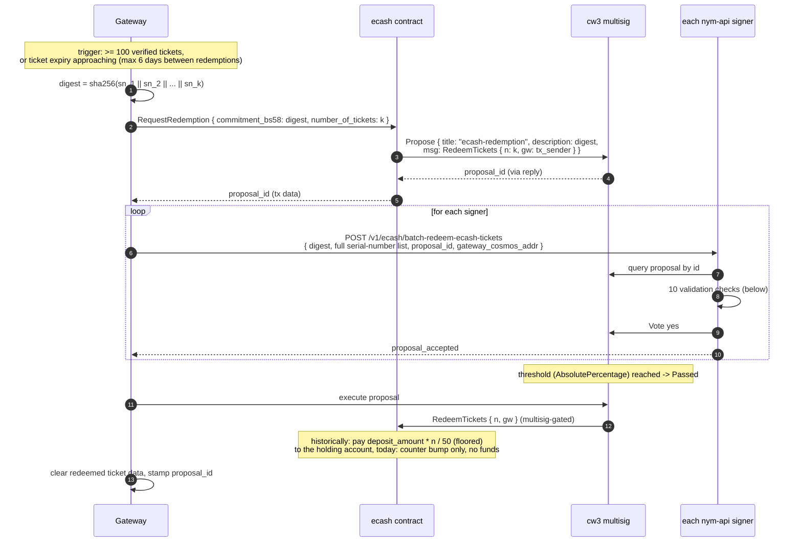

# Redemption

Redemption is how a gateway converts verified spent tickets into on-chain payment. It is documented here in two parts: the flow as designed (most of which is still live code), and the current operational reality.

> **Status: the redemption path is currently severed at both ends.** Two commits from 2026-03-25 disabled it:
>
> | Commit | Effect |
> |---|---|
> | `f858608ac9` "stop gateways from creating redemption multisig proposals" | deleted all gateway-side batching, proposal creation, vote tracking and proposal execution (~560 lines of `credential_sender.rs`) |
> | `981582c107` "stop transferring tokens to the holding account after redemption" | removed the payout computation and the `BankMsg::Send` from the contract's `RedeemTickets` |
>
> Everything in between (the contract's `RequestRedemption`, the multisig proposal machinery, the nym-api validation + voting endpoint) remains deployed and functional, but has no caller. `grep BankMsg contracts/ecash/src/` returns nothing: the ecash contract currently has **no fund-egress path at all**.
>
> **This is a deliberate staging decision, not an oversight.** The per-gateway, per-batch redemption flow described below is being replaced rather than repaired; see "The intended replacement" at the end of this document. The scaffolding is retained because parts of it inform the successor design.

The contract layer is authoritatively specified in [`openspec/specs/ecash-contract/spec.md`](../../openspec/specs/ecash-contract/spec.md) (requirements "RequestRedemption...", "The redemption-proposal reply handler...", "Legacy RedeemTickets...").

## The designed flow

### On-chain: `RequestRedemption`

Callable by **any address**, no funds, no allowlist. The handler validates only that `commitment_bs58` decodes to exactly 32 bytes (a sha256 digest), then dispatches a cw3 `Propose` submessage: title `"ecash-redemption"`, description = the digest verbatim, and a single embedded `RedeemTickets { n: number_of_tickets, gw: <tx sender> }` targeting the ecash contract itself. The gateway identity thus enters the proposal as the chain-authenticated tx sender and cannot be spoofed. The multisig only accepts proposals from configured addresses (the ecash contract must be registered as its `coconut_bandwidth_addr`, a legacy field name), the proposing contract gets a zero-weight ballot, and the multisig-assigned `proposal_id` flows back to the caller through the reply handler into the tx data.

**Only a digest goes on-chain.** The full serial-number list travels off-chain, over HTTP, to each signer; the proposal description pins it by hash.

### nym-api validation and voting

`POST /v1/ecash/batch-redeem-ecash-tickets` (`nym-api/src/ecash/api_routes/spending.rs`, `batch_redeem_tickets`; still live). The request body is unsigned; validation binds everything to chain state instead. Checks in order:

1. caller api is a signer this epoch (`ensure_signer`);
2. the gateway (by cosmos address) has previously submitted tickets to this api;
3. rate limit: at most one batch per gateway per 24 h (`MIN_BATCH_REDEMPTION_DELAY`);
4. the digest matches the attached serial numbers (recomputed sha256);
5. on-chain proposal validation (`validate_redemption_proposal`, `nym-api/src/ecash/state/mod.rs`): title is `"ecash-redemption"`; status is exactly `Open`; **description equals the request digest** (the link between the off-chain list and the on-chain commitment); proposer is the ecash contract; exactly one embedded message; it is a funds-free `WasmMsg::Execute` on the ecash contract; it deserialises to `RedeemTickets { n, gw }`; **`gw` equals the requesting gateway's address** (binds the HTTP claim to the chain-authenticated proposer); `n` equals the number of submitted serial numbers;
6. **every submitted serial number is in this api's own verified-ticket set** for that gateway, within the window since the gateway's previous batch (each api trusts only what it personally verified at spend time; see [spending.md](spending.md)). Tickets the api verified but the gateway did not include are silently forfeited once the cutoff advances (source comment: "tough luck, they're going to lose them");
7. cast a `Vote::Yes` on the cw3 proposal. A failed vote transaction is logged at debug and swallowed; the endpoint replies `proposal_accepted: true` regardless and advances the gateway's batch cutoff either way.

The cw3 multisig tallies votes with its configured `AbsolutePercentage` threshold over the cw4 group snapshot taken at proposal creation. Proposals expire after the multisig's `max_voting_period`; an expired open proposal degrades to `Rejected`. Signers whose vote arrives after the threshold has passed get `AlreadyPassed` errors from their own validation (step 5 requires `Open`), a known rough edge flagged by a TODO in source.

### Execution and payout

Historically the gateway itself executed the passed proposal. The multisig then calls `RedeemTickets { n, gw }` on the ecash contract (multisig-gated). The payout, before `981582c107`, was pro-rata and floored: `deposit_amount * n / TICKETBOOK_SIZE` (so 1 ticket of a 100 NYM 50-ticket book = 2 NYM), sent **to the holding account**, not the gateway (a still-earlier change, `3cb69780a6`, removed the 95/5 gateway/holding split), and accumulated into `PoolCounters.total_redeemed`.

Today `RedeemTickets` ignores `gw`, increments `PoolCounters.tickets_requested_and_not_redeemed`, emits a `ticket_redemption` event with `moved_to_holding_account = "false"`, and moves nothing. The spec explicitly classifies it as dead code retained for backwards compatibility. `total_redeemed` is zero-initialised and never written; `holding_account` is validated at instantiation and never debited.

### Double-redemption prevention (all layers still live)

- per-api serial-number UNIQUE storage plus the `identify()` replay check at spend-submission time;
- the per-gateway `verified_at > last_batch_verification` cutoff: once an api votes on a batch, everything verified before that moment leaves the redeemable window irreversibly;
- digest binding plus the requirement that the proposal be `Open`: a passed or executed proposal cannot be re-voted.

## Current operational reality

With `f858608ac9`, the gateway's `CredentialHandler` does exactly one periodic thing: retry pending *verifications*. Consequences:

- **Gateways are not paid for ticket-metered bandwidth.** Clients deposit; `total_deposited` grows; the contract has no egress; verified tickets are purged by each nym-api 8 days after their spend date with nothing claimed against them.
- **Gateway-side redemption state decays into dead weight.** The `verified_tickets`, `redemption_proposals` tables and the six storage methods that serve them (`common/gateway-storage`) have zero production callers; `redemption_proposals` stays empty; and because the only deletion path for `ticket_data`/`verified_tickets` rows was post-redemption cleanup, **these tables now grow without bound** on every gateway (the serial-number replay index with them).
- **Dead configuration**: `minimum_redemption_tickets` (default 100) and `maximum_time_between_redemption` (default 6 days, derived from ticket validity) are still parsed and plumbed into `CredentialHandlerConfig` but never read; node config templates still tell operators the cosmos mnemonic is "used for zk-nym redemption".
- The nym-api endpoint, contract messages, client helpers (`request_ticket_redemption`, `batch_redeem_ecash_tickets`) and error variants all remain in place, callable, and covered by the checks above; re-enabling the flow is a matter of restoring a driver plus a payout, not rebuilding the machinery.

## Historical gateway batching logic (for context)

The pre-`f858608ac9` driver (recoverable via `git show f858608ac9^:common/credential-verification/src/ecash/credential_sender.rs`) ran on the 300 s poller: skip if any verification is pending; rate-limit one day since the last stored proposal; redeem when ≥ `minimum_redemption_tickets` (100) verified tickets accumulated, with an expiry escape hatch that bypassed the size floor when the oldest proposal was older than `maximum_time_between_redemption`; build the digest; send `RequestRedemption`; persist the proposal id against the included tickets; then fan the serial-number list out to the signers and, on `Passed`, execute the proposal and purge the redeemed rows. Known acknowledged limitations in that code: the first-ever redemption could never take the expiry escape hatch, and crash recovery could not reconcile multiple missed proposals.

## The intended replacement

The flow above is not scheduled to be re-enabled in its current shape; it is being replaced rather than repaired. The design is not yet fully specified, but the direction is settled:

- nym-apis globally agree on the **share of tickets each gateway submitted** over an epoch.
- That share determines the gateway's **`work_factor`**, which feeds an updated rewarding formula in the mixnet contract.
- Gateways no longer send requests to the ecash contract at all. The per-gateway, per-batch on-chain negotiation described above would not have scaled.

This also accounts for several loose ends in the current code: `RedeemTickets` surviving as a no-op, `PoolCounters::total_redeemed` never being written, the `holding_account` never being debited, and the gateway-side redemption tables and configuration remaining wired but unread. They are remnants of the superseded design rather than an unfinished implementation of the current one.

## Data retention summary

| Store | Data | Cleanup | Status |
|---|---|---|---|
| nym-api `verified_tickets` | serial number + spending metadata per verified ticket | purged 8 days after spend date (2 h sweep) | active |
| nym-api `issued_ticketbook` | issuance audit rows + merkle leaves | purged 2 days after expiration | active |
| gateway `ticket_data` | serial numbers (+ blob until quorum) | blob nulled at quorum; row deleted only on rejection or redemption | **grows unbounded** (no redemption) |
| gateway `verified_tickets` / `redemption_proposals` | redemption bookkeeping | only via post-redemption cleanup | **unreachable code path** |
| client `ecash_ticketbook` | ticketbooks + spent counters | expired books cleaned up (yesterday cutoff) | active |
