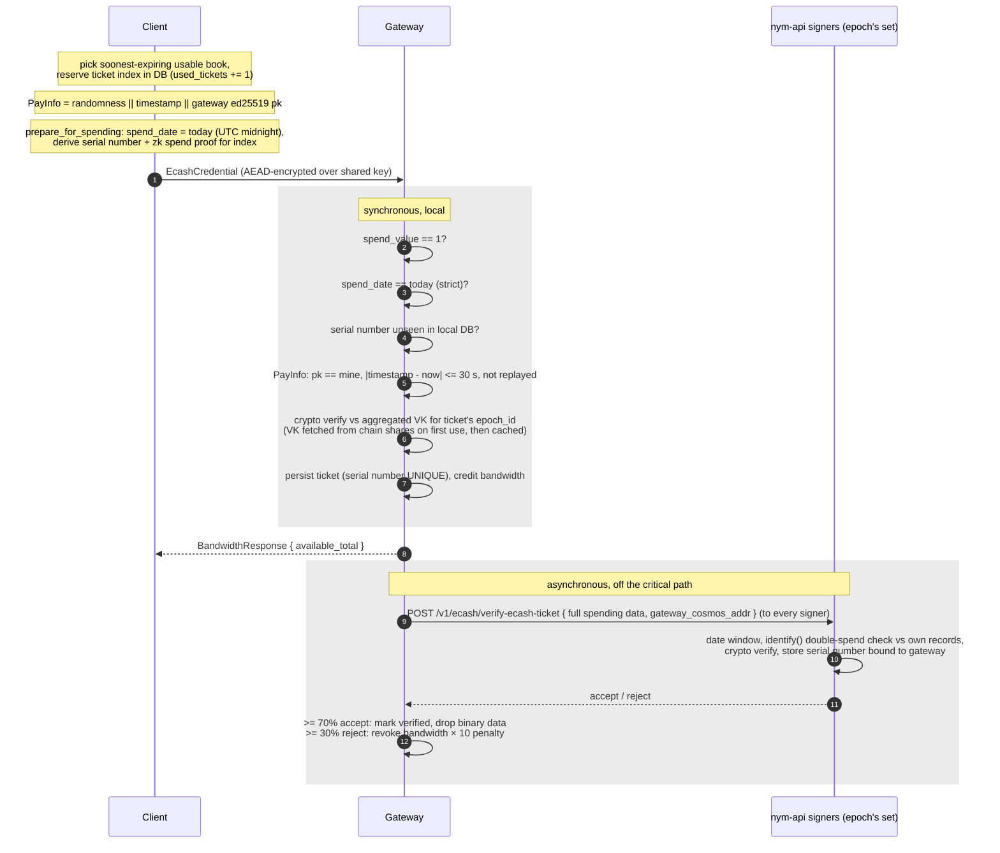

# Spending and verification

Spending presents one ticket from a stored ticketbook to a gateway in exchange for bandwidth. Verification is deliberately layered: the gateway does everything needed to grant bandwidth locally and synchronously, then reports the ticket to the signer quorum asynchronously for cross-gateway double-spend detection (and, by design, eventual redemption).

## Client side

**Ticket selection** is a small state machine over local storage (`common/credential-storage`): `get_next_unspent_ticketbook` picks the soonest-expiring book of the right type with spare tickets (`used_tickets + n <= total_tickets AND expiration_date >= today`), and `used_tickets` is incremented *in the same transaction* as a reservation, so concurrent tasks cannot take the same index. On a failed spend the counter is reverted with a compare-and-swap (`attempt_revert_ticketbook_withdrawal`), a rollback that is intentionally skipped when the gateway reports the failure as a ticket replay.

**Spend preparation** (`BandwidthController::prepare_ecash_ticket`, `common/bandwidth-controller/src/controller.rs`) first ensures the master VK, coin-index signatures and expiration-date signatures for the book's `(epoch_id, expiration_date)` are in local storage (fetching on miss), then builds the payload:

- **PayInfo** (`common/credentials-interface`): exactly 72 bytes: 32 B randomness, 8 B big-endian unix timestamp, 32 B provider public key = the **gateway's ed25519 identity key**. This binds the payment to one gateway and one moment.
- `IssuedTicketBook::prepare_for_spending` sets `spend_date = ecash_today()` (UTC midnight) and calls the black-box `spend()`, which derives, for the reserved index: the **serial number** (deterministic in the wallet secret and index; independent of PayInfo, which is what makes replays detectable), an identification tag (enables recovering the spender's public key if the same ticket is spent with two different PayInfos), and a zk spend proof binding everything to the PayInfo. The prerequisite aux signatures (7 date signatures, 50 coin-index signatures) are consumed here.
- The wire object is `CredentialSpendingData { payment, pay_info, spend_date, epoch_id }`; the embedded `epoch_id` tells the verifier which master key to use.

**Always exactly one ticket per request.** The crypto supports multi-ticket payments, but every client spends 1 (`TICKETS_TO_SPEND = 1`) and both the gateway and the nym-api hard-reject `spend_value != 1` (`MultipleTickets`).

**Transports.** The same payload travels several routes: the mixnet websocket control message `EcashCredential` (AEAD-encrypted with the client-gateway shared key), triggered when remaining bandwidth drops below a threshold (default 20% of a mixnet ticket, i.e. 40 MB); the WireGuard registration flow (`nym-registration-client`); the WG live-tunnel top-up endpoint (`POST /v1/bandwidth/topup`); and the authenticator/probe clients.

## Gateway verification, in order

`CredentialVerifier::verify` (`common/credential-verification/src/lib.rs`):

| # | Check | Failure | Scope |
|---|---|---|---|
| 1 | mock-mode short-circuit (`--use-mock-ecash`), a local-testing option that must never be enabled on a production gateway | n/a | local |
| 2 | `spend_value == 1` | `MultipleTickets` | local |
| 3 | `spend_date == today` (strict equality, UTC-midnight) | `InvalidCredentialSpendingDate` | local |
| 4 | serial number not already in this gateway's `ticket_data` | `BandwidthCredentialAlreadySpent` | local DB |
| 5 | PayInfo: provider pk equals this gateway's identity key | `InvalidPayInfoPublicKey` | local |
| 6 | PayInfo: timestamp within ±30 s of now | `InvalidPayInfoTimestamp` | local wall clock |
| 7 | PayInfo: not in the in-memory replay list (a timestamp-sorted vec pruned to the ±30 s window; process-local, lost on restart) | `DuplicatePayInfo` | local memory |
| 8 | cryptographic verification against the aggregated VK for the ticket's `epoch_id` | `MalformedTicket*` variants | local compute; chain only on epoch cache miss |
| 9 | persist ticket (`received_ticket` + `ticket_data` with UNIQUE serial number), enqueue async quorum verification | storage errors | local |
| 10 | credit bandwidth: `ticket_amount(t_type)`, expiring today + 6 days | | local |

What step 8 actually proves (black-box summary of `spend_verify`, `common/nym_offline_compact_ecash/src/scheme/mod.rs`): no duplicate serial numbers within the payment; the zk spend proof is valid for this exact PayInfo (recomputing the PayInfo-derived challenge, which is what makes the ticket non-transferable to another gateway or time); the wallet signature verifies against the epoch's master key including the ticket-type attribute; possession of a valid **expiration-date signature for the claimed spend date** (the verifier never learns the book's expiration date, it only learns "spend_date is within validity"); and batched validity of the coin-index signatures.

**What a spent ticket reveals vs conceals.** Of the four signed attributes ([issuance.md](issuance.md)), only the two public ones surface. Revealed in plaintext: `t_type`, `spend_date`, `epoch_id`, `spend_value`, the serial number(s) and identification tag(s), and the PayInfo. Concealed: `sk_user` and `v` (present only inside randomised/blinded group elements), the book's actual expiration date (the verifier learns only "the claimed spend date is within validity"), the index of the ticket within its book (the coin-index signatures prove index validity without disclosing it), and any linkage to the deposit or issuance session. `sk_user` stops being concealed in exactly one case: spending the same ticket index with two different PayInfos lets `identify()` recover the spender's public key from the two identification tags.

**Per-epoch verification state** (`common/credential-verification/src/ecash/state.rs`): on the first ticket of an unseen epoch the gateway queries the DKG contract for the epoch's threshold and all VK shares, converts them into signer clients, checks that at least threshold remain, aggregates the master key, and caches it in a per-epoch map (also persisting the signer set into `ecash_signer`). Note the conversion step is the stricter of the two: it rejects **any** share still marked unverified and fails the whole call, so in practice an epoch is usable only if *every* submitted share was verified during its ceremony, not merely threshold-many. Everything after that is chain-free, which is why spending keeps working during DKG ceremonies and chain outages, for already-cached epochs. Gateway startup hard-requires the DKG contract to be reachable once.

Note the gateway consumes only the master VK; the aggregated expiration-date and coin-index signatures travel *inside* the payment (`sig_exp`, `omega`), so the gateway never fetches them.

**Ticket type is not matched against the service**: `t_type` is a signed attribute (unforgeable, but freely chosen by the client at issuance) and the gateway uses it only to pick the credited bandwidth amount; nothing asserts that a WireGuard ticket is being spent on WireGuard or a mixnet ticket on the mixnet.

**Bandwidth accounting** (`BandwidthStorageManager`): credited immediately and durably; consumption is decremented per sphinx packet (mixnet) or via polled kernel counters (WireGuard, where exhaustion removes the peer from the interface), with a deliberately lossy flush policy (sync every 512 kB delta or 5 ms on nym-node defaults); credited bandwidth expires at `cred_exp_date()` (today + 6 days) and the row is zeroed on expiry. Two non-ticket paths also exist: a testnet bandwidth grant, gated by the `enforce_zk_nyms` setting that production gateways are expected to enable, and [upgrade mode](upgrade-mode.md), which disables metering during chain upgrades.

## Asynchronous quorum verification

Every accepted ticket is queued (unbounded channel) for the `CredentialHandler` task (`common/credential-verification/src/ecash/credential_sender.rs`), which POSTs the **full spending data** plus the gateway's cosmos address to *every* signer of the ticket's epoch (32-way concurrent), records each vote in `ticket_verification`, and applies quorum arithmetic over the epoch's signer count:

- accepted ratio ≥ `minimum_api_quorum` (default **0.7**): the ticket becomes *verified*; its binary blob is dropped from `ticket_data` (the serial number stays for replay protection).
- rejected ratio ≥ 0.3: the ticket is marked rejected, its `ticket_data` row (including the serial number) is deleted, and the client's bandwidth is revoked at **10×** the ticket's value (`REVOCATION_BANDWIDTH_PENALTY`), not clamped at zero.
- in between (too many failures): retried by a poller every 300 s; pending state is rebuilt from the DB on restart.

### nym-api side: `POST /v1/ecash/verify-ecash-ticket`

Each signer independently (`nym-api/src/ecash/api_routes/spending.rs`, `verify_ticket`):

1. `ensure_signer()`.
2. `spend_value == 1`.
3. Spend-date window: the code intends "today, or yesterday if before 01:00 UTC". As written, the rejection condition is `spend_date != today && now > 01:00 && spend_date != yesterday`, which accepts yesterday-dated tickets all day and accepts *any* date before 01:00 UTC; deliberately looser than the gateway's strict-today rule either way.
4. Double-spend detection against its own records: if the serial number is already stored, `identify()` distinguishes an identical replay (`ReplayedTicket`) from a genuine double-spend with a different PayInfo, in which case the spender's public key is recovered from the two identification tags and the ticket is rejected as `DoubleSpend`.
5. Cryptographic verification against the master key for the embedded epoch.
6. Store the serial number bound to the submitting gateway's cosmos address (`INSERT OR IGNORE` + UNIQUE; losing a race surfaces as `ReplayedTicket`). This stored set is also what redemption validation later checks against (see [redemption.md](redemption.md)). The api does not validate PayInfo's provider binding or timestamp; first submitter wins the gateway binding.

Verified tickets are retained api-side for spend date + 8 days, then purged by the background cleaner.

## Double-spend protection, summarised

| Layer | Mechanism | Scope | Timing |
|---|---|---|---|
| 1 | `ticket_data.serial_number` UNIQUE + pre-insert lookup | per gateway, durable | synchronous |
| 2 | PayInfo replay list (±30 s, in-memory) | per gateway process | synchronous |
| 3 | quorum vote over every spent ticket; ≥30% rejections → 10× bandwidth revocation | cross-gateway | asynchronous (seconds to minutes; 300 s retry) |
| 4 | per-signer serial-number store + `identify()` | per signer, durable (8 days) | at layer-3 submission time |

The historical **double-spending bloom filter is gone**: `GET /v1/ecash/double-spending-filter-v1` is deprecated and permanently returns 410; no filter is built, synced, or consulted anywhere. Cross-gateway protection is therefore the quorum path, which is deliberately asynchronous: this is the standard offline-ecash trade, where verification stays local and fast, and cross-verifier reconciliation plus its penalty (revocation at ten times the ticket's value, and recovery of the spender's public key from the identification tags) follow after the fact rather than gating the request.

## Offline behaviour

Fully offline-capable once warm: client spending (with cached aux data), all gateway synchronous checks, bandwidth accounting. Chain needed only at gateway boot and on first-ticket-of-epoch. nym-apis needed for client acquisition of books/aux data and for the asynchronous layer 3; a nym-api outage degrades cross-gateway double-spend detection and future redeemability, never availability of already-issued tickets.
