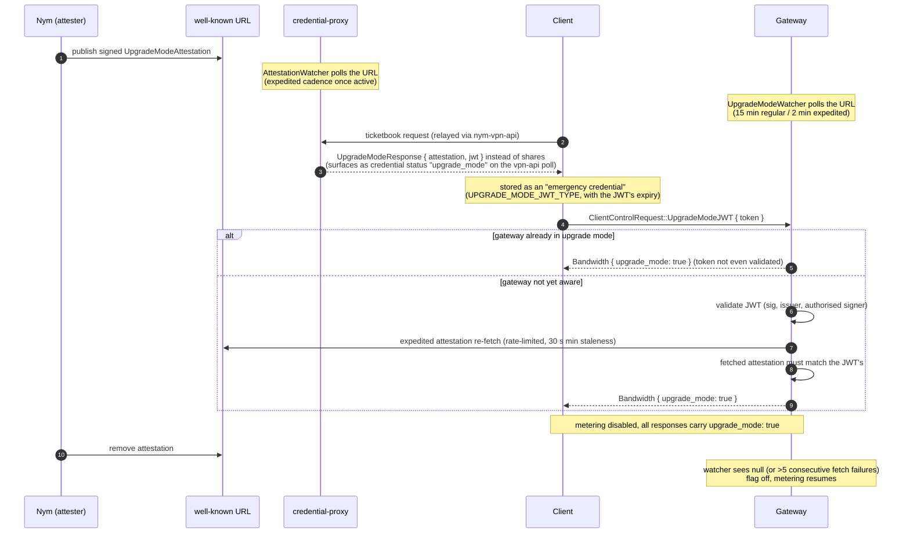

# Upgrade mode (the JWT bypass)

Upgrade mode is a network-wide escape hatch that keeps bandwidth flowing **without tickets** while the Nyx chain is undergoing an upgrade. During a chain upgrade the entire ticketbook pipeline stalls: deposits cannot be made, signers cannot verify deposits, and clients cannot restock. Spending already-issued tickets at gateways would still work (verification is offline-capable), but clients would run dry. Upgrade mode replaces payment with an authorisation: a Nym-signed attestation, relayed to clients as a JWT, that tells gateways to stop metering until the upgrade is over.

Primitives live in `common/upgrade-mode-check`; gateway-side state in `common/credential-verification/src/upgrade_mode.rs`; the watchers in `gateway/src/node/upgrade_mode/watcher.rs` and `nym-credential-proxy/.../attestation_watcher.rs`.

## Trust chain

1. **Pinned attester key + well-known URL.** Network defaults (`common/network-defaults/src/mainnet.rs`, env-overridable) carry `UPGRADE_MODE_ATTESTATION_URL` (`https://nymtech.net/.wellknown/upgrade-mode/attestation.json`) and `UPGRADE_MODE_ATTESTER_ED25519_BS58_PUBKEY`, the ed25519 key expected to sign attestations. Gateways additionally persist both in their config (`nym-node/src/config/gateway_tasks.rs`, `UpgradeModeWatcher`).
2. **The attestation.** To begin upgrade mode, Nym publishes an `UpgradeModeAttestation { starting_time, attester_public_key, authorised_jwt_issuers: [ed25519 pks], signature }` at that URL; removing the file (serving `null`) ends it. Consumers verify the signature *and* check the embedded attester key against their pinned expectation, so the attestation is only as trustworthy as the pinned key.
3. **The JWT.** The credential proxy wraps the attestation in an EdDSA JWT (`issuer = "nym-credential-proxy"`, a configured validity, the signer's public key in the token header) and hands it to clients. A JWT is only accepted if its signing key appears in the attestation's `authorised_jwt_issuers` list, which is how the attester delegates "who may relay this to clients".

## The flow

## Gateway behaviour

- **Watcher.** If enabled in config, the gateway polls the attestation URL every 15 min (2 min once upgrade mode is active), verifies each retrieved attestation against its pinned attester key, and flips a process-wide atomic flag (`UpgradeModeState`). A clean `null` disables immediately; retrieval *errors* only disable after more than 5 consecutive failures, guarding against a transiently broken URL ending upgrade mode by accident.
- **Client-triggered activation.** A client's `UpgradeModeJWT` can only *accelerate* discovery, never substitute for the gateway's own view: the gateway validates the JWT, then performs its own expedited fetch (rate-limited to one per 30 s across all clients, `upgrade_mode_min_staleness_recheck`) and requires the independently fetched attestation to equal the one embedded in the JWT (`try_enable_via_received_jwt`). A gateway already in upgrade mode short-circuits without validating anything.
- **Effect while enabled.** Bandwidth metering is disabled across all paths: the websocket handler stops decrementing on sphinx forwarding and answers bandwidth queries with `max(current, threshold + 1)` so that *old* clients (unaware of the `upgrade_mode` response field) never think they need to send a ticket; WireGuard peer enforcement is skipped; WG registration accepts `BandwidthCredential::UpgradeModeJWT` in place of a ticket; the authenticator accepts the JWT over the mixnet; and the private-metadata API exposes a `check_upgrade_mode` request. Every relevant response (`Register`, `Authenticate`, `Bandwidth`, `Send`) carries an `upgrade_mode: bool` so aware clients stop spending tickets. Tickets already verified are unaffected; nothing about stored ticketbooks changes.

## Client behaviour

The bandwidth controller treats the JWT as an alternative credential: a fetch can yield `NymCredential::UpgradeModeToken { jwt, expiration }` instead of a ticketbook, stored in credential storage as an *emergency credential* (`UPGRADE_MODE_JWT_TYPE`) with the JWT's expiry. Readiness reporting treats "upgrade mode token present" as its own ready state (so a connect may proceed with zero ticketbooks), and the stored token is served to connection code via `get_upgrade_mode_token`. Presenting it requires a gateway protocol version that supports upgrade mode (`supports_upgrade_mode`).

### How the production VPN stack drives it

The driving logic lives in `nym-vpn-client/nym-vpn-core` (external repo, pinned to a monorepo release branch); summarised here because it determines which of the monorepo's mechanisms are actually exercised.

**Acquisition.** There is no dedicated attestation endpoint for apps. The JWT rides the normal zk-nym request: when the proxy answers `obtain-async` with the upgrade-mode response, nym-vpn-api stores it on the credential row (`status: upgrade_mode`), and the app's poll of `GET .../zknym/{id}` returns `{ upgrade_mode_attestation, upgrade_mode_jwt }`. The client deliberately does **not** verify the attestation's signature (source comment: "we trust our credential-proxy -> VPN API chain to have validated that the attestation had been signed with expected key"); it only decodes the JWT claims to read the expiry, then stores it as the emergency credential. The gateways remain the only parties that validate the full trust chain independently.

**Presentation - what is live and what is not.** Per gateway, the WireGuard bandwidth monitor consults the gateway-reported `upgrade_mode` flag (returned on bandwidth query/top-up responses) before each top-up:

- gateway reports `true`: the client does nothing at all - no ticket spent, no JWT sent; the flag alone suffices (a client may legitimately hold no JWT here, e.g. if it had enough stored books to never ask the vpn-api).
- gateway reports `false` but the client holds a JWT and was not previously seeing upgrade mode: the client *pushes* the JWT to the gateway via the private-metadata `check_upgrade_mode` request (or the legacy authenticator equivalent) to trigger the gateway's own expedited re-check, and still spends a ticket for this round.
- gateway reports `false`, the client holds a JWT, and the previous check saw upgrade mode: upgrade mode has ended; the client clears its emergency credentials and resumes normal ticket top-ups.
- gateway too old to report the flag: the client falls back to spending tickets.

Two monorepo mechanisms are currently *not* exercised by this client: the mixnet-websocket `ClientControlRequest::UpgradeModeJWT` sender (`send_upgrade_mode_jwt`) has no caller, so mixnet-mode bandwidth claims always spend a ticket; and the LP registration path explicitly does not support upgrade mode and always spends its registration ticket (only the legacy authenticator-over-mixnet registration can substitute `BandwidthCredential::UpgradeModeJWT` for it). On upgrade-mode exit the JWT simply expires or is cleared as above, after which normal ticket spending resumes.

## Relationship to the ticketbook lifecycle

Upgrade mode is orthogonal to DKG epochs: it does not touch keys, epochs, or issued books. It exists because a chain upgrade makes both deposits and (chain-dependent) issuance impossible; note that the credential proxy also refuses regular issuance while it holds an attestation, returning the JWT response instead, even if some signers were still reachable. Verification of the trust chain is anchored solely in the pinned attester public key; there is no on-chain component (deliberately, since the chain is the thing being upgraded).
