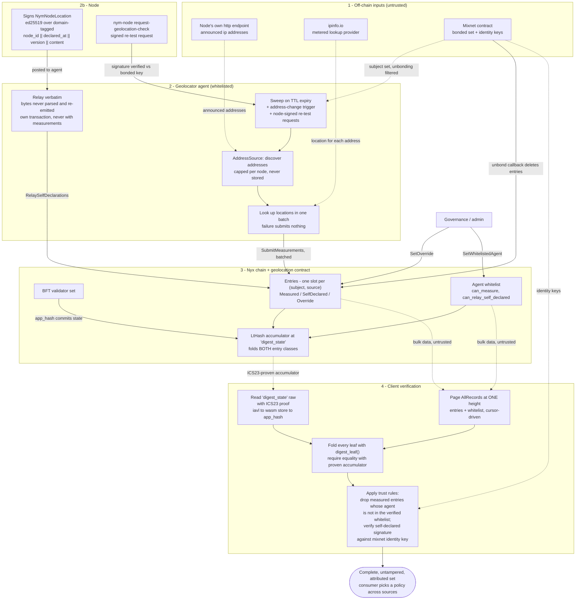

# Verifiable Node Geolocation

Where a nym-node is, recorded on chain so that a client can check it rather than trust whoever served it.

This replaces the geolocation that lived inside `nym-node-status-api`, where results reached consumers by two routes that could disagree, a restart served `geoip: null` until the next sweep refilled an in-memory cache, and an unresolvable node produced an empty country code that silently dropped a gateway from the dVPN directory.

## Trust model

### Core principle

The contract stores **opinions, not a verdict**. One node may carry several answers at once: one per measuring agent, plus its own signed declaration, plus an admin override. Choosing between them is the consumer's job and is deliberately unspecified here, because the right policy differs between a dVPN client picking an exit and an explorer drawing a map.

What the contract guarantees is narrower and more useful: every entry says who asserted it, when it was checked, and nothing about it can be altered or omitted without the digest changing.

### Three sources, three different things to trust

| Source | Who asserts it | What authenticates it | Slots per node |
|---|---|---|---|
| `Measured { method, agent }` | a whitelisted agent | the chain: the writer is the transaction sender | one per agent |
| `SelfDeclared` | the node itself | an ed25519 signature by the node's identity key | exactly one |
| `Override` | governance | admin role on the contract | exactly one |

A measured entry carries no signature of its own, and does not need one: the agent's address is in the storage key, and the chain already authenticated it as the sender. A self-declaration carries a signature because the agent relaying it is a **courier, not a witness**, which is also why the slot is keyed without the relayer. Two agents relaying the same artifact write the same entry rather than two competing ones. An override names the admin *role* rather than an address, so rotating the admin does not orphan existing overrides.

### Authorisation is evaluated at read time

Whitelist membership is checked on every write, never trusted from when an entry was first accepted. Removing an agent therefore takes effect immediately, with nothing to invalidate and nothing to enumerate.

The consequence for a client is that the whitelist is **part of the data it must verify**, not configuration it can assume. A measured entry proves only that some address wrote it; whether that address was authorised is a separate fact, which is why the whitelist is a second digest-committed entry class and why the global enumeration covers both. A reader that could not see the authorised set would have no way to reject entries laundered through a fabricated one.

### The digest

Both entry classes fold into a single `LtHash16` accumulator, maintained incrementally: an insert adds its leaf, a delete subtracts it, a replacement subtracts the old leaf and adds the new one. LtHash is commutative, so batch ordering never affects the result and two agents submitting overlapping batches in different orders converge.

The **whole accumulator** lives at a fixed raw storage key, `digest_state`, written verbatim rather than through `cw-storage-plus`, so the proven key is exactly those bytes after the contract's storage prefix. This matters because CosmWasm smart queries carry no proof at all: only a raw store read yields an ICS23 proof. The `Digest {}` query serves the 32-byte collapse of that same value as a convenience for consumers that only need to compare, never as something to prove against.

Each leaf commits the key, the payload bytes, `checked_at`, and a class tag, with every variable-length field length-prefixed. `checked_at` being in the leaf is what stops a stale entry from being presented as fresh.

### What is deliberately absent

**No node's IP address is ever written on chain, in any form.** Not the address, and not a hash of it: IPv4 has 2^32 addresses, so an unsalted hash is brute-forceable, and a contract-wide salt is public. A hash of an IP is an IP.

The one stored value that resembles an address is the ASN record's `route`, the provider's announced prefix. It is the same string for every node behind that block, so it names the network rather than anything in it, and it is kept because node status API already serves it.

The service holds addresses in memory only, for the duration of a measurement and as the baseline its change detection compares against. They are never persisted, never logged, and never exposed on any endpoint.

The cost is that change detection is agent-local and lost on restart. A restarting agent reloads what it already submitted from the contract, so only genuinely expired entries come due; a *fresh* agent measures everything, spread over several sweeps by a per-sweep ceiling.

### Replay and freshness of self-declarations

A self-declaration is accepted only when its `declared_at` is strictly greater than the one already stored, which makes replay of a superseded artifact impossible, and only when it does not exceed block time by more than `MAX_SKEW`, which stops a far-future timestamp from freezing the slot forever. There is no lower bound: monotonicity alone governs the past.

## End-to-end flow

Legend: **solid arrows** are a trusted write or a trust input; **dotted arrows** are data fetched from an untrusted source and verified cryptographically after the fact.

## How to read it

1. **Inputs are untrusted.** A node's announced addresses are unverified input, so they are capped per node before anything metered is spent on them. The location provider is likewise untrusted, and an address it cannot place produces no entry rather than an empty one.
2. **The agent measures and submits.** Bonded nym-nodes are the subject set. Measurements go up in batches sized to the contract's limit, each batch its own transaction, pre-validated so an entry the contract would reject cannot take a batch down with it.
3. **The node speaks for itself, optionally.** It signs a `NymNodeLocation` over domain-separated bytes and posts it to an agent, which verifies it exactly as the contract will and then forwards the bytes **verbatim**. Nothing on that path decodes the payload, because JSON key order, whitespace and float formatting all vary between implementations, and a re-serialised payload would fail the node's own signature.
4. **The chain commits it.** Both entry classes fold into one accumulator, and the validator set's `app_hash` commits that state.
5. **The client verifies.** Everything above can be lied about by whoever serves it. What cannot be lied about is the accumulator, so the client pulls the full set from anywhere, folds it, and requires equality with the proven digest. That single comparison proves the set is both complete and untampered.

## Client verification flow

The one route that requires trusting nobody:

1. **Pick a height.** Every page must come from the same height or the fold will not match. The contract cannot pin a height for you, so this is the client's responsibility.
2. **Page `AllRecords`.** The cursor is a `RecordKey` that names which class it is in, so the scan crosses from location entries into the whitelist without the caller knowing there are two stores. Continue until the response carries no cursor.
3. **Read the digest with proof.** `abci_query` the raw key `digest_state` with `prove = true`, and verify the ICS23 chain up to an `app_hash` you have anchored independently. The value is the full accumulator, not the collapse.
4. **Fold and compare.** `LtHash16::new()`, add `digest_leaf()` of every record pulled, and require equality. A missing record, an altered payload, an altered `checked_at` or a forged whitelist entry all fail here.
5. **Attribute what survived.** Now, and only now, apply the trust rules: discard measured entries whose agent is absent from the whitelist you just verified or lacks `can_measure`, and verify each self-declaration's signature against the node's identity key from the mixnet contract.
6. **Choose a policy.** Multiple sources may disagree. That is by design; the contract records who said what, and the consumer decides.

The end-to-end recompute is pinned by `a_client_recomputes_the_digest_from_the_query_surface_alone`, which performs exactly these steps against both the proven raw accumulator and the `Digest` query's collapse, including a payload under a version the contract has never been taught to read.

## Implementation map

| Concern | Where |
|---|---|
| Shared types, payload, signing payload, leaf encoding | `common/cosmwasm-smart-contracts/geolocation-contract/` |
| Contract storage and digest maintenance | `contracts/geolocation/src/storage.rs` |
| Contract transactions | `contracts/geolocation/src/transactions.rs` |
| Contract queries, including `AllRecords` and `Digest` | `contracts/geolocation/src/queries.rs` |
| Storage keys a verifier pins | `constants::storage_keys` |
| Geolocator service | `nym-geolocator/` |
| Address discovery behind a swappable source | `nym-geolocator/src/node_scraper/address_source/` |
| Re-test and relay endpoints | `nym-geolocator/src/http/` |
| Wire types and the node-side client | `nym-geolocator/nym-geolocator-requests/` |
| Node command to request a re-test | `nym-node/src/cli/commands/request_geolocation_check.rs` |
| Chain query and signing traits | `common/client-libs/validator-client/src/nyxd/contract_traits/geolocation_*.rs` |

## Status

The contract, the geolocator service and the node-side re-test command are implemented. Node-side production of the signed `NymNodeLocation` artifact is deferred: the relay path that consumes one is complete and verified on the service side, but nothing on a node emits one yet.

The address source is behind a trait so the directory contract's node-published information can replace scraping each node's HTTP endpoint, without the measurement, batching or submission paths changing.

Node status API still serves its own geolocation. Moving it onto the contract is a separate change: see [node-status-api-migration.md](./node-status-api-migration.md) for what is already in place, what that change has to decide, and the two constraints it inherits.
