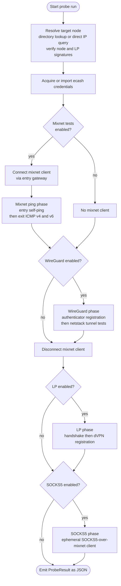

# Gateway Probe: Design and Rationale

The probe's job is narrow: given a target gateway and a `TestMode`, connect to it over every transport the mode calls for, and hand back one result.
`nym_gateway_probe::Probe` (`nym-gateway-probe/src/lib.rs`) carries that state across a run: the resolved `entry_node` and optional `exit_node` (both `TestedNodeDetails`), the `ProbeConfig`, the `NymNetworkDetails`, and a cached mixnet `topology` fetched once per run.

This document covers the entry points, test-mode gating, and phase order. The following documents cover the tests themselves and the result shape.

## Documents in this section

- [Probe tests](probe-tests.md): what each phase tests and how, from node resolution through mixnet ping, WireGuard, LP, SOCKS5, and the ports-check flow.
- [Result shape and consumers](result-and-consumers.md): `ProbeResult` and `PortCheckResult`, and the signed protocol the NS agent and the node status API use to run and submit a probe.

## Four entry points, one CLI subcommand each

`src/run.rs` defines four `clap` subcommands, each building a `Probe` a different way and calling a different `Probe` method:

| Subcommand | `Probe` method | Target | Directory lookup |
|---|---|---|---|
| `run-local` | `probe_run_locally` | Unannounced gateway, by IP | Direct HTTP query to the node (`query_gateway_by_ip`) |
| `run` | `probe_run` | Bonded gateway, by identity | `nym-api` (`NymApiDirectory`) |
| `run-ports` | `Probe::run_ports` (associated function) | Bonded gateway | `nym-api` |
| `run-agent` | `probe_run_agent`, via `new_for_agent` | Bonded gateway | `nym-api` |

`run-local` cannot run the mixnet phases: it has no directory entry to build a mixnet client against, so `probe_run_locally` never opens one, and `do_probe_test` receives `None` in its place. LP registration still runs, because it is a direct TCP session to the node's LP control port, and `query_gateway_by_ip` builds `TestedNodeLpDetails` from the node's self-reported, signature-verified `lewes_protocol` block the same way the directory path does.

`run-agent` forces `TestMode::All` (`Probe::new_for_agent`, `nym-gateway-probe/src/lib.rs`), so an agent-driven audit always exercises every transport regardless of what the agent's caller asked for. It also takes a different credential path: `CredentialArgs` instead of `CredentialMode` (see below), and `Ephemeral` mixnet storage instead of on-disk storage, because the agent has no persistent identity to keep between runs.

`run-ports` and its agent counterpart, `Probe::run_ports_for_agent`, are a separate code path from the other three. They never call `do_probe_test`; they build their own mixnet client, warm up routes with a self-ping, then run a dedicated authenticator-registration-and-port-scan loop (`Probe::port_check_after_connect`). See [Probe tests](probe-tests.md#the-ports-check-flow) for the retry and target-selection detail.

## Test-mode gating

`TestMode` (`src/config/test_mode.rs`, default `Core`) gates which phases a `run`, `run-local` or `run-agent` invocation actually performs:

| Test mode | Mixnet ping | WireGuard | LP | SOCKS5 |
|---|:---:|:---:|:---:|:---:|
| `core` (alias `mixnet`) | yes | yes | no | no |
| `wg-mix` | no | yes | no | no |
| `wg-lp` | no | yes | yes | no |
| `lp-only` | no | no | yes | no |
| `socks5-only` | no | no | no | yes |
| `all` | yes | yes | yes | yes |

Four predicate methods on `TestMode` read this table at each gate: `mixnet_tests()`, `wireguard_tests()`, `lp_tests()`, `socks5_tests()`. A fifth, `needs_mixnet()`, is broader than `mixnet_tests()`: it also covers `wg-mix`, because WireGuard registers through the authenticator over an already-connected mixnet client even when the mixnet ping phase itself is skipped. `TestMode::from_str` accepts the canonical spellings above plus `snake_case` and no-separator variants, case-insensitively.

Exit-policy port checking is not a `TestMode` value. It is the separate `run-ports` subcommand, noted as such in the `test_mode.rs` module doc.

## Phase order

`do_probe_test` (`nym-gateway-probe/src/lib.rs`) runs the gated phases in one fixed order, for both `run` and `run-agent`:

The mixnet client, when one exists, is held open through the WireGuard phase and disconnected before LP and SOCKS5 run. Neither of those two later phases reuses it: LP registration opens its own raw TCP session to the node's LP control port, and the SOCKS5 phase builds a fresh, ephemeral SOCKS5-over-mixnet client of its own. A full `all` run against a bonded gateway therefore opens two independent mixnet sessions to the same node, one before the disconnect and one after.

A failure in one phase does not stop the rest. WireGuard and LP failures fall back to their default (all-false) result structs. A SOCKS5 failure is logged and recorded in the result; it does not abort or alter the phases that already ran.

### Entry-under-test bookkeeping

`entry_under_test = self.exit_node.is_none()` (`do_probe_test`). When no separate exit node was supplied, the entry gateway under test doubles as the exit, and a connection failure at that gateway is reported through `Entry::fail_to_connect()`. When a distinct exit node is supplied, the same low-level failure at the entry is instead recorded as `Entry::EntryFailure`, because the node actually under test is the exit, and the entry gateway was only ever a means to reach it. Both are `Entry` variants (`src/common/types.rs`); see [Result shape and consumers](result-and-consumers.md) for the full type.

## Credential handling

Two argument groups feed ecash credentials into a run, chosen by which entry point is in use:

- `CredentialMode` (`src/config/credentials.rs`), for `run` and `run-local`. A required, mutually exclusive `clap` argument group: `--use-mock-ecash` or `--mnemonic`. In mnemonic mode, `CredentialMode::acquire` checks the on-disk credential store, and if it holds fewer than one ticketbook, acquires one each of `V1MixnetEntry`, `V1WireguardEntry` and `V1WireguardExit` (`acquire_bandwidth`, `src/common/bandwidth_helpers.rs`), retrying up to 50 times with a one-second backoff. It treats a `NyxdError` whose log line contains `account sequence mismatch` as retryable, the signature of another process sharing the same mnemonic.
- `CredentialArgs` (`src/config/credentials.rs`), for `run-agent` only. It takes `--ticket-materials` (bs58-encoded, versioned) and `--ticket-materials-revision`, and `import_credential` decodes and imports them into an ephemeral mixnet client's credential store (`import_bandwidth`, `src/common/bandwidth_helpers.rs`). The agent neither needs nor accepts a mnemonic or mock-ecash flag: the node status API already paid for and attached the tickets before handing the agent its assignment. See [Result shape and consumers](result-and-consumers.md#how-the-agent-and-the-node-status-api-interact).

Both a mock and a real credential path exist because the probe runs in two very different settings: a developer or CI environment with a mock gateway (`--use-mock-ecash`, which requires the gateway itself to have been started with a matching mock-ecash flag), and a real network where every mixnet, WireGuard and LP action costs a genuine ecash ticket.

## Go netstack dependency

The WireGuard tunnel tests (DNS resolution, ping ratios, download, and the port scan) run through a small Go library, `netstack_ping/`, built by `build.rs` into a static C archive and linked into the Rust binary at compile time. `build.rs` only builds it for `macos` and `linux` targets. Rust calls into it over a blocking FFI boundary, so every call site wraps it in `tokio::task::spawn_blocking`; see [Probe tests](probe-tests.md#wireguard) for the call itself.

`build.rs` also generates `EXIT_POLICY_PORTS`, the canonical port list `run-ports --check-all-ports` uses, by parsing the `PORT_MAPPINGS` associative array out of `scripts/nym-node-setup/network-tunnel-manager.sh` at build time. The generated list is sorted and de-duplicated; a port range in the shell script contributes its two endpoints. This keeps the probe's exit-policy port list in lockstep with the shell script that configures a node's firewall, without hand-maintaining a second copy.
