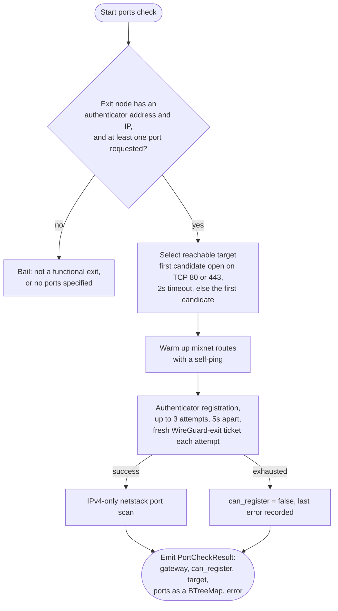

# Probe Tests

This document covers what each phase of a probe run tests and how, in the order [Design and rationale](README.md#phase-order) sets out: node resolution and credentials, mixnet ping, WireGuard, LP registration, SOCKS5, and the separate ports-check flow.

## Node resolution

A probe run starts by turning a gateway identifier into a `TestedNodeDetails` (`src/common/nodes.rs`): the exit router address, network-requester address, authenticator address and version, an IP address, and optional LP connection details.

For a bonded gateway, `NymApiDirectory::new` fetches every described node from `nym-api` (`get_all_described_nodes_v2`) once, up front. `entry_gateway` and `exit_gateway` look a node up by identity and check its declared role: entry lookups require `declared_role.entry`, exit lookups require `declared_role.can_operate_exit_gateway()`. `DirectoryNode::to_testable_node` then converts the node's self-description, and requires at least one host IP address, failing the conversion otherwise.

For an unannounced gateway (`run-local`), `query_gateway_by_ip` queries the node's own HTTP API directly, trying `http://<addr>:8080`, `https://<addr>` and `http://<addr>` in turn when no port was given. It requires the node's health check to report `up`, verifies the host-information signature (`verify_host_information`), and requires `roles.gateway_enabled`. It bails on the first candidate address that fails any of those checks and only returns success once one address passes all of them.

Both paths apply the same LP check: when the node's description carries a `lewes_protocol` block, `to_testable_node` verifies its signature against the node's identity (`lp_data.verify(&identity)`) before trusting any of it, and bails the whole conversion if verification fails. A node with no `lewes_protocol` block simply has no `TestedNodeLpDetails`; the LP phase handles that case explicitly (see [LP registration](#lp-registration) below).

## Credential acquisition

Before any test phase runs, the probe makes sure it can pay for one. See [Design and rationale, Credential handling](README.md#credential-handling) for the two argument groups and their acquisition and import paths.

## Mixnet ping

Gated by `TestMode::mixnet_tests()` (`core` and `all`). Implemented in `do_ping`, `do_ping_entry`, `connect_exit` and `do_ping_exit` (`src/common/probe_tests.rs`).

The entry phase sends the client's own mixnet address a self-ping (`self_ping_and_wait`) through the entry gateway and waits for it to come back. A failure here is reported as `Entry::fail_to_connect()` when the entry gateway is the node under test, or `Entry::EntryFailure` when a separate exit node is under test and the entry only served as a relay to it (see [Entry-under-test bookkeeping](README.md#entry-under-test-bookkeeping)). Success sets `Entry::success()`, both `can_connect` and `can_route` true.

When the target node has an exit router address, the probe then connects to it as an IP packet router (`IprClientConnect::connect`) and, on success, sends ICMP echo requests over the resulting tunnel IPs. It sends ten IPv4 echoes each to the IPR's own tun-device address and to an external address (`8.8.8.8`), and ten IPv6 echoes each to the IPR's tun-device address and to an external address (`2001:4860:4860::8888`). It then listens on the mixnet client for up to two seconds, decoding any bundled IP packets and checking each one for an ICMP echo-reply beacon (`icmp::check_for_icmp_beacon_reply`). Whichever of the four reply kinds it sees during that window sets the matching `Exit` flag: `can_route_ip_v4`, `can_route_ip_external_v4`, `can_route_ip_v6`, `can_route_ip_external_v6`. `can_connect` on `Exit` is set as soon as the IPR connection itself succeeds, independently of which pings come back.

## WireGuard

Gated by `TestMode::wireguard_tests()` (`core`, `wg-mix`, `wg-lp`, `all`). Implemented in `wg_probe` (`src/common/probe_tests.rs`) and `run_tunnel_tests` (`src/common/wireguard.rs`).

`wg_probe` first runs the authenticator registration handshake over the mixnet: it sends an `Initial` registration message carrying a fresh x25519 public key, and, on a `PendingRegistration` reply, verifies it, attaches an ecash credential (`V1WireguardEntry` when the entry gateway is under test, `V1WireguardExit` otherwise), and finalises registration. The message shape is versioned: the probe builds a version-specific `InitMessage` for authenticator versions V2 through V6, and bails immediately (`"unknown version number"`) for V1 or an unrecognised version. `can_register` on the eventual `WgProbeResults` is set from this handshake succeeding, not from anything the netstack call below reports.

On success, the probe has the gateway's WireGuard public key, the client's assigned private IPv4 and IPv6 addresses, and the WireGuard port. It builds the endpoint address with `SocketAddr::new(gateway_ip, port).to_string()`, which brackets an IPv6 gateway address correctly (`[addr]:port`); a hand-built `format!("{ip}:{port}")` would have produced an unparseable string for any IPv6 gateway, because the address's own colons would collide with the port separator. No node currently advertises an IPv6 address first, so this was previously a latent bug, pinned by the `wg_endpoint_brackets_ipv6` unit test.

The probe then runs the tunnel tests through the Go netstack library on `tokio::task::spawn_blocking`, since the call crosses a blocking FFI boundary. `run_tunnel_tests` issues one IPv4 request and, unless `port_check_only` is set, one IPv6 request, each recording: a metadata query (`can_query_metadata`, IPv4 only), handshake success, DNS resolution, ping success ratios against a configured set of hostnames and IPs (`safe_ratio`, which returns `0.0` rather than a division-by-zero `NaN` when nothing was sent), and a file-download duration and size. In `port_check_only` mode, the IPv4 request also carries the per-port TCP scan results, and the function returns immediately after that request, skipping IPv6 entirely, because a ports check only needs one working path to prove the ports are open.

## LP registration

Gated by `TestMode::lp_tests()` (`wg-lp`, `lp-only`, `all`). Implemented in `lp_registration_probe` (`src/common/probe_tests.rs`).

When the tested node has no LP data, `do_probe_test` skips `lp_registration_probe` entirely and reports `LpProbeResults { can_connect: false, can_handshake: false, can_register: false, error: Some("no LP data") }` directly.

When it does, the probe builds an `LpGatewayClient` over a direct TCP connection and, under a 15-second timeout, performs the LP handshake (`perform_handshake`). Success sets both `can_connect` and `can_handshake`, because in the LP client's packet-per-connection model a handshake cannot succeed without an implicit connection. Failure, including a timeout, records the error and returns immediately without attempting registration.

On a successful handshake, the probe generates a fresh WireGuard keypair and, under a second 15-second timeout, calls `LpDvpnRegistrationClient::register` with ticket type `V1WireguardEntry`. Success sets `can_register` and the probe logs the returned gateway data (public key, optional PSK, assigned private IPv4 and IPv6, and endpoint) for operator visibility; none of that data reaches the JSON result.

## SOCKS5

Gated by `TestMode::socks5_tests()` (`socks5-only`, `all`). Implemented in `do_socks5_connectivity_test` (`src/common/probe_tests.rs`) and `HttpsConnectivityTest` (`src/common/socks5_test/mod.rs`).

This phase only runs when the exit node advertises a network-requester address; otherwise `do_probe_test` logs a warning and leaves `probe_result.outcome.socks5` unset. It builds its own ephemeral SOCKS5-over-mixnet client, pinned to the entry gateway (`request_gateway`), with minimum gateway performance forced to `0` and the egress-epoch-role filter ignored, so that a gateway which would otherwise be filtered out of a normal client's topology is still reachable for testing. It fetches its own topology rather than reusing any topology cached earlier in the run, because the tested gateway might be filtered out of a topology fetched under default settings.

A connection failure at this point returns `Socks5ProbeResults::error_before_connecting` and the phase ends there; it does not abort the rest of the probe run. On a successful connection, `HttpsConnectivityTest::run_tests` issues up to `test_count` HTTPS requests (an `eth_chainId` JSON-RPC call, with a configurable list of endpoints to fall back across on failure), stopping early once the number of failed attempts exceeds `failure_count_cutoff`. The aggregated `HttpsConnectivityResult` reports overall success, the last HTTP status code seen, the average latency across the successful attempts only, which endpoint was last used, and any errors collected along the way.

## The ports-check flow

`run-ports` and its agent counterpart, `run_ports_for_agent`, are a distinct code path (`Probe::run_ports`, `Probe::port_check_after_connect`, `src/lib.rs`). They do not go through `do_probe_test`, `TestMode`, or the entry/exit ping and LP phases at all.

`PortCheckSetup::new` rejects a target with no authenticator address or IP as "not a functional exit", and rejects a request for zero ports. When the operator supplied more than one comma-separated port-check target (`--use-target`), `port_check_after_connect` tries each in order with a two-second TCP connect to port 80 or 443, and uses the first one that answers; if none do, it falls back to the first target in the list regardless.

Authenticator registration in this flow is its own retry loop (`run_port_scan_with_retries`), separate from the single-attempt handshake the standard WireGuard phase uses: up to three attempts, five seconds apart, fetching a fresh `V1WireguardExit` ecash ticket for every attempt, because a spent or expired ticket from an earlier attempt cannot be reused. `can_register` is only set true once a `wg_probe` call actually returns `can_register: true`; three exhausted attempts leave it false, with the last error recorded on the result.

The netstack call in this flow always runs with `port_check_only: true`, so it only scans IPv4 and only reports the port results, skipping the ping, DNS and download checks the standard WireGuard phase collects. The output `ports` map is a `BTreeMap<String, bool>`, keyed by port number as a string, so that a downstream signed submission serialises it in a stable, deterministic order every time.
