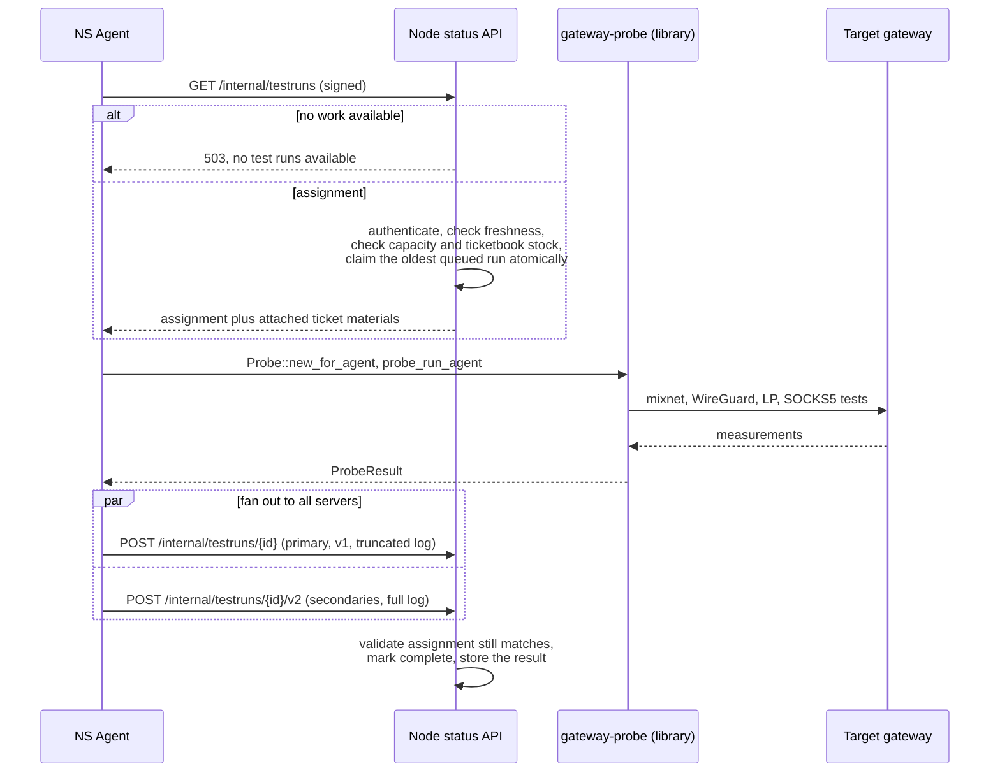

# Result Shape and Consumers

A probe run emits exactly one JSON value on stdout: a `ProbeResult` for `run`, `run-local` and `run-agent`, or a `PortCheckResult` for `run-ports`. Both types live in `src/common/types.rs` and derive `Serialize`/`Deserialize`. Dated 2026-09-18, the `utoipa` `ToSchema` derive sits on the per-transport component types (`ProbeOutcome`, `Entry`, `EntryTestResult`, `Exit`, `WgProbeResults`, `LpProbeResults`, `Socks5ProbeResults`, and `HttpsConnectivityResult`), not on the two top-level `ProbeResult` and `PortCheckResult` wrappers, so a service that consumes them, such as the node status API, gets a generated OpenAPI schema for the sub-results but hand-writes the outer envelope.

## `ProbeResult`

```
ProbeResult {
    node: String,           // identity of the node under test
    used_entry: String,     // identity of the gateway actually used as mixnet entry
    outcome: ProbeOutcome {
        as_entry: Entry,
        as_exit: Option<Exit>,
        socks5: Option<Socks5ProbeResults>,
        wg: Option<WgProbeResults>,
        lp: Option<LpProbeResults>,
    }
}
```

`node` and `used_entry` are the same identity unless the caller passed a separate exit gateway (`--exit-gateway` / `--exit-gateway-ip`); see [Design and rationale, Entry-under-test bookkeeping](README.md#entry-under-test-bookkeeping) for how that split changes which failure variant `as_entry` takes. Each of the four `Option` fields on `ProbeOutcome` is `None` when the corresponding `TestMode` gate was off for that run, not just when the test failed, so a consumer can tell "not attempted" apart from "attempted and failed" by checking for `None` versus a populated struct with failure flags.

- `Entry` (`src/common/types.rs`) is untagged over three states: `Tested(EntryTestResult { can_connect, can_route })`, `NotTested`, and `EntryFailure`. The constructors `Entry::success()`, `Entry::fail_to_connect()` and `Entry::fail_to_route()` build the `Tested` variant with the matching flag combination.
- `Exit` carries `can_connect` plus the four per-address-family routing flags described in [Probe tests, Mixnet ping](probe-tests.md#mixnet-ping). `Exit::from_ping_replies` and `Exit::fail_to_connect` are its two constructors.
- `WgProbeResults` carries `can_register`, the IPv4 and IPv6 metadata/handshake/DNS/ping-ratio/download fields, and an optional `port_check_results: Option<BTreeMap<String, bool>>` that is only populated when a WireGuard run was itself a port-check-only call.
- `LpProbeResults` carries `can_connect`, `can_handshake`, `can_register` and an optional `error`.
- `Socks5ProbeResults` wraps a `bool` (`can_connect_socks5`) and an `HttpsConnectivityResult` (success, status code, average latency, endpoint used, and any errors); see [Probe tests, SOCKS5](probe-tests.md#socks5).

## `PortCheckResult`

```
PortCheckResult {
    gateway: String,
    can_register: bool,
    port_check_target: String,
    ports: BTreeMap<String, bool>,   // port number (as a string) -> open
    error: Option<String>,
}
```

`ports` is a `BTreeMap` rather than a `HashMap` specifically so that a downstream bincode-serialised, signed submission has one canonical byte representation regardless of insertion order. `PortCheckResult::closed_ports()` gives the failed ports back as `u16`s, skipping and logging any key that fails to parse. A separate summary type, `PortsCheckSummary`, reduces a full `PortCheckResult` to `{ all_pass, error, port_check_target, failed_ports }` for callers that only need a pass/fail view; `all_pass` requires `can_register`, an empty `failed_ports` list, and a non-empty `ports` map, so a scan that registered but checked zero ports does not read as a pass.

## How the agent and the node status API interact

The agent is the bridge between the probe library and the node status API. Every invocation is one request-run-submit cycle; an external scheduler decides when to run the agent again. All agent-to-API traffic is ed25519-signed: the payload is bincode-serialised and signed, the agent's public key travels inside the payload, and the API checks the signature and the key against its own whitelist.



Ticket materials pay for the run. The node status API keeps its own buffer of threshold-signed ecash ticketbooks and attaches materials to the assignment; the agent imports them through `CredentialArgs::import_credential` rather than acquiring anything itself. See [Design and rationale, Credential handling](README.md#credential-handling) for the import path, and the [node status API](../../services/node-status-api/README.md) for how that buffer is stocked.

A ports check follows the same shape over a separate pair of routes, `GET /internal/testruns/ports-check` and `POST /internal/testruns/{id}/ports-check/v2`, and the API stores only the compact `PortCheckResult`; it does not persist a probe log for a ports check the way it does for a standard run.

The full detail of the API side, the assignment query, the freshness and capacity gates, and the ticketbook buffer itself, belongs to the [node status API](../../services/node-status-api/README.md) node, not here. This document stops at the boundary the probe's own result types define.
