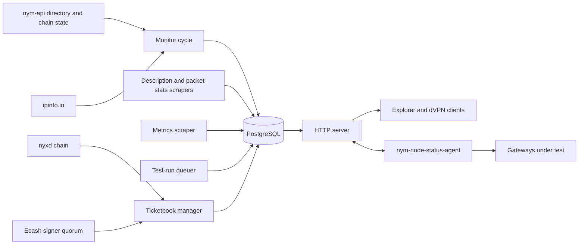

# Node Status API: Design and Rationale

The node status API answers one question for every other part of the network that needs it: what does the Nym node directory look like right now, and which of those nodes actually work? It runs as a single binary. That binary hosts an axum HTTP server and six independent background workers under one `nym_task::ShutdownManager`, all sharing one PostgreSQL pool (`nym-node-status-api/nym-node-status-api/src/main.rs`).

## Four subsystems, one store

The service is easiest to read as four subsystems that only talk to each other through the database:

1. **The monitor cycle.** A timed loop pulls the node directory and chain bond state from nym-api, geolocates nodes against `ipinfo.io`, and writes gateways, nym-nodes, families, delegations and a network summary. Two further scrapers (descriptions, packet stats) and a metrics scraper run on their own schedules against the same node set. See [Monitor cycle](monitor-cycle.md).
2. **The HTTP surface.** An axum server reads that store, mostly through short-lived caches, and answers the public `/v2/*`, `/explorer/v3/*` and `/dvpn/v1/*` routes plus the authenticated `/internal/testruns*` routes. See [HTTP surface](http-surface.md).
3. **Persistence.** One PostgreSQL schema, one migration set, shared by every writer above and every reader below. Column-level ownership matters here: three different workers write different columns of the same `gateways` row without coordinating. See [Persistence](persistence.md).
4. **Test-runs and ticketbooks.** A queuer enqueues probe and ports-check work for bonded gateways. External `nym-node-status-agent` processes claim that work over the authenticated internal API, run the probe, and submit signed results. Each claim needs an ecash ticket, so a ticketbook manager keeps a private buffer stocked by depositing on `nyxd` and collecting threshold-signed wallets from the ecash signer quorum. See [Test-runs](testruns.md) and [Ticketbook issuance and geodata](ticketbook-and-geodata.md).

## Why one process

Every worker keeps its own timed loop and its own failure-retry delay rather than sharing a scheduler (`openspec/specs/architecture/spec.md`). A cycle that fails partway leaves whatever it already committed in place: nothing rolls a cycle back, and nothing marks a partial write as unusable. A reader can therefore see a gateway snapshot from one monitor cycle sitting next to a probe result from an entirely different test run, or a nym-nodes table refreshed minutes after the gateways table that depends on it. This is a deliberate simplicity trade, not an oversight: see [Monitor cycle](monitor-cycle.md#a-cycle-is-not-atomic) for the exact ordering and its failure modes.

## Why the service tests gateways itself

Bond state and self-description are unverified claims. A gateway can bond, describe a working WireGuard endpoint, and still be unreachable. Nothing else in the network measures that from an outside vantage point on a schedule. The node status API fills that gap by running its own agents, and it treats the results as the compatibility surface the dVPN directory depends on: `as_entry`, `as_exit`, `wg`, `socks5` and `lp` in the stored probe result flow, largely unchanged, into what NymVPN clients read. See [Test-runs](testruns.md) and [HTTP surface](http-surface.md#the-dvpn-directory-pipeline).

## Code

- `nym-node-status-api/nym-node-status-api/src/main.rs`: process wiring, in this order: tracing, CLI parsing, the PostgreSQL pool and migrations, the shared geodata and delegations caches, the description and packet-stats scrapers, the monitor, the test-run queuer, the metrics scraper, the ticketbook manager and its quorum checker, then the HTTP server.
- `src/monitor`, `src/node_scraper`, `src/metrics_scraper`: the ingestion workers.
- `src/http`: the axum server, its route builders, its models and its caches.
- `src/db`: the `sqlx` pool, the embedded migrations, and one query module per table area.
- `src/testruns`: the background queuer and the `/internal/testruns*` handlers' supporting logic.
- `src/ticketbook_manager`: the ecash ticketbook buffer, its storage layer, and the material-assignment path.
- `nym-node-status-agent`, `nym-node-status-client`: the external worker and the signed-request library it shares with the server side of the internal API.

## Documents in this section

- [Monitor cycle](monitor-cycle.md)
- [HTTP surface](http-surface.md)
- [Persistence](persistence.md)
- [Test-runs](testruns.md)
- [Ticketbook issuance and geodata](ticketbook-and-geodata.md)
