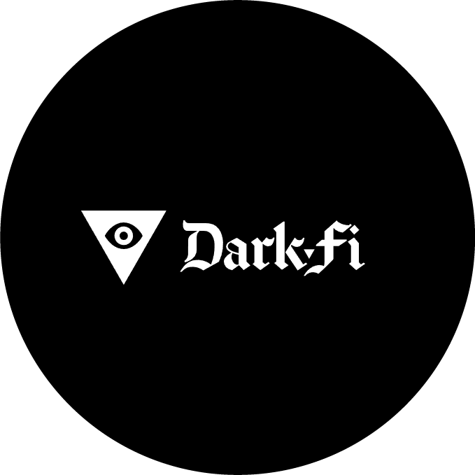
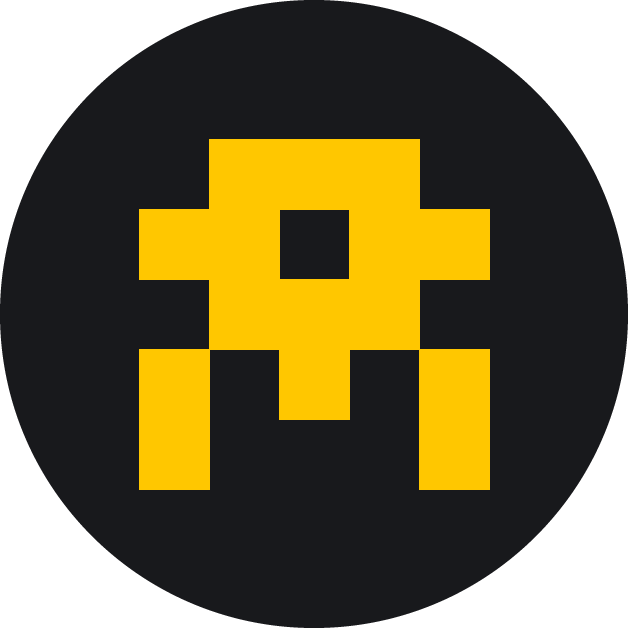

# Community Applications

If you would like to share your application here, please submit a pull request to the `main` branch of the `nymtech/dev-portal` [repository](https://github.com/nymtech/dev-portal).

## Pastenym

>A [pastebin](https://pastebin.com) inspired project, offer a solution for sharing text with Nym products to offer full anonymity, even on metadata level.

* [Github](https://github.com/notrustverify/pastenym)
* [Deployed App](https://pastenym.ch)

## Nostr-Nym

> [Nostr-nym](https://github.com/notrustverify/nostr-nym) offer a solution to use [Nostr](https://nostr.how/en/what-is-nostr) protocol by giving the possibility to run a relay on mixnet. By using a  nostr client compatible with the mixnet, users can protect their privacy to be able to use Nostr has the want, without being observed.

* [Github](https://github.com/notrustverify/nostr-nym)
* [Deployed App](https://nostrnym.pnproxy.org/) 
* [Documentation](https://blog.notrustverify.ch/nostr-relay-on-nym) 

##  Spook

> Ethereum RPC request mixer uses the Nym network mixing service to anonymize RPC requests to the Ethereum network without revealing sensitive data and metadata.
* [Github](https://github.com/EdenBlockVC/spook)
	  

##  Ethereum Transaction Broadcaster

> Ethereum Transaction Broadcaster that uses the Nym Mixnet to provide privacy and anonymity for transactions on the Ethereum network command-line interface.

* [Github](https://github.com/noot/nym-ethtx)

## NymDrive

> An open-source, decentralized, E2E encrypted, privacy friendly alternative to Google Drive/Dropbox, allowing for file encryption and decryption using the Nym Mixnet.
* [Github](https://github.com/saleel/nymdrive)
* [Demo](https://www.youtube.com/watch?v=5Rx73nw8NYI)
* [Presentation](https://docs.google.com/presentation/d/1MpvIK32Mx9VKLVfMTcvbeyrsKHHUsTvDQ-3n31dR0NE/edit#slide=id.p)

## Nym Dashboard

> Developed by No Trust Verify, this dashboard is a great tool to get information about the mixnet, gateways and mixnodes.
* [Deployed App](https://status.notrustverify.ch/d/CW3L7dVVk/nym-mixnet?orgId=1)

## Is Nym Up
 
> Explore whether we're up through IsNymUp, a tool that helps check the heath of the Nym network as well as some mixnet related statistics!
* [Deployed App](https://isnymup.com/)

## DarkFi over Nym

> DarkFi leverages Nym's mixnet as a pluggable transport for IRCD, their p2p IRC variant. Users can anonymously connect to peers over the network, ensuring secure and private communication within the DarkFi ecosystem.
* [Github](https://github.com/darkrenaissance/darkfi)
* [Documentation](https://darkrenaissance.github.io/darkfi/clients/nym_outbound.html)

## Nymstr email

> Experience secure and private email communication with ease using Nymstr email, which enables seamless transmission of emails over a SOCKS5 proxy and our NYM mixnet! 
* [Github](https://github.com/dial0ut/nymstr-email)

## Minibolt

> Proxies the clearnet connections of a Bitcoin node and its associated tools using the NYM mixnet.
* [Github](https://github.com/minibolt-guide/minibolt)
* [Documentation](https://v2.minibolt.info/bonus-guides/system/nym-mixnet#proxying-bitcoin-core)

## NymGraph

> NymGraph is a graphical chat client for Nym running on Ubuntu and Debian. Test it to chat over the Nym network!
* [Github](https://github.com/Tyz3/nymgraph)

   
  
# Community Guides

We aren't the only ones writing documentation: the Nym developer community is also a great source of guides and resources, some of which we've included here.

##  No Trust Verify

>No Trust Verify is a project that aims to build open-source, privacy-enhancing technologies that make it easier to use the Internet securely and anonymously. Their focus is on providing tools and services that make it simple for developers to create decentralized applications (dApps) that respect users' privacy.

* [Awesome Nym list](https://notrustverify.github.io/awesome-nym/) ([GitHub](https://github.com/notrustverify/awesome-nym))
* A lot of guides can be found on the [NTV Blog](https://blog.notrustverify.ch/)

## The Way of the NYMJA

by Pineapple Proxy🍍

>Born out of a study group from Nym's Shipyard Academy, Pineapple Proxy has emerged as a cluster of motivated and skilled individuals who see the new internet taking shape. With vibecare at the heart of their approach, this zesty collective is on a mission to make privacy convenient for everyone via content, new tools, events, and novel experiences. They believe in collective intelligence, empathy, and collaboration as the means by which privacy will become a meaningful reality.
* [Website](https://pnproxy.org/welcome.html) ([GitHub](https://github.com/Pineapple-Proxy-DAO/web))

