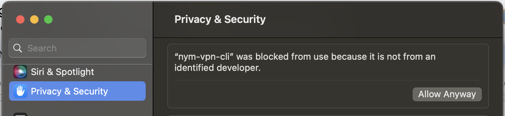

# NymVPN alpha

Nym has announced [NymVPN](https://nymvpn.com/en) and presented the [NymVPN Litepaper](https://nymvpn.com/nymVPN-litepaper.pdf). At CCC 2023 we have the unique opportunity to do the first alpha public testing. This page provides a how to guide, explaining steps to install and run NymVPN CLI and GUI on the Nym Sandbox testnet. 
 
NymVPN is a client that uses [Nym Mixnet](https://nymtech.net) to anonymise users entire internet traffic.

The default is to run in 5-hop mode: 

```
                      ┌─►mix──┐  mix     mix
                      │       │
            Entry     │       │                   Exit
client ───► Gateway ──┘  mix  │  mix  ┌─►mix ───► Gateway ───► internet
                              │       │
                              │       │
                         mix  └─►mix──┘  mix
```

Users can switch to 2-hop only mode, which is a faster but less private option. In this mode traffic is only sent between the two Gateway's, and is not passed between Mix Nodes. 

The client can optionally do the first connection to the entry gateway using Wireguard. NymVPN uses Mullvad libraries for wrapping `wireguard-go` and to setup local routing rules to route all traffic to the TUN virtual network device.

```admonish warning
NymVPN is an experimental software and it's for [testing](./nym-vpn.md#testing) purposes only. All users testing the client are expected to sign GDPR Information Sheet and Consent Form, available [here](https://opnform.com/forms/nymvpn-user-research-at-37c3-yccqko).
```

## Goals

This alpha testing will help:

* Stabilise NymVPN client
* Understand NymVPN client behavior in various setups (OS, connectivity, etc.)
* Stabilize the VPN infrastructure and improve its reliability / speed / features (e.g. IPv6 support)
* Load test the network in Sandbox environment and identify / anticipate potential weaknesses
 
 
```admonish info
Our alpha testing round is done live with some participants at CCC 2023. This guide will not work for everyone, as the NymVPN binaries aren't publicly accessible yet. Note that this setup of Nym testnet Sandbox environment is limited for CCC 2023 event and some of the configurations will not work in the future.

```

> **If you committ to test NymVPN aplha, please start with the [user research form](https://opnform.com/forms/nymvpn-user-research-at-37c3-yccqko) where all the steps will be provided**. 

## Preparation

> Any syntax in `<>` brackets is a user's/version unique variable. Exchange with a corresponding name without the `<>` brackets.

We have CLI and UI binaries available for Linux (Debian based) and macOS. 


* Visit the [releases page](https://github.com/nymtech/nym/releases/) to download the binary for your system.
* Open terminal in the same directory and make executable by running:

```sh
# for CLI
chmod +x ./nym-vpn-cli 

# for GUI
chmod +x ./nym-vpn_0.0.0_amd64.AppImage
# make sure your path to package is correct and the package name as well
```

* If you prefer to use the `.deb` version for installation (Linux only), open terminal in the same directory and run:
```
sudo dpkg -i ./<PACKAGE_NAME>.deb
# or
sudo apt-get install -f ./<PACKAGE_NAME>.deb
```

* For CLI: Create Sandbox environment config file by saving [this](https://raw.githubusercontent.com/nymtech/nym/develop/envs/sandbox.env) as `sandbox.env` in the same directory as your NymVPN binaries. In case of GUI setup, see the steps below.

### GUI configuration

* Create a NymVPN config directory called `nym-vpn` in your `~/.config`, either manually or by a command:
```sh
# for Linux
mkrid $HOME/.config/nym-vpn/

# for macOS
mkdir $HOME/Library/Application Support/nym-vpn/
```
* Create the network config by saving [this](https://raw.githubusercontent.com/nymtech/nym/develop/envs/sandbox.env) as `sandbox.env` in the directory `nym-vpn` you just created
* Create the main config file called `config.toml` in the same directory with this content:
```toml
# for Linux
env_config_file = "~/.config/nym-vpn/sandbox.env"
entry_node_location = "DE" # two letters country code

# for macOS
env_config_file = "$HOME/Library/Application Support/nym-vpn/"
entry_node_location = "DE" # two letters country code
```

## Running

***For NymVPN to work, all other VPNs must be switched off!***

**Note:** At this alpha stage of NymVPN, network connection (wifi) must be re-connected after or in-between NymVPN testing rounds. 

* Get your private key for wireguard setup [here](https://nymvpn.com/en/37c3)
* See a JSON list of all Gateways [here](https://nymvpn.com/en/ccc/api/gateways)
* As NymVPN need a permission for network settings, it is run with `sudo` root command

### CLI

Make sure your terminal is open in the same directory as your `nym-vpn-cli` binary.

Running a help command:

```sh
./nym-vpn-cli --help
```

~~~admonish example collapsible=true title="Console output"
```
Usage: nym-vpn-cli [OPTIONS]

Options:
  -c, --config-env-file <CONFIG_ENV_FILE>
          Path pointing to an env file describing the network
      --mixnet-client-path <MIXNET_CLIENT_PATH>
          Path to the data directory of a previously initialised mixnet client, where the keys reside
      --entry-gateway-id <ENTRY_GATEWAY_ID>
          Mixnet public ID of the entry gateway
      --entry-gateway-country <ENTRY_GATEWAY_COUNTRY>
          Auto-select entry gateway by country ISO
      --exit-router-address <EXIT_ROUTER_ADDRESS>
          Mixnet recipient address
      --exit-gateway-id <EXIT_GATEWAY_ID>

      --exit-router-country <EXIT_ROUTER_COUNTRY>
          Mixnet recipient address
      --enable-wireguard
          Enable the wireguard traffic between the client and the entry gateway
      --private-key <PRIVATE_KEY>
          Associated private key
      --wg-ip <WG_IP>
          The IP address of the wireguard interface
      --ip <IP>
          The IP address of the TUN device
      --mtu <MTU>
          The MTU of the TUN device
      --disable-routing
          Disable routing all traffic through the VPN TUN device
      --enable-two-hop
          Enable two-hop mixnet traffic. This means that traffic jumps directly from entry gateway to exit gateway
      --enable-poisson-rate
          Enable Poisson process rate limiting of outbound traffic
  -h, --help
          Print help
  -V, --version
          Print version


```
~~~

To run the CLI a few things need to be specified:

```sh
sudo ./nym-vpn-cli -c ./sandbox.env --entry-gateway-id <ENTRY_GATEWAY_ID> --exit-router-address <EXIT_ROUTER_ADDRESS> --enable-wireguard --private-key <PRIVATE_KEY> --wg-ip <WG_IP>
```
All the arguments' values and your private key for testing purposes can be found on our event webpage [nymvpn.com/en/37c3](https://nymvpn.com/en/37c3).

### Options Flags

Here is a list of the options and their descriptions. Some are essential, some are more technical and not needed to adjusted by users:

- `-c` is a path to the [Sandbox config](https://raw.githubusercontent.com/nymtech/nym/develop/envs/sandbox.env) file saved as `sandbox.env` 
- `--entry-gateway-id`: paste one of the values labeled with a key `"identityKey"` (without `" "`) from [here](https://nymvpn.com/en/ccc/api/gateways)
- `--exit-router-address`: paste one of the values labeled with a key `"address"` (without `" "`) from here [here](https://nymvpn.com/en/ccc/api/gateways)
- `--enable-wireguard`: Enable the wireguard traffic between the client and the entry gateway. NymVPN uses Mullvad libraries for wrapping `wireguard-go` and to setup local routing rules to route all traffic to the TUN virtual network device
- `--wg-ip`: The address of the wireguard interface, you can get it [here](https://nymvpn.com/en/37c3)
- `--private-key`: get your private key for testing purposes [here](https://nymvpn.com/en/37c3)
- `--enable-two-hop` is a faster setup where the traffic is routed from the client to Entry Gateway and directly to Exit Gateway (default is 5-hops)

**More advanced options**

- `--enable-poisson`: Enables process rate limiting of outbound traffic (disabled by default). It means that NymVPN client will send packets at a steady stream to the Entry Gateway. By default it's on average one sphinx packet per 20ms, but there is some randomness (poisson distribution). When there are no real data to fill the sphinx packets with, cover packets are generated instead. 
- `--ip` is the IP address of the TUN device. More detailed description coming soon.
- `--mtu`: The MTU of the TUN device. More detailed description coming soon.
- `--disable-routing`: Disable routing all traffic through the VPN TUN device. More detailed description coming soon.

### GUI

If you installed the `.deb` package you may be able to have a NymVPN application icon in your app menu. However this may not work as the application needs root permission.

Make sure you went through the GUI configuration in the [preparation section](./nym-vpn.md#gui-configuration). Then open terminal in the same directory where you [installed](./nym-vpn.md#preparation) the binary run:

```sh
sudo -E ./nym-vpn_0.0.0_amd64.AppImage

# In case you use another binary, just add the correct name as:
sudo -E ./<FULL_BINARY_NAME>
```

In case of errors, see [troubleshooting section](./nym-vpn.md#macos-alert-on-nymvpn-ui-startup).


## Testing

One of the main aims of the demo is testing; your results will help us to make NymVPN robust and stabilise both the client and the network through provided measurements. 

1. Create a directory called `nym-vpn_tests` and copy your `nym-vpn-cli` binary and `sandbox.env` to that directory
2. Copy the [block below](./nym-vpn.md#testssh) and save it to the same folder as `tests.sh`
3. Open terminal in the same directory
4. Turn off any existing VPN's (including the NymVPN instances) and run `sudo sh ./tests.sh`
5. In case of errors, see [troubleshooting section](./nym-vpn.md#missing-jq-error) below
6. The script will print a JSON view of existing Gateways and prompt you to chose 
    - `enter a gateway ID`: paste one of the values labeled with a key `"identityKey"` printed above (without `" "`) 
    - `enter an exit address`: paste one of the values labeled with a key `"address"` printed above (without `" "`)
    - Make sure to use two different Gateways for entry and exit
7. The script shall run the tests and generate a folder called `tests_<LONG_STRING>` and files `perf_test_results.log` or `two_hop_perf_test_results.log` as well as some temp files. This is how the directory structure will look like:
```sh
nym-vpn-tests
├── tests.sh
├── nym-vpn-cli
├── sandbox.env
├── perf_test_results.log 
├── tests_<LONG_STRING>
│   ├── api_response_times.txt
│   ├── download_time.txt
│   └── ping_results.txt
├── timeout
└── two_hop_perf_test_results.log
```
8. In case of errors, see [troubleshooting section](./nym-vpn.md#missing-jq-error) below
9. When the tests are finished, remove the `nym-vpn-cli` binary from the folder and compress it as `nym-vpn_tests.zip`
10. Upload this compressed file to the [questionnaire](https://opnform.com/forms/nymvpn-user-research-at-37c3-yccqko) upload field when prompted. 

#### tests.sh

```sh
#!/bin/bash

NEW_ENDPOINT="https://nymvpn.com/en/ccc/api/gateways"

download_file() {
    local file_url=$1
    local output_file=$2
    local time_file=$3

    echo "starting download speed test..."
    local start_time=$(date +%s)
    if [[ "$OSTYPE" == "linux-gnu"* ]]; then
        wget -O $output_file $file_url
    elif [[ "$OSTYPE" == "darwin"* ]]; then
        curl -o $output_file $file_url
    fi
    local end_time=$(date +%s)
    local elapsed_time=$((end_time - start_time))
    echo "download speed test completed in $elapsed_time seconds." >"$time_file"
}

if ! command -v jq &>/dev/null; then
    echo "jq is not installed. Please install jq to proceed."
    exit 1
fi

data=$(curl -s "$NEW_ENDPOINT")
if [ $? -ne 0 ]; then
    echo "Error fetching data from endpoint"
    exit 1
fi

temp_log_file="temp_log.txt"

perform_tests() {
    local gateway_id=$1
    local exit_address=$2
    local test_directory="tests_${gateway_id}_${exit_address}"
    local file_url="http://ipv4.download.thinkbroadband.com/2MB.zip"

    mkdir -p "$test_directory"
    local ping_results_file="${test_directory}/ping_results.txt"
    local download_time_file="${test_directory}/download_time.txt"
    local api_response_file="${test_directory}/api_response_times.txt"

    # ping test
    echo "starting ping test..."
    for site in google.com youtube.com facebook.com baidu.com wikipedia.org amazon.com twitter.com instagram.com yahoo.com ebay.com netflix.com; do
        ping -c 4 $site >>"$ping_results_file"
    done
    echo "ping test completed. Results saved in $ping_results_file"

    # download speed test
    download_file $file_url /dev/null "$download_time_file"

    # api test
    local api_endpoint="https://validator.nymtech.net/api/v1/mixnodes"
    local iterations=10
    >"$api_response_file"
    for i in $(seq 1 $iterations); do
        local start_time=$(date +%s)
        local response=$(curl -s -o /dev/null -w '%{http_code}' $api_endpoint)
        local end_time=$(date +%s)

        local elapsed_seconds=$((end_time - start_time))
        local hours=$((elapsed_seconds / 3600))
        local minutes=$(((elapsed_seconds % 3600) / 60))
        local seconds=$((elapsed_seconds % 60))

        local human_readable_time=$(printf "%02dh:%02dm:%02ds" $hours $minutes $seconds)
        echo "iteration $i: response Time = ${human_readable_time}, status code = $response" >>"$api_response_file"
    done
    echo "api response test completed. Results saved in $api_response_file."
}

echo $data | jq .

read -p "enter a gateway ID: " identity_key
read -p "enter an exit address: " exit_address

# starting nymVpn
sudo ./nym-vpn-cli -c sandbox.env --entry-gateway-id "$identity_key" --exit-router-address "$exit_address" --enable-two-hop >"$temp_log_file" 2>&1 &

timeout=15
start_time=$(date +%s)
while true; do
    current_time=$(date +%s)
    if grep -q "received plain" "$temp_log_file"; then
        echo "successful configuration with identity_key: $identity_key and exit address: $exit_address" >>perf_test_results.log
        perform_tests "$identity_key" "$exit_address"
        break
    fi
    if ((current_time - start_time > timeout)); then
        echo "failed to connect with identity_key: $identity_key using the exit address: $exit_address" >>perf_test_results.log
        break
    fi
    sleep 1
done

echo "terminating nym-vpn-cli..."
pkill -f './nym-vpn-cli'
sleep 5
rm -f "$temp_log_file"
```

## Troubleshooting

#### Thread `main` panicked

If you see a message like:
```sh
thread 'main' panicked at /Users/runner/.cargo/git/checkouts/mullvadvpn-app-a575cf705b5dfd76/ccfbaa2/talpid-routing/src/unix.rs:301:30:
```
Restart your wifi connection and start again. 

#### macOS alert on NymVPN UI startup

If you are running NymVPN on mac OS for the first time, you may see this alert message:


1. Head to System Settings -> Privacy & Security and click `Allow anyway`



2. Confirm with your password or TouchID

3. Possibly you may have to confirm again upon running the application

#### Missing `jq` error

In case of missing `jq` on Linux (Debian) install it with:
```sh
# Linux (Debian)
sudo apt-get install jq
# macOS
brew install jq
``` 
On some Linux distributions however the [script](./nym-vpn.md#testssh) returns `jq` error even if your system claims that `jq is already the newest version`.
In that case, comment the `jq` check in the script as follows:
```sh
#if ! command -v jq &>/dev/null; then
#    echo "jq is not installed. Please install jq to proceed."
#    exit 1
#fi
```

#### Error current_time: not found

When running `sudo sh ./test.sh` you may see an error like: `93: current_time: not found`. This has something to do with the `current_time` setup of your system and on itself shall not have a negative impact on the test. It has nothing to do with the client at all as it only relates to the code in our testing script. 

#### Not connecting to the endpoint

In case the automatic download of all the Gateways fail (and it shouldn't), you do an easy manual work around:

1. Open the list of Gateways created by API [here](https://nymvpn.com/en/ccc/api/gateways)
2. On top click on `JSON` option (shall be default view) and `Save`
3. Save it as `data.json` to the `nym-vpn-tests` folder
4. Replace line 3 in the [script `tests.sh`](./nym-vpn.md#testssh) with:
```sh
NEW_ENDPOINT="http://localhost:8000/data.json"
```
5. In a new terminal window run:
```sh
python3 -m http.server 8000
```
6. Continue with the steps listed in [testing section](./nym-vpn.md#testing)


