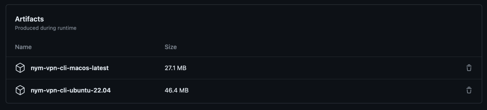

# NymVPN alpha: Guide for GNU/Linux

```admonish warning
NymVPN is an experimental software and it's for [testing](./nym-vpn-testing.md) purposes only. All users testing the client are expected to sign GDPR Information Sheet and Consent Form (shared at the event), and follow the steps listed in the form [*NymVPN User research*](https://opnform.com/forms/nymvpn-user-research-at-37c3-yccqko-2).
```

## Preparation

> Any syntax in `<>` brackets is a user's/version unique variable. Exchange with a corresponding name without the `<>` brackets.



* Visit the [releases page](https://github.com/nymtech/nym/releases/tag/ccc) to download the binary for Debian based Linux
* Open terminal in the same directory and make executable by running:

```sh
# for CLI
chmod +x ./nym-vpn-cli

# for GUI
chmod +x ./nym-vpn_0.0.0_amd64.AppImage
# make sure your path to package is correct and the package name as well
```
* If you prefer to use the `.deb` version for installation (Linux only), open terminal in the same directory and run:
```
sudo dpkg -i ./<PACKAGE_NAME>.deb
# or
sudo apt-get install -f ./<PACKAGE_NAME>.deb
```
* **For CLI**: Create Sandbox environment config file by saving [this](https://raw.githubusercontent.com/nymtech/nym/develop/envs/sandbox.env) as `sandbox.env` in the same directory as your NymVPN binaries. In case of GUI setup, see the steps below.

### GUI configuration

* Create a NymVPN config directory called `nym-vpn` in your `~/.config`, either manually or by a command:
```sh
# for Linux
mkdir $HOME/.config/nym-vpn/

# for macOS
mkdir $HOME/Library/Application Support/nym-vpn/
```
* Create the network config by saving [this](https://raw.githubusercontent.com/nymtech/nym/develop/envs/sandbox.env) as `sandbox.env` in the directory `nym-vpn` you just created
* Create the main config file called `config.toml` in the same directory with this content:
```toml
# change <USER> to your username
env_config_file = "/home/<USER>/.config/nym-vpn/sandbox.env"
entry_node_location = "DE" # two letters country code
```

## Running

* **For NymVPN to work, all other VPNs must be switched off!**
* At this alpha stage of NymVPN, network connection (wifi) must be re-connected after or in-between NymVPN testing rounds.

### Run CLI

Make sure your terminal is open in the same directory as your `nym-vpn-cli` binary.

* Find the entire command with all the needed arguments' values and your wireguard private key for testing purposes at [nymvpn.com/en/alpha](https://nymvpn.com/en/alpha)
* Run it with `sudo` as root, the command will look like this with specified arguments:
```sh
sudo ./nym-vpn-cli -c ./sandbox.env --entry-gateway-id <ENTRY_GATEWAY_ID> --exit-router-address <EXIT_ROUTER_ADDRESS> --enable-wireguard --private-key <PRIVATE_KEY> --wg-ip <WG_IP>
```
* To chose different Gateways, visit [nymvpn.com/en/alpha/api/gateways](https://nymvpn.com/en/alpha/api/gateways)
* To see all possibilities see [command explanation](#cli-commands-and-options) below

### Run GUI

In case you used `.deb` package and installed the client, you may be able to have a NymVPN application icon in your app menu. However this may not work as the application needs root permission.

Make sure you went through the GUI configuration in the [preparation section](#gui-configuration). Then open terminal in the same directory where you [installed](#preparation) the binary and run:

```sh
sudo -E ./<FULL_BINARY_NAME>
```

In case of errors, see [troubleshooting section](./nym-vpn-troubleshooting.md).

### CLI Commands and Options

The basic syntax of `nym-vpn-cli` is:
```sh
sudo ./nym-vpn-cli -c ./sandbox.env --entry-gateway-id <ENTRY_GATEWAY_ID> --exit-router-address <EXIT_ROUTER_ADDRESS> --enable-wireguard --private-key <PRIVATE_KEY> --wg-ip <WG_IP>
```
* To chose different Gateways, visit [nymvpn.com/en/alpha/api/gateways](https://nymvpn.com/en/alpha/api/gateways)
* To see all possibilities run with `--help` flag:
```sh
./nym-vpn-cli --help
```

~~~admonish example collapsible=true title="Console output"
```
Usage: nym-vpn-cli [OPTIONS]

Options:
  -c, --config-env-file <CONFIG_ENV_FILE>
          Path pointing to an env file describing the network
      --mixnet-client-path <MIXNET_CLIENT_PATH>
          Path to the data directory of a previously initialised mixnet client, where the keys reside
      --entry-gateway-id <ENTRY_GATEWAY_ID>
          Mixnet public ID of the entry gateway
      --entry-gateway-country <ENTRY_GATEWAY_COUNTRY>
          Auto-select entry gateway by country ISO
      --exit-router-address <EXIT_ROUTER_ADDRESS>
          Mixnet recipient address
      --exit-gateway-id <EXIT_GATEWAY_ID>

      --exit-router-country <EXIT_ROUTER_COUNTRY>
          Mixnet recipient address
      --enable-wireguard
          Enable the wireguard traffic between the client and the entry gateway
      --private-key <PRIVATE_KEY>
          Associated private key
      --wg-ip <WG_IP>
          The IP address of the wireguard interface
      --ip <IP>
          The IP address of the TUN device
      --mtu <MTU>
          The MTU of the TUN device
      --disable-routing
          Disable routing all traffic through the VPN TUN device
      --enable-two-hop
          Enable two-hop mixnet traffic. This means that traffic jumps directly from entry gateway to exit gateway
      --enable-poisson-rate
          Enable Poisson process rate limiting of outbound traffic
  -h, --help
          Print help
  -V, --version
          Print version


```
~~~

**Fundamental commands and arguments**

Here is a list of the options and their descriptions. Some are essential, some are more technical and not needed to adjusted by users:

- `-c` is a path to the [Sandbox config](https://raw.githubusercontent.com/nymtech/nym/develop/envs/sandbox.env) file saved as `sandbox.env`
- `--entry-gateway-id`: paste one of the values labeled with a key `"identityKey"` (without `" "`) from [here](https://nymvpn.com/en/alpha/api/gateways)
- `--exit-router-address`: paste one of the values labeled with a key `"address"` (without `" "`) from here [here](https://nymvpn.com/en/alpha/api/gateways)
- `--enable-wireguard`: Enable the wireguard traffic between the client and the entry gateway. NymVPN uses Mullvad libraries for wrapping `wireguard-go` and to setup local routing rules to route all traffic to the TUN virtual network device
- `--wg-ip`: The address of the wireguard interface, you can get it [here](https://nymvpn.com/en/alpha)
- `--private-key`: get your private key for testing purposes [here](https://nymvpn.com/en/alpha)
- `--enable-two-hop` is a faster setup where the traffic is routed from the client to Entry Gateway and directly to Exit Gateway (default is 5-hops)

**Advanced options**

- `--enable-poisson`: Enables process rate limiting of outbound traffic (disabled by default). It means that NymVPN client will send packets at a steady stream to the Entry Gateway. By default it's on average one sphinx packet per 20ms, but there is some randomness (poisson distribution). When there are no real data to fill the sphinx packets with, cover packets are generated instead.
- `--ip` is the IP address of the TUN device. That is the IP address of the local private network that is set up between local client and the Exit Gateway.
- `--mtu`: The MTU of the TUN device. That is the max IP packet size of the local private network that is set up between local client and the Exit Gateway.
- `--disable-routing`: Disable routing all traffic through the VPN TUN device.
