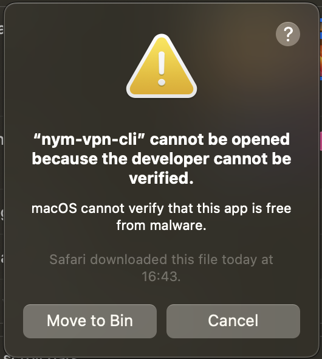
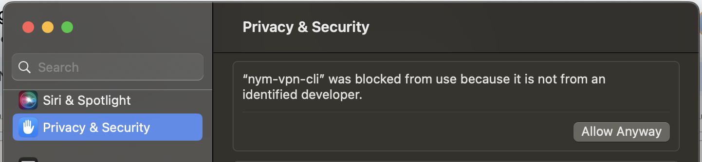

## Troubleshooting

Below are listed some points which may need to be addressed when testing NymVPN alpha. If you crashed into any errors which are not listed, please contact us at the event.

#### Thread `main` panicked

If you see a message like:
```sh
thread 'main' panicked at /Users/runner/.cargo/git/checkouts/mullvadvpn-app-a575cf705b5dfd76/ccfbaa2/talpid-routing/src/unix.rs:301:30:
```
Restart your wifi connection and start again.

#### macOS alert on NymVPN UI startup

If you are running NymVPN on mac OS for the first time, you may see this alert message:



1. Head to System Settings -> Privacy & Security and click `Allow anyway`



2. Confirm with your password or TouchID

3. Possibly you may have to confirm again upon running the application

#### Missing `jq` error

In case of missing `jq` on Linux (Debian) install it with:
```sh
# Linux (Debian)
sudo apt-get install jq
# macOS
brew install jq
```
On some Linux distributions however the [script](./nym-vpn.md#testssh) returns `jq` error even if your system claims that `jq is already the newest version`.
In that case, comment the `jq` check in the script as follows:
```sh
#if ! command -v jq &>/dev/null; then
#    echo "jq is not installed. Please install jq to proceed."
#    exit 1
#fi
```

#### Error current_time: not found

When running `sudo sh ./test.sh` you may see an error like: `93: current_time: not found`. This has something to do with the `current_time` setup of your system and on itself shall not have a negative impact on the test. It has nothing to do with the client at all as it only relates to the code in our testing script.

#### Not connecting to the endpoint

In case the automatic download of all the Gateways fail (and it shouldn't), you do an easy manual work around:

1. Open the list of Gateways created by API [here](https://nymvpn.com/en/ccc/api/gateways)
2. On top click on `JSON` option (shall be default view) and `Save`
3. Save it as `data.json` to the `nym-vpn-tests` folder
4. Replace line 3 in the [script `tests.sh`](./nym-vpn.md#testssh) with:
```sh
NEW_ENDPOINT="http://localhost:8000/data.json"
```
5. In a new terminal window run:
```sh
python3 -m http.server 8000
```
6. Continue with the steps listed in [testing section](./nym-vpn.md#testing)
