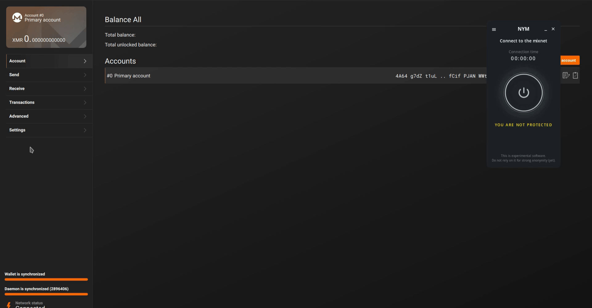

# HCPP 2023 - Securing the Lunarpunks Workshop

[Serinko's](https://resistance.hcpp.cz/) [workshop](ttps://cfp.paralelnipolis.cz/hcpp23/talk/LLPWXW/) will introduce ***why*** and ***how to use [Nym](https://nymtech.net) platform as a network protection*** layer when using some of our favorite privacy applications. This page serves as an accessible guide alongside the talk and it includes all the steps, pre-requisities and dependencies needed. Preferably the users interested in this setup start downloading and building the tools before the workshop or in the beginning of it. We can use the limited time for questions and addressing problems. This guide will stay online after the event just in case people were not finished and want to catch up later.  

This page is a *how to guide* so it contains the setup only, to see the entire presentation join in at [HCPP 2023](https://resistance.hcpp.cz/) on [Sunday](https://cfp.paralelnipolis.cz/hcpp23/talk/LLPWXW/).

## Preparation

During this workshop we will introduce [NymConnect](https://nymtech.net/developers/quickstart/nymconnect-gui.html) and [Socks5 client](https://nymtech.net/docs/clients/socks5-client.html). The difference between them is that the Socks5 client does everything Nymconnect does, but it has more optionality and it's run from a commandline. NymConnect is a one-button GUI application that wraps around the `nym-socks5-client` for proxying application traffic through the Mixnet.  

We will learn how to run through [Nym Mixnet](https://nymtech.net/docs/architecture/network-overview.html) the following applications: Electrum Bitcoin wallet, Monero wallet (desktop and CLI), Matrix (Element app) and ircd chat. For those who want to run ircd through the Mixnet, `nym-socks5-client` client is a must. For all other applications you can choose if you settle with our slick app NymConnect which does all the job in the background or you prefer Socks5 client.

> Any syntax in `<>` brackets is a user's/version unique variable. Exchange with a corresponding name without the `<>` brackets.

## NymConnect Installation

NymConnect application is for everyone who does not want to install and run `nym-socks5-client`. NymConnect is plug-and-play, fast and easy use. Electrum Bitcoin wallet, Monero wallet (desktop and CLI) and Matrix (Element app) connects through NymConnect automatically to the Mixnet.

1. [Download](https://nymtech.net/download/nymconnect) NymConnect
2. On Linux and Mac, make executable by opening terminal in the same directory and run:

```sh
chmod +x ./nym-connect_<VERSION>.AppImage
```

3. Start the application
4. Click on `Connect` button to initialise the connection with the Mixnet
5. Anytime you'll need to setup Host and Port in your applications, click on `IP` and `Port` to copy the values to clipboard
6. In case you have problems such as `Gateway Issues`, try to reconnect or restart the application

## Connect Privacy Enhanced Applications (PEApps)

For simplification in this guide we connect Electrum, Monero wallet and Matrix (Element) using NymConnect and ircd over `nym-socks5-client`. Of course if your choice is to run `nym-socks5-client` all these apps will connect through that and you don't need to install NymConnect.

```admonish info
This guide aims to connect your favourite applications to Nym Mixnet, therefore we do not include detailed guides on how to install them, only reference to the source pages.
```

### Electrum Bitcoin wallet via NymConnect

To download Electrum visit the [official webpage](https://electrum.org/#download). To connect to the Mixnet follow these steps:

1. Start and connect [NymConnect](./hcpp23-serinko.html#nymconnect-installation) (or [`nym-socks5-client`](./hcpp23-serinko.html#building-nym-platform))
2. Start your Electrum Bitcoin wallet
3. Go to: *Tools* -> *Network* -> *Proxy*
4. Set *Use proxy* to ✅, choose `SOCKS5` from the drop-down and add the values from your NymConnect application
5. Now your Electrum Bitcoin wallet runs through the Mixnet and it will be connected only if your NymConnect or `nym-socks5-client` are connected.


### Monero wallet via NymConnect

To download Monero wallet visit [getmonero.org](https://www.getmonero.org/downloads/). To connect to the Mixnet follow these steps:

1. Start and connect [NymConnect](./hcpp23-serinko.html#nymconnect-installation) (or [`nym-socks5-client`](./hcpp23-serinko.html#building-nym-platform))
2. Start your Monero wallet
3. Go to: *Settings* -> *Interface* -> *Socks5 proxy* -> Add values: IP address `127.0.0.1`, Port `1080` (the values copied from NymConnect)
5. Now your Monero wallet runs through the Mixnet and it will be connected only if your NymConnect or `nym-socks5-client` are connected.



If you prefer to run Monero-CLI wallet with Monerod, please check out [this guide](https://nymtech.net/developers/tutorials/monero.html#how-can-i-use-monero-over-the-nym-mixnet).

### Matrix (Element) via NymConnect

To download Element (chat client for Matrix) visit [element.io](https://element.io/download). To connect to the Mixnet follow these steps:

1. Start and connect [NymConnect](./hcpp23-serinko.html#nymconnect-installation) (or [`nym-socks5-client`](./hcpp23-serinko.html#building-nym-platform))
2. Start `element-desktop` with `--proxy-server` argument:

**Linux**

```sh
element-desktop --proxy-server=socks5://127.0.0.1:1080
```

**Mac**

```sh
open -a Element --args --proxy-server=socks5://127.0.0.1:1080
```

To setup your own alias or key-binding see our [*Matrix NymConnect Integration* guide](https://nymtech.net/developers/tutorials/matrix.html#optimise-setup-with-a-keybinding--alias).


## Building Nym Platform

If you prefer to run to run `nym-socks5-client` the possibility is to download the pre-build binary or build the entire platform. To run ircd through the Mixnet `nym-socks5-client` and `nym-network-requester` are mandatory. Before you start with download and installation, make sure you are on the same machine from which you will connect to ircd.

We recommend to clone and build the entire platform instead of individual binaries as it offers an easier update and more options down the road, however it takes a basic command-line knowledge and more time. The [Nym platform](https://github.com/nymtech/nym) is written in Rust. For that to work we will need a few pre-requisities. If you prefer to download individual pre-build binaries, skip this part and go directly [that chapter](./hcpp23-serinko.html#pre-built-binaries). 

### Prerequisites 
- Debian/Ubuntu: `pkg-config`, `build-essential`, `libssl-dev`, `curl`, `jq`, `git`

```sh
apt install pkg-config build-essential libssl-dev curl jq git
```

- Arch/Manjaro: `base-devel`

```sh
pacman -S base-devel
```

- Mac OS X: `pkg-config` , `brew`, `openss1`, `protobuf`, `curl`, `git`
Running the following the script installs Homebrew and the above dependencies:

```sh
/bin/bash -c "$(curl -fsSL https://raw.githubusercontent.com/Homebrew/install/HEAD/install.sh)"
```

- `Rust & cargo >= {{minimum_rust_version}}`

We recommend using the [Rust shell script installer](https://www.rust-lang.org/tools/install). Installing cargo from your package manager (e.g. `apt`) is not recommended as the packaged versions are usually too old.

If you really don't want to use the shell script installer, the [Rust installation docs](https://forge.rust-lang.org/infra/other-installation-methods.html) contain instructions for many platforms.

### Download and Compile Nym

The following commands will compile binaries into the `nym/target/release` directory:

```sh
rustup update
git clone https://github.com/nymtech/nym.git
cd nym
git checkout master # master branch has the latest release version: `develop` will most likely be incompatible with deployed public networks
cargo build --release # build your binaries with **mainnet** configuration
```

Quite a bit of stuff gets built. The key working parts for the workshop are:

* [socks5 client](https://nymtech.net/docs/clients/socks5-client.html): `nym-socks5-client`
* [network requester](https://nymtech.net/operators/nodes/network-requester-setup.html): `nym-network-requester`

## Pre-built Binaries

The [Github releases page](https://github.com/nymtech/nym/releases) has pre-built binaries which should work on Ubuntu 20.04 and other Debian-based systems, but at this stage cannot be guaranteed to work everywhere.

**Download:** Find the binary of your choice, right click on the binary, select *Copy Link*. This will save the binary `<URL>` to clipboard. Run the following commands on your machine:

```
wget <URL> # to download the binary
```

If the pre-built binaries don't work or are unavailable for your system, you will need to [build the platform](./hcpp23-serinko.html#building-nym-platform) yourself.

All Nym binaries must first be made executable. 

To make a binary executable, open terminal in the same directory and run:

```sh
chmod +x ./<BINARY_NAME> 
# for example: chmod +x ./nym-network-requester
```

## Initialize Socks5 Client and Network Requester

Whether you build the entire platform or downloaded binaries, `nym-socks5-client` and `nym-network-requester` need to be initialised with `init` before being `run`.

In your terminal navigate to the directory where you have your `nym-socks5-client` and `nym-network-requester`. In case you built the entire platform it's in `nym/target/release`.

```sh
# change directory from nym repo
cd target/release
```

**Network Requester**

The `init` command is usually where you pass flags specifying configuration arguments such as the gateway you wish to communicate with, the ports you wish your binary to listen on, etc. 

The `init` command will also create the necessary keypairs and configuration files at `~/.nym/<BINARY_TYPE>/<BINARY_ID>/` if these files do not already exist. **It will NOT overwrite existing keypairs if they are present.** 

To run [ircd](https://darkrenaissance.github.io/darkfi/clients/nym_outbound.html) through the Mixnet you need to run your own [Network Requester](https://nymtech.net/operators/nodes/network-requester-setup.html) and add known peer's domains/addresses to `~/.nym/service-providers/network-requester/<NETWORK-REQUESTER-ID>/data/allowed.list`. For all other applications `nym-socks5-client` (or NymCOnnect) is enough, no need to initialize and run `nym-network-requester`.

Here are the steps to initialize `nym-network-requester`:

```sh
# open the directory with your binaries
./nym-network-requester init --id <CHOOSE_ANY_NAME_AS_ID>
```
This will print you information about your client `<ADDRESS>`, it will look like:
```sh
The address of this client is: 8hUvtEyZK8umsdxxPS2BizQhEDmbNeXEPBZLgscE57Zh.5P2bWn6WybVL8QgoPEUHf6h2zXktmwrWaqaucEBZy7Vb@5vC8spDvw5VDQ8Zvd9fVvBhbUDv9jABR4cXzd4Kh5vz
```

**Socks5 Client**

If you run `nym-socks5-client` instead of NymConnect, you can choose your `--provider` [here](https://explorer.nymtech.net/network-components/service-providers) or leave that flag empty and your client will chose one randomly. To run ircd, you will need to connect it to your `nym-network-requester` by using your `<ADDRESS>` for your `nym-socks5-client` initialisation and add a flag `--use-reply-surbs true`. Run the command in the next terminal window:

```sh
# to connect to your nym-network-requester as a provider for ircd
./nym-socks5-client init --use-reply-surbs true --id <CHOSE_ANY_NAME_AS_ID> --provider <ADDRESS>

# simple socks5 client init (random provider) for other apps
./nym-socks5-client init --id <CHOSE_ANY_NAME_AS_ID>
```

```admonish info
You can reconfigure your binaries at any time by editing the config file located at `~/.nym/service-providers/<BINARY_TYPE>/<BINARY_ID>/config/config.toml` and restarting the binary process. 
```

**Run Clients**

Once you have run `init`, you can start your binary with the `run` command, accompanied by the `id` of the binary that you specified. 

This `id` is **never** transmitted over the network, and is used to select which local config and key files to use for startup. 

```sh
# network requester
./nym-network-requester run --id <ID>

# socks5 client (in other terminal window)
./nym-socks5-client run --id <ID>
```

**Troubleshooting**

In case your `nym-socks5-client` has a problem to connect to your `nym-network-requester` try to setup a firewall by running these commands:

```sh
# check if you have ufw installed
ufw version

# if it is not installed, install with
sudo apt install ufw -y

# enable ufw
sudo ufw enable

# check the status of the firewall
sudo ufw status

# open firewall ports for network requester
sudo ufw allow 22,9000/tcp

# re-check the ufw status
sudo ufw status
```

Restart your network requester.


## ircd

[Dark.fi](htps://dark.fi) built a fully anonymous and p2p instance of IRC chat called [ircd](https://darkrenaissance.github.io/darkfi/misc/ircd/ircd.html). The team is just finishing their new instance of the program darkirc which we hope to see in production soon.

```admonish info
It is highly recomended to install [dark.fi architecture](https://github.com/darkrenaissance/darkfi) prior to the workshop following the [documentation](https://darkrenaissance.github.io/darkfi/misc/ircd/ircd.html) so we have enough time for the network configuration.
```

### Configuration

Make sure to have [ircd installed](https://darkrenaissance.github.io/darkfi/misc/ircd/ircd.html) on the same machine like your `nym-socks5-client` (`nym-network-requester` can run anywhere). 

Currently `nym-network-requester` automatically connnects only to the [whitelisted URLs](https://nymtech.net/.wellknown/network-requester/standard-allowed-list.txt). This will [change soon](https://nymtech.net/operators/faq/smoosh-faq.html) into a more opened setup. This list can be changed by an operator running a node. 

**Edit allowed.list**

1. Open a text editor and add:
```yaml
dasman.xyz
```
2. Save it as `allowed.list` in `~/.nym/service-providers/network-requester/<NETWORK-REQUESTER-ID>/data/`
3. Restart your `nym-network-requester`
```sh
./nym-network-requester run --id <ID>
```
4. Make sure both `nym-socks5-client` and `nym-network-requester` are running and connected

**ircd setup**

In case your ircd has problems to start or connect, run the following:

```sh
# cd to darkfi repo
git pull
git checkout c4b78ead5111b0423fca3bd53cb7185acd6f0faa

# compile ircd
make ircd

# in case of dependency error: "failed to load source for dependency `halo2_gadgets`"
rm Cargo.lock
make ircd

# remove the config file (rename it if you want to safe any values first)
rm ~/.config/darkfi/ircd_config.toml

# rerun ircd to generate new config file
./ircd

# add your custom values from the old config file
```

5. Open `~/.config/darkfi/ircd_config.toml`
6. Coment the line with `seeds`
7. Add line:
```yaml
peers = ["nym://dasman.xyz:25552"]
```
8. Change `outbond_transports` to:
```yaml
outbond_transports = ["nym"]
```
9. Make sure that
```yaml
outbound_connections = 0
```
10. Save and restart `ircd`

Observe the ircd deamon to see that the communication is running through the mixnet.

## Bonus: Join hcpp23 channel

Now, when your Darkfi's ircd runs through Nym Mixnet, you can join public and fully anonymous channel `#hcpp23`. To do so, follow one of the two possibilities:

1. Run a command in your weechat:
```sh
/join #hcpp23
```
2. Open `~/.config/darkfi/ircd_config.toml` and add `"#hcpp23"` to the `autojoin = []` brackets, save and restart ircd.


