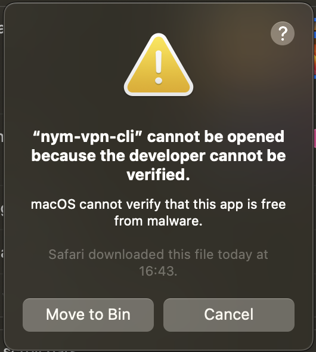
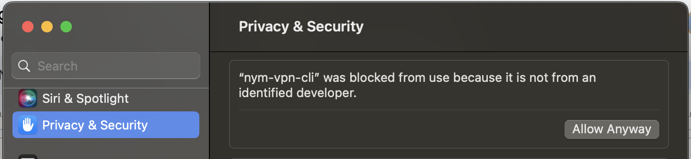

# Troubleshooting

Below are listed some points which may need to be addressed when testing NymVPN alpha. If you crashed into any errors which are not listed, please contact us at the event.

#### Problems with the newest version `nym-vpn-alpha-0.0.2 demo`

Try the previous version `nym-vpn-alpha-0.0.1 demo` which was tested multiple times by downloading the client from this [release page(https://github.com/nymtech/nym/releases/tag/nym-vpn-alpha-0.0.1) and doing all the steps with the name of your downloaded binary.

#### Installing GUI on MacOS not working

In case there was a problem running the script, try a manual configuration:

* Visit the [releases page](https://github.com/nymtech/nym/releases/tag/nym-vpn-alpha-0.0.1) to download the binary for Debian based Linux
* Open terminal in the same directory and check the the `sha256sum` by running:
```sh
# for MacOS GUI
sha256sum ./nym-vpn-ui-macos-latest.zip
```
* Compare the result with the sha256 hash shared on the [release page](https://github.com/nymtech/nym/releases/tag/nym-vpn-alpha-0.0.1)
* Extract files with `unzip` command or manually as you are used toi
* Create a NymVPN config directory called `nym-vpn` in your `~/.config`, either manually or by a command:
```sh
mkdir $HOME/Library/Application Support/nym-vpn/
```
* Create the network config by saving [this](https://raw.githubusercontent.com/nymtech/nym/develop/envs/sandbox.env) as `sandbox.env` in the config directory `nym-vpn` you just created
* Create the main config file called `config.toml` in the same directory with this content:
```toml
env_config_file = "$HOME/Library/Application Support/nym-vpn/"
entry_node_location = "DE" # two letters country code
```

**Note:** Some users had a problem to access their home config folder on macOS, in that case save the configuration files in the same directory where you downloaded your `nym-vpn` binary as following:

* Create the network config by saving [this](https://raw.githubusercontent.com/nymtech/nym/develop/envs/sandbox.env) as `.env` (yes just like that) in the same directory like `nym-vpn` binaries.
* Create the main config file called `config.toml` in the very same directory with this content:
```toml
env_config_file = "$HOME/Library/Application Support/nym-vpn/"
entry_node_location = "DE" # two letters country code
```

#### Thread `main` panicked

If you see a message like:
```sh
thread 'main' panicked at /Users/runner/.cargo/git/checkouts/mullvadvpn-app-a575cf705b5dfd76/ccfbaa2/talpid-routing/src/unix.rs:301:30:
```
Restart your wifi connection and start again.

#### macOS alert on NymVPN UI startup

If you are running NymVPN on mac OS for the first time, you may see this alert message:



1. Head to System Settings -> Privacy & Security and click `Allow anyway`



2. Confirm with your password or TouchID

3. Possibly you may have to confirm again upon running the application

#### Missing `jq` error

In case of missing `jq` on Linux (Debian) install it with:
```sh
# Linux (Debian)
sudo apt-get install jq
# macOS
brew install jq
```
On some Linux distributions however the [script](./nym-vpn.md#testssh) returns `jq` error even if your system claims that `jq is already the newest version`.
In that case, comment the `jq` check in the script as follows:
```sh
#if ! command -v jq &>/dev/null; then
#    echo "jq is not installed. Please install jq to proceed."
#    exit 1
#fi
```

#### Error current_time: not found

When running `sudo sh ./test.sh` you may see an error like: `93: current_time: not found`. This has something to do with the `current_time` setup of your system and on itself shall not have a negative impact on the test. It has nothing to do with the client at all as it only relates to the code in our testing script.

#### Not connecting to the endpoint

In case the automatic download of all the Gateways fail (and it shouldn't), you do an easy manual work around:

1. Open the list of Gateways created by API [here](https://nymvpn.com/en/ccc/api/gateways)
2. On top click on `JSON` option (shall be default view) and `Save`
3. Save it as `data.json` to the `nym-vpn-tests` folder
4. Replace line 3 in the [script `tests.sh`](./nym-vpn.md#testssh) with:
```sh
NEW_ENDPOINT="http://localhost:8000/data.json"
```
5. In a new terminal window run:
```sh
python3 -m http.server 8000
```
6. Continue with the steps listed in [testing section](./nym-vpn.md#testing)
