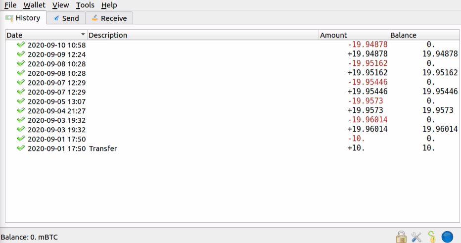

# Electrum Wallet NymConnect Integration

Electrum is one of the most favorite Bitcoin wallet for desktop users and it is used as a backend wallet for various crypto aplications in smart phones. Electrum was among the first integrations of Nym. This easy setup allows users to enhance privacy when managing the flagship of blochain cryptocurencies Bitcoin.

## How can I use Bitcoin over the Nym mixnet?

> Any syntax in `<>` brackets is a user’s unique variable. Exchange with a corresponding name without the `<>` brackets.

### NymConnect Installation

NymConnect application is for everyone who does not want to install and run `nym-socks5-client`. NymConnect is plug-and-play, fast and easy use. Electrum Bitcoin wallet, Monero wallet (desktop and CLI) and Matrix (Element app) connects through NymConnect automatically to the Mixnet.

1. [Download](https://nymtech.net/download/nymconnect) NymConnect
2. On Linux and Mac, make executable by opening terminal in the same directory and run:

```sh
chmod +x ./nym-connect_<VERSION>
```

3. Start the application
4. Click on `Connect` button to initialise the connection with the Mixnet
5. Anytime you'll need to setup Host and Port in your applications, click on `IP` and `Port` to copy the values to clipboard
6. In case you have problems such as `Gateway Issues`, try to reconnect or restart the application

### Electrum Bitcoin wallet via NymConnect


To download Electrum visit the [official webpage](https://electrum.org/#download). To connect to the Mixnet follow these steps:

7. Start and connect [NymConnect](electrum.mdymconnect-installation) (or [`nym-socks5-client`](https://nymtech.net/docs/clients/socks5-client.html))
2. Start your Electrum Bitcoin wallet
3. Go to: *Tools* -> *Network* -> *Proxy*
4. Set *Use proxy* to ✅, choose `SOCKS5` from the drop-down and add the values from your NymConnect application
5. Now your Electrum Bitcoin wallet runs through the Mixnet and it will be connected only if your NymConnect or `nym-socks5-client` are connected.


