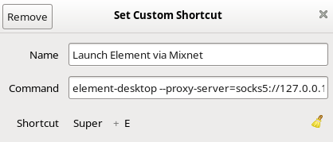

# Matrix NymConnect Integration


Chat applications became an essential part of human communication. Matrix chat has end to end encryption on protocol level and Element app users can sort their communication into spaces and rooms. Now the Matrix communities can rely on network privacy as NymConnect supports Matrix chat protocol.

Currently there is no option in Matrix's Element client to set a Socks5 proxy. In order to use Element via NymConnect users have to start it from the command-line. The setup is simple, for convenience a keyboard shortcut setting or terminal alias can be easily done.


## Setup & Run

Make sure you have installed and started **[NymConnect](https://nymtech.net/developers/quickstart/nymconnect-gui.html)** on your desktop.

To then start Matrix's Element client via a Socks5 proxy connected to NymConnect, open terminal and run:

**Linux**

```sh
element-desktop --proxy-server=socks5://127.0.0.1:1080
```

**Mac**

```sh
open -a Element --args --proxy-server=socks5://127.0.0.1:1080
```

## Optimise setup with a keybinding / alias

### Keybinding
An eloquent solution to avoid entering a command every time is to setup your keybinding. Open your settings, navigate to `Keyboard Shortcuts` and choose to `Set Custom Shortcut`. `Name` and `Shortcut` fields are up to your preference, to the `Command` line add:

```sh
element-desktop --proxy-server=socks5://127.0.0.1:1080
```
Make sure your `Shortcut` isn't already taken by something else in the menu.

An example can look like this.



Alternatively you can add a keybinding via the CLI, using whatever config files you edit for your given desktop environment / window manager.

### Create an alias
If you prefer to simply shorten the length of the command (or all your keybindings are already taken) then you can simply create an alias for this long-winded command (this example aliases that command to the single word `element`, but you can replace it with whatever you like):

**Linux**

```sh
alias element="element-desktop --proxy-server=socks5://127.0.0.1:1080"
```

To make this alias persist, then add this to your `.bashrc` or `.zshrc` file (usually located in your `$HOME` directory) and `source` that file. This can be done by appending the alias command directly to the shell config file with one command. 

For `bash` enter:

```sh
alias element="element-desktop --proxy-server=socks5://127.0.0.1:1080" >> ~/.bashrc
```

For `zsh` enter:

```sh
alias element="element-desktop --proxy-server=socks5://127.0.0.1:1080" >> ~/.zshrc
```

You can add the alias manually by opening your `$HOME` directory, enable hidden files (press `ctrl` + `h`) and open `.bashrc` or `.zshrc` file (based on your terminal setup) in a text editor, paste the string `alias element="element-desktop --proxy-server=socks5://127.0.0.1:1080"` to the the end, save and exit. Start a new terminal and run `element`.

**Mac**

```sh
alias element="open -a Element --args --proxy-server=socks5://127.0.0.1:1080"

```

To make this alias persist, then add this to your `.zshrc` (or `.bashrc`/`.profile`) file (usually located in your `$HOME` directory) and `source` that file. This can be done by appending the alias command directly to the shell config file with one command.

For `zsh` enter:

```sh
alias element="open -a Element --args --proxy-server=socks5://127.0.0.1:1080" >> ~/.zshrc
```

For `.bashrc` or `.profile` just change the end of the command.  

You can add the alias manually by opening your `$HOME` directory, enable hidden files (in Finder press `Shift` + `Command` + `.`) and open `.zshrc` file (or `.bashrc`/`.profile`) in a text editor, paste the string `alias element="open -a Element --args --proxy-server=socks5://127.0.0.1:1080"` to the the end, save and exit. Start a new terminal and run `element`.  


**Now you can run Element through the Nym Mixnet with a single-word command.**
