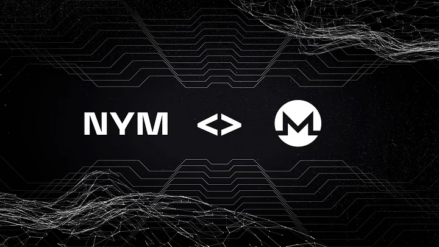

# Monero NymConnect Integration

*New Nym mixnet integration launched for Monero desktop to secure the right to financial privacy and censorship-resistance*



Financial privacy is an important component of digital currencies and the use of Nym will provide users with the highest level of privacy at the infrastructure level. All users of digital currencies should be afforded equal rights to protection from financial surveillance.

A team made up of Monero community members have successfully set up a service provider to use Monero (using the Monero desktop wallet) over the Nym mixnet. This allows Monero users to easily use NymConnect to run Monero over the mixnet, thereby enhancing the privacy of Monero transactions.

## How can I use Monero over the Nym mixnet?

> Any syntax in `<>` brackets is a user's unique variable. Exchange with a corresponding name without the `<>` brackets.

The mainnet service provider to Monero over the Nym mixnet is now ready for use via [NymConnect](https://nymtech.net/download-nymconnect/).

* **Download** the latest version of [**NymConnect**](https://nymtech.net/download-nymconnect/).
* Make sure your NymConnect is executable.
```sh
# in Linux open terminal in the same folder and run:
chmod +x ./nym-connect_<YOUR_VERSION>.AppImage
```
* **Open NymConnect app**
* **Turn it on** - Monero wallet is listed in the apps supported by default, no need for any setup
* **Copy** the **Socks5 address** and **Port**

Then go to your Monero wallet (desktop or CLI) and change the settings to run over socks5 proxy:

**Monero desktop wallet:**

* Settings -> Interface -> Socks5 proxy -> Add values: IP address `127.0.0.1`, Port `1080` (the values copied from NymConnect)

<!---commenting the video as it has a redundant part about manual NR setup
<iframe width="700" height="400" src="https://www.youtube.com/embed/oSHnk1BG_f0" title="Demo: Connect Your Monero Wallet to the Nym Mixnet via NymConnect" frameborder="0" allow="accelerometer; autoplay; clipboard-write; encrypted-media; gyroscope; picture-in-picture; web-share" allowfullscreen></iframe>
--->
**CLI wallet**

* **Monerod:** add `--proxy 127.0.0.1:1080 --bootstrap-daemon-proxy 127.0.0.1:1080` to args

* **Monero-wallet-{rpc, cli}:** add `--proxy 127.0.0.1:1080 --daemon-ssl-allow-any-cert` to args

For those who want to try it out in testnet, a stagenet service provider is also available: [https://nymtech.net/.wellknown/connect/service-providers.json](https://nymtech.net/.wellknown/connect/service-providers.json)

Now your Monero traffic is protected by the network privacy of Nym Mixnet. 
