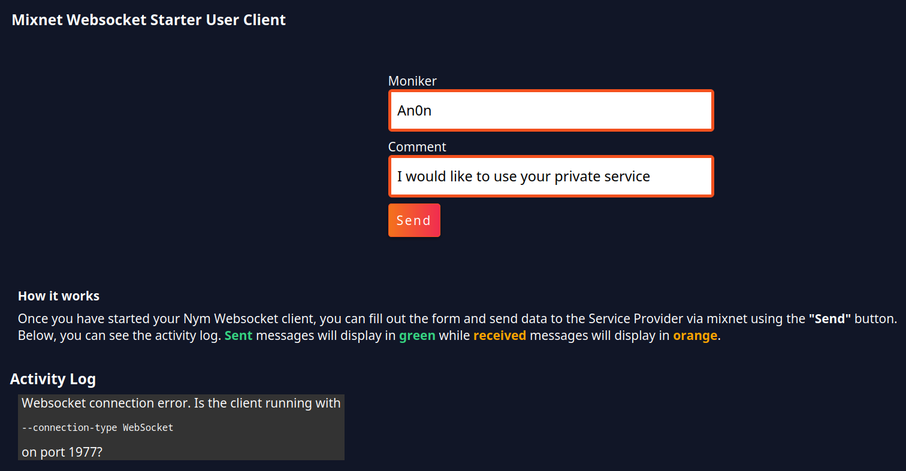
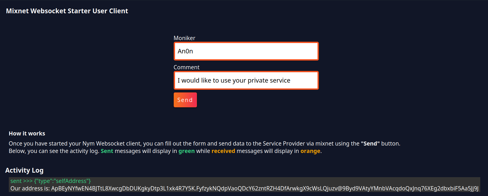

# Building Your User Client

## Adding Core Functionality 
Most of the work here will be configuring and adding functionality to `src/index.ts` file, allowing you to establish and handle the websocket connection to your local Nym client, and create and send messages to the SP. 

* Replace the existing content of `src/index.ts` with: 
    
```typescript
async function main() {}

function connectWebsocket(url) {
    return new Promise(function (resolve, reject) {
        var server = new WebSocket(url);
        console.log('connecting to Websocket Server (Nym Client)...')
        server.onopen = function () {
            resolve(server);
        };
        server.onerror = function (err) {
            reject(err);
        };
      
    });
}
    
main();
```

`main()` will the majority of the app's logic. It's best to declare it at the start of the file and call it at the end to run when launching the application.

`connectWebsocket(url)` returns a `Promise` that attempts to create a websocket connection to `url`. If the connection is successful, you will get a notification in your running application in the browser, as well as the connected Nym client. If it fails an error will be displayed in the browser. 

* Now to implement the functions that will handle DOM (Document Object Model) manipulation. Add the following below `connectWebsocket()`:
   
```typescript
function handleResponse(resp) {
    try {
        let response = JSON.parse(resp.data);
        if (response.type == "error") {
            displayJsonResponse("Server responded with error: " + response.message);
        } else if (response.type == "selfAddress") {
            ourAddress = response.address;
            displayClientMessage("Our address is:  " + ourAddress + ", we will now send messages to ourself.");
        } else if (response.type == "received") {
            handleReceivedTextMessage(response)
        }
    } catch (_) {
            displayJsonResponse(resp.data)
    }
}
       
function handleReceivedTextMessage(message) {
    const text = JSON.parse(message.message);
    displayJsonResponse(text);
}
        
// Display websocket responses in the Activity Log.
function displayJsonResponse(message) {
    let receivedDiv = document.createElement("div")
    let paragraph = document.createElement("p")
    paragraph.setAttribute('style', 'color: orange')
    let textNode = document.createTextNode("received >>> " + message.text)
    paragraph.appendChild(textNode)
    
    receivedDiv.appendChild(paragraph)
    document.getElementById("output").appendChild(receivedDiv)
}

function displayClientMessage(message) {
    document.getElementById("output").innerHTML += "<p>" + message + "</p >";
}
```

`handleResponse()` parses the type of any messages received from the websocket, and handles forwarding the message on to the appropriate function depending on this `type`. You can find documentation on these types [here](https://nymtech.net/docs/clients/websocket-client.html#message-types). 

`handleReceivedTextMessage()` ensures that data is `json` data before displaying on the UI. 

`displayJsonResponse()` is responsible for displaying received messages on the UI, creating a new `<p>` HTML element for each message that needs to be displayed on screen.

`displayClientMessage()` displays the address of the connected Nym client.  

* Declare the following variables above `main()`  

```typescript
var ourAddress:          string;
var targetAddress:       string;
var websocketConnection: any;
```

`ourAddress` takes the value of the connected Nym client address.

`targetAddress` will be the Nym address of the SP. 

`websocketConnection` populated upon a successful response from `connectWebsocket()`. 

* Add the following to `main()`:
  
```typescript
async function main() {
    var port = '1977' // Nym Websocket Client listens on 1977 by default.
    var localClientUrl = "ws://127.0.0.1:" + port;
    
    // Set up and handle websocket connection to our desktop client.
    websocketConnection = await connectWebsocket(localClientUrl).then(function (c) {
        return c;
    }).catch(function (err) {
        displayClientMessage("Websocket connection error. Is the client running with <pre>--connection-type WebSocket</pre> on port " + port + "?");
    })

    websocketConnection.onmessage = function (e) {
        handleResponse(e);
    };
    
    sendSelfAddressRequest();
    
    // Set up the send button
    const sendButton = document.querySelector('#send-button');
    
    sendButton?.addEventListener('click', function handleClick(event) {
        sendMessageToMixnet(); 
    });
```

And between `main()` and `displayClientMessage()`:

```typescript
function sendSelfAddressRequest() {
    var selfAddress = {
        type: "selfAddress"
    }
    displayJsonSend(selfAddress);
    websocketConnection.send(JSON.stringify(selfAddress));
}
```

`sendSelfAddressRequest()` sends a `selfAddress` message to the connected websocket client, passing the response to `displayJsonSend()` to be displayed on your UI. 

`main()` now contains logic for: connecting to a local Nym client, getting its address with a `selfAddress` message, and displaying it on the UI. Now your app can display its connection status, letting you know whether it is(n't) connected to a running client! 

* Underneath `sendSelfAddressRequest()` implement a function to send messages down the websocket connection to the SP:

```typescript
function sendMessageToMixnet() {

    var nameInput = (<HTMLInputElement>document.getElementById("nameInput")).value;
    var textInput = (<HTMLInputElement>document.getElementById("textInput")).value;
   
    const messageContentToSend = {
        name : nameInput,
        comment : textInput,
    }
    
    const message = {
        type: "sendAnonymous",
        message: JSON.stringify(messageContentToSend),
        recipient: targetAddress,
        replySurbs: 5
    }
    
    displayJsonSend(message);
    websocketConnection.send(JSON.stringify(message));
}
```

Nym clients accept messages in either binary or JSON formats. Since you are sending JSON data, you need to `stringify` any `message`s you wish to send through the mixnet. 

You are sending [replySURBs](https://nymtech.net/docs/architecture/traffic-flow.html#private-replies-using-surbs) along with the message to the SP. This allows the SP to reply to you without you having to doxx yourself and supply a 'return address' in a readable form to it. TLDR; SURBs allow for anonymous replies from mixnet services! 

* Below `sendMessageToMixnet()`, add the following:

```typescript
function displayJsonSend(message) {
    let sendDiv = document.createElement("div")
    let paragraph = document.createElement("p")
    paragraph.setAttribute('style', 'color: #36d481')
    let paragraphContent = document.createTextNode("sent >>> " + JSON.stringify(message))
    paragraph.appendChild(paragraphContent)
            
    sendDiv.appendChild(paragraph)
    document.getElementById("output").appendChild(sendDiv)
}
```

`displayJsonSend()` displays sent messages in the "Activity Log" section of the UI.

* Replace the contents of `src/index.html` with the following:

```html
<!doctype html>
<html>
    <head>
        <meta charset="UTF-8">
        <title>Mixnet Websocket Starter Client</title>
        <link rel="stylesheet" href="../assets/styles.css"/>
    </head>
    <body>
        <div class="content" role="main">
            <div class="toolbar">
                <h3>Mixnet Websocket Starter User Client</h3>
            </div>
            
            <div class="section-container">
               
                <label for="nameInput" class="form-field-label">Moniker</label>
                <input id="nameInput" type="text" value="An0n" name="nameInput">

                <label for="textInput" class="form-field-label">Comment</label>
                <input id="textInput" type="text" value="I would like to use your private service" name="textInput">
         
                <div id="send-button">
                    <label for="send-button" class="submit-button">Send</label>
                </div>
            </div>
        </div>
        
        <div class="" style="margin-left:20px;max-width: fit-content;">
            <div style="color: white;margin-bottom: 2rem;">
                <h4>How it works</h4>
                <p>Once you have started your Nym Websocket client, you can fill out the form and send data to the Service Provider via mixnet using the <b>"Send"</b> button.</p>
                <p>Below, you can see the activity log. <b style='color: #36d481;'>Sent</b> messages will display in <b style='color: #36d481;'>green</b> while <b style='color: orange;'>received</b> messages will display in <b style='color: orange;'>orange</b>.</p>
            </div>
        </div>
        
        <h3 style="margin-left:10px">Activity Log</h3>
        
        <p class="output-container">
            <span id="output"></div>
        </p>
        <script src="index.ts"></script>
    </body>
</html>
```

Lets add the finishing touches to the UI by adding in the stylesheet which we specified at the top of `index.html`: 

```
mkdir -p assets
touch assets/styles.css

# grab the stylesheet from the remote repo and save it to the newly created css file
curl https://raw.githubusercontent.com/nymtech/developer-tutorials/main/simple-service-provider-tutorial/user-client/assets/styles.css -o assets/styles.css
```

* Return back to your terminal and run:

```
npm start
```

Return to [localhost:1234](http://localhost:1234/)) and you should see an updated UI.  



## Connecting to your Nym Client

Follow instructions in the [Nym websocket client documentation](https://nymtech.net/docs/clients/websocket-client.html#initialising-your-client)to `init` and `run` a client then refresh your browser window. You should see a successful response, including a Nym address, in the 'Activity Log' of the UI

Your User Client application code is connected to a Nym websocket client, and ready to send messages through the mixnet! 



In the next section, you will build the Service application you will send these messages to. 
 
