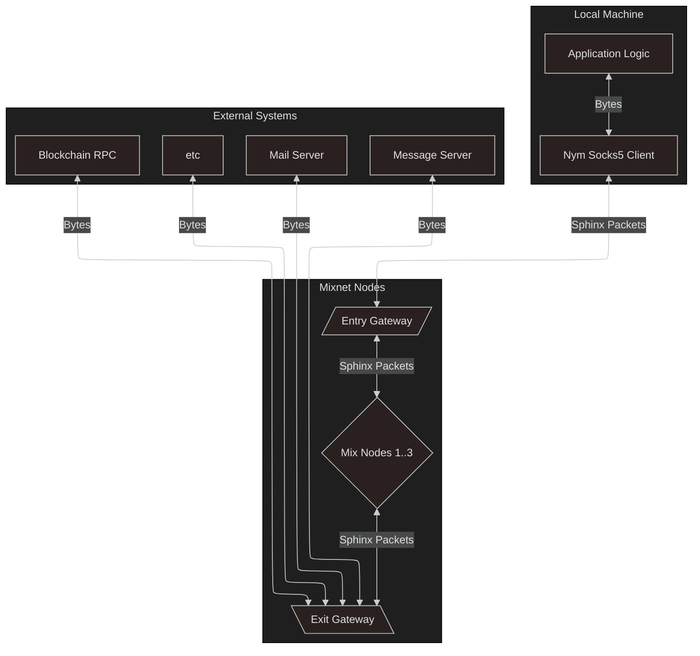

# Socks5 Client (Standalone)

> This client can also be utilised via the [Rust SDK](../rust).

## What is this client for?
Many existing applications are able to use either the SOCKS4, SOCKS4A, or SOCKS5 proxy protocols. If you want to send such an application's traffic through the mixnet, you can use the `nym-socks5-client` to bounce network traffic through the Nym network, like this:

There are 2 pieces of software that work together to send SOCKS traffic through the mixnet: the `nym-socks5-client`, and a `nym-node` running as an Exit Gateway.

> The functionality performed by the Exit Gateway was previously performed by the `nym-network-requester`: this functionality has been migrated into the Exit Gateway mode of the `nym-node`.

The `nym-socks5-client` allows you to do the following from your local machine:
* Take a TCP data stream from a application that can send traffic via SOCKS5.
* Chop up the TCP stream into multiple Sphinx packets, assigning sequence numbers to them, while leaving the TCP connection open for more data
* Send the Sphinx packets through the Nym Network. Packets are shuffled and mixed as they transit the mixnet.

The `nym-node` then reassembles the original TCP stream using the packets' sequence numbers, and make the intended request. It will then chop up the response into Sphinx packets and send them back through the mixnet to your `nym-socks5-client`. The application will then receive its data, without even noticing that it wasn't talking to a "normal" SOCKS5 proxy!

## Download or compile socks5 client

If you are using OSX or a Debian-based operating system, you can download the `nym-socks5-client` binary from our [Github releases page](https://github.com/nymtech/nym/releases).

If you are using a different operating system, or want to build from source, simply use `cargo build --release` from the root of the Nym monorepo.
