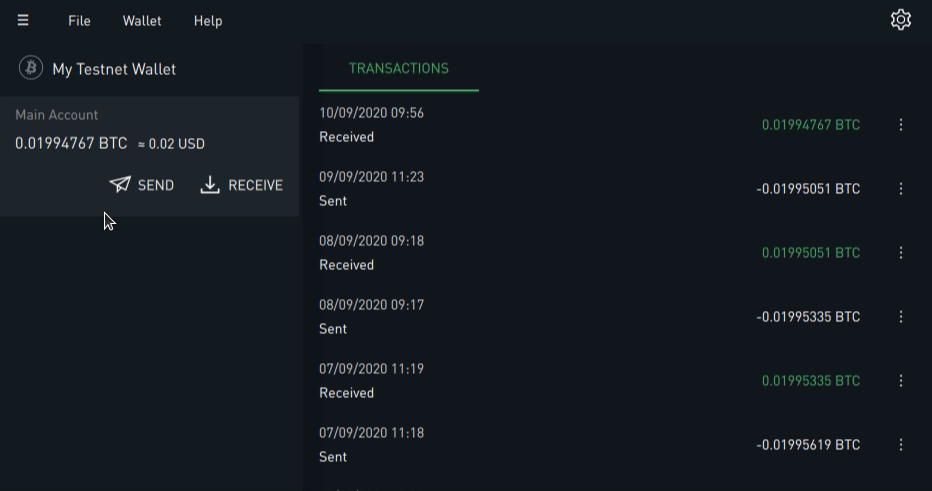

# Socks5 Client

## What is this client for?
Many existing applications are able to use either the SOCKS4, SOCKS4A, or SOCKS5 proxy protocols. If you want to send such an application's traffic through the mixnet, you can use the `nym-socks5-client` to bounce network traffic through the Nym network, like this:

```
                                                                              External Systems:
                                                                                     +--------------------+
                                                                             |------>| Monero blockchain  |
                                                                             |       +--------------------+
                                                                             |       +--------------------+
                                                                             |------>|    Email server    |
                                                                             |       +--------------------+
                                                                             |       +--------------------+
                                                                             |------>|    RPC endpoint    |
                                                                             |       +--------------------+
                                                                             |       +--------------------+
                                                                             |------>|       Website      |
                                                                             |       +--------------------+
                                                                             |       +--------------------+
  +----------------------------------+                                       |------>|       etc...       |
  | Mixnet:                          |                                       |       +--------------------+
  |       * Gateway your client is   |                                       |
  |       connected to               |          +--------------------+       |
  |       * Mix nodes 1 -> 3         |<-------->| Network requester  |<------+
  |       * Gateway that network     |          +--------------------+
  |       requester is connected to  |
  +----------------------------------+
           ^
           |
           |
           |
           |
           v
 +-------------------+
 | +---------------+ |
 | |  Nym client   | |
 | +---------------+ |
 |         ^         |
 |         |         |
 |         |         |
 |         |         |
 |         v         |
 | +---------------+ |
 | | Your app code | |
 | +---------------+ |
 +-------------------+
  Your Local Machine
```

There are 2 pieces of software that work together to send SOCKS traffic through the mixnet: the `nym-socks5-client`, and a `nym-node` running as an Exit Gateway.

> The functionality performed by the Exit Gateway was previously performed by the `nym-network-requester`: this functionality has been migrated into the Exit Gateway mode.

The `nym-socks5-client` allows you to do the following from your local machine:
* Take a TCP data stream from a application that can send traffic via SOCKS5.
* Chop up the TCP stream into multiple Sphinx packets, assigning sequence numbers to them, while leaving the TCP connection open for more data
* Send the Sphinx packets through the Nym Network. Packets are shuffled and mixed as they transit the mixnet.

The `nym-node` then reassembles the original TCP stream using the packets' sequence numbers, and make the intended request. It will then chop up the response into Sphinx packets and send them back through the mixnet to your `nym-socks5-client`. The application will then receive its data, without even noticing that it wasn't talking to a "normal" SOCKS5 proxy!


## Download or compile socks5 client

If you are using OSX or a Debian-based operating system, you can download the `nym-socks5-client` binary from our [Github releases page](https://github.com/nymtech/nym/releases).

If you are using a different operating system, or want to build from source, simply use `cargo build --release` from the root of the Nym monorepo.

## Client setup
### Viewing command help

You can check that your binaries are properly compiled with:

```
./nym-socks5-client --help
```

You can check the necessary parameters for the available commands by running:

```
./nym-client <COMMAND> --help
```

### Initialising a new client instance
Before you can use the client, you need to initalise a new instance of it, which can be done with the following command:

```
./nym-socks5-client init --id docs-example --use-reply-surbs true --provider Entztfv6Uaz2hpYHQJ6JKoaCTpDL5dja18SuQWVJAmmx.Cvhn9rBJw5Ay9wgHcbgCnVg89MPSV5s2muPV2YF1BXYu@Fo4f4SQLdoyoGkFae5TpVhRVoXCF8UiypLVGtGjujVPf
```

The `--id` in the example above is a local identifier so that you can name your clients and keep track of them on your local system; it is **never** transmitted over the network.

The `--use-reply-surbs` field denotes whether you wish to send [SURBs](https://nymtech.net/docs/architecture/traffic-flow.md#private-replies-using-surbs) along with your request. It defaults to `false`, we are explicitly setting it as `true`. It defaults to `false` for compatibility with older versions of the [Network Requester](https://nymtech.net/nodes/network-requester.md).

The `--provider` field needs to be filled with the Nym address of a Network Requester that can make network requests on your behalf. If you don't want to [run your own](https://nymtech.net/operators/nodes/network-requester.md) you can select one from the [mixnet explorer](https://explorer.nymtech.net/network-components/service-providers) by copying its `Client ID` and using this as the value of the `--provider` flag. Alternatively, you could use [this list](https://harbourmaster.nymtech.net/).

#### Choosing a Gateway
By default - as in the example above - your client will choose a random gateway to connect to.

However, there are several options for choosing a gateway, if you do not want one that is randomly assigned to your client:
* If you wish to connect to a specific gateway, you can specify this with the `--gateway` flag when running `init`.
* You can also choose a gateway based on its location relative to your client. This can be done by appending the `--latency-based-selection` flag to your `init` command. This command means that to select a gateway, your client will:
	* fetch a list of all availiable gateways
	* send few ping messages to all of them, and measure response times.
	* create a weighted distribution to randomly choose one, favouring ones with lower latency.

> Note this doesn't mean that your client will pick the closest gateway to you, but it will be far more likely to connect to gateway with a 20ms ping rather than 200ms

### Configuring your client
When you initalise a client instance, a configuration directory will be generated and stored in `$HOME_DIR/.nym/socks5-clients/<client-name>/`.

```
tree $HOME/<user>/.nym/socks5-clients/docs-example
├── config
│   └── config.toml
└── data
    ├── ack_key.pem
    ├── credentials_database.db
    ├── gateway_shared.pem
    ├── persistent_reply_store.sqlite
    ├── private_encryption.pem
    ├── private_identity.pem
    ├── public_encryption.pem
    └── public_identity.pem

```

The `config.toml` file contains client configuration options, while the two `pem` files contain client key information.

The generated files contain the client name, public/private keypairs, and gateway address. The name `<client_id>` in the example above is just a local identifier so that you can name your clients.

#### Configuring your client for Docker
By default, the native client listens to host `127.0.0.1`. However this can be an issue if you wish to run a client in a Dockerized environment, where it can be convenenient to listen on a different host such as `0.0.0.0`.

You can set this via the `--host` flag during either the `init` or `run` commands.

Alternatively, a custom host can be set in the `config.toml` file under the `socket` section. If you do this, remember to restart your client process.

### Running the socks5 client

You can run the initialised client by doing this:

```
./nym-socks5-client run --id docs-example
```

## Automating your socks5 client with systemd

Create a service file for the socks5 client at `/etc/systemd/system/nym-socks5-client.service`:

```ini
[Unit]
Description=Nym Socks5 Client
StartLimitInterval=350
StartLimitBurst=10

[Service]
User=nym # replace this with whatever user you wish
LimitNOFILE=65536
ExecStart=/home/nym/nym-socks5-client run --id <your_id>
KillSignal=SIGINT
Restart=on-failure
RestartSec=30

[Install]
WantedBy=multi-user.target
```

Now enable and start your socks5 client:

```
systemctl enable nym-socks5-client.service
systemctl start nym-socks5-client.service
# you can always check your socks5 client has succesfully started with:
systemctl status nym-socks5-client.service
```

## Using your Socks5 Client

After completing the steps above, your local Socks5 Client will be listening on `localhost:1080` ready to proxy traffic to the Network Requester set as the `--provider` when initialising.

When trying to connect your app, generally the proxy settings are found in `settings->advanced` or `settings->connection`.

Here is an example of setting the proxy connecting in Blockstream Green:



Most wallets and other applications will work basically the same way: find the network proxy settings, enter the proxy url (host: **localhost**, port: **1080**).

In some other applications, this might be written as **localhost:1080** if there's only one proxy entry field.

## Useful Commands

**no-banner**

Adding `--no-banner` startup flag will prevent Nym banner being printed even if run in tty environment.

**build-info**

A `build-info` command prints the build information like commit hash, rust version, binary version just like what command `--version` does. However, you can also specify an `--output=json` flag that will format the whole output as a json, making it an order of magnitude easier to parse.
