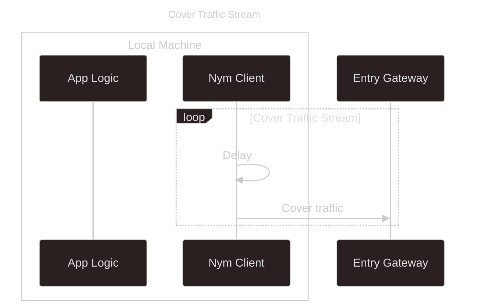
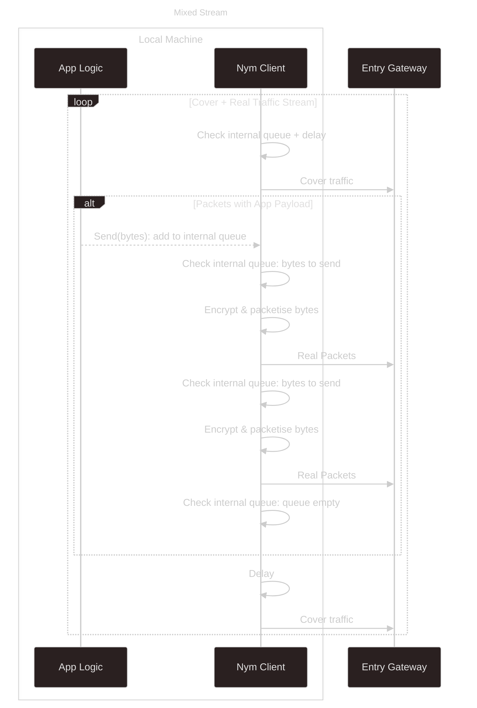

# Message Queue

Clients, once connected to the Mixnet, **are always sending traffic into the Mixnet**; as well as the packets that you as a developer are sending from your application logic, they send [cover traffic](../../network/concepts/cover-traffic) at a constant rate defined by a Poisson process. This is part of the network's mitigation of timing attacks.

There are two constant streams of sphinx packets leaving the client at the rate defined by the Poisson process.
- one that is solely cover traffic
- one that sends a mixture of cover and 'real' traffic

> Since Sphinx packets are indistinguishable to an external observer, the only difference between 'real' and cover traffic is whether the payload is empty or not. This can be only known to the eventual receiver of the packet.

## What does `send()` do then?

When passing a message to a client (however you do it, either piping messages from an app to a standalone client or via one of the `send` functions exposed by the SDKs), you are **putting that message into the queue** to be source encrypted and sent in the future, in order to ensure that traffic leaving the client does so in a manner that to an external observer is uniform / does not create any 'burst' or change in traffic timings that could aid traffic analysis.

## Note on Client Shutdown
Accidentally dropping a client before your message has been sent is something that is possible and should be avoided (see the [troubleshooting guide](../rust/mixnet/troubleshooting) for more on this) but is easy to avoid simply by remembering to:
- keep your client process alive, even if you are not expecting a reply to your message
- (in the case of the SDKs) properly disconnecting your client in order to make sure that the message queue is flushed of Sphinx packets with actual payloads.
