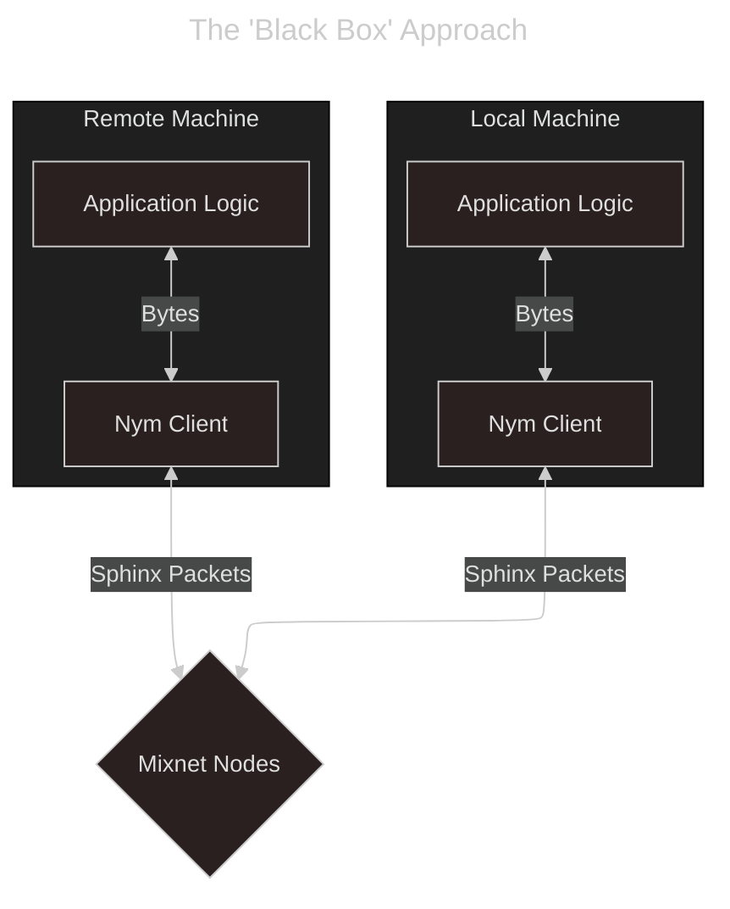

# Required Application Architecture

Due to the fact that there are a lot of components that make up the Nym network (the Mixnet, Blockchain, etc) there is often confusion / misunderstandings about what is required to run application traffic through the Mixnet and take advantage of its various privacy properties.

## What do I need?
Nym clients on 'both sides' of the Mixnet.
- traditional client / server application setups involve having a Nym client on the local 'client' machine, as well as on the 'server' backend your local app/process wants to remotely communicate with. We need to put the Mixnet betwen them to gain the privacy properties as we need our local app to pipe its traffic to its local Nym client and have this traffic encrypted and slotted into the message queue for sending, and our server code to have a Nym client listening out for incoming messages to decrypt, reconstruct, and pass upstream to the server process. The server-side Nym client can then [anonymously reply via SURBs](../../network/traffic/anonymous-replies) to the client-app.
- P2P app setups may differ only insofar as that they probably shouldn't rely on [ephemeral clients](../rust/mixnet/examples/simple) as they will likely need a persistent Nym address - otherwise the logic is the same as client/server apps.

> We haven't yet tried to integrate a fully P2P application using anonymous replies: reach out if you are trying / have ideas!

That's it - so long as you have a Nym client, you can communicate with other Nym clients through the Mixnet. The content of your message payloads is up to you, and you can approach funneling traffic through the Mixnet as a black box if you want!

## What don't I need (but is maybe nice to have)?
You **do not need to run any infrastructure to integrate Mixnet functionality**.

That said, if you are expecting a lot of traffic and perhaps don't want to rely on other people's Gateway infrastructure, you could run your own. However, this is something that is more in the 'nice to have'/'quality of service' category, and is not necessarily expected when starting to build on Nym. Furthermore, if our tokenomic incentives are working as they should, Gateway uptimes should be so good as to not require this regardless!

## What do I definitely not need?
- To run a Mix Node. Defining which Mix Nodes you want to run traffic through is, although [technically possible](../rust/mixnet/examples/custom-topology), **only to be used in testing or research scenarios**; limiting the potential paths of your packets to a subset of the overall Mixnet topology is effectively reducing your anonymity set, and potentially leaking this subset through e.g. having the calculation logic open sourced is even worse. The best performing Mix Nodes are selected to route traffic per epoch, and will be used by your Nym clients when routing packets.
- To run a Validator / NymAPI instance.
- `NYM` tokens: for the moment the Mixnet is free to use. Developers will have access to a Credential faucet once the [zk-nym](../../network/cryptography/zk-nym) scheme is enabled in mainnet.
