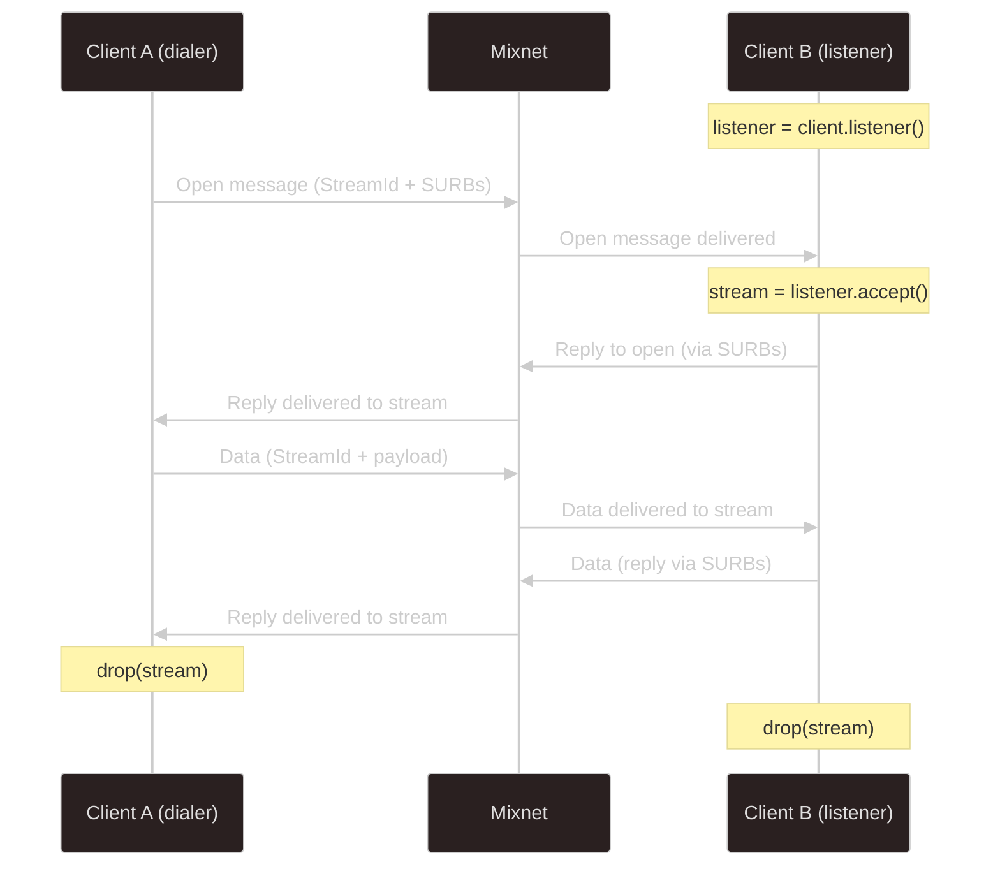

# Stream Module

import { Callout } from 'nextra/components'

The Mixnet is fundamentally a message-based anonymity network — no persistent connections, no guaranteed ordering, no TCP. The default [message API](./mixnet) works at this native level: individual payloads sent independently through mix nodes. This is powerful for privacy, but it's not how most networking code works.

The **Stream module** bridges that gap. It gives you persistent, bidirectional byte channels that look and feel like TCP sockets. Each `MixnetStream` implements Rust's standard [`AsyncRead`](https://docs.rs/tokio/latest/tokio/io/trait.AsyncRead.html) and [`AsyncWrite`](https://docs.rs/tokio/latest/tokio/io/trait.AsyncWrite.html) traits — use `tokio::io::copy`, codecs, `BufReader`/`BufWriter`, or any library that works with async I/O. Under the hood, the module handles framing, multiplexing, and routing so you don't have to.

**If you're coming from socket-based networking, start here.**

Under the hood, every stream is multiplexed over a single `MixnetClient`. A background router task decodes a small header on each incoming Mixnet message and dispatches payloads to the correct stream by ID — no extra connections or gateways needed.

## How it works

The two sides of a stream connection follow a client/server pattern:

1. **Dialer** calls `client.open_stream(recipient, surbs)` — this generates a random `StreamId`, registers the stream locally, and sends an `Open` message through the Mixnet.
2. **Listener** calls `listener.accept()` — this blocks until an `Open` arrives, registers the new stream, and returns a `MixnetStream` ready for reading and writing.
3. Both sides read and write using standard `AsyncRead`/`AsyncWrite` — bytes are wrapped with a 10-byte stream header, routed through the Mixnet, and demultiplexed on arrival.
4. **Cleanup** happens on `drop` — the stream deregisters from the local router. No close message is sent over the wire (the Mixnet doesn't guarantee message ordering, so a close could arrive before the final data).



## Complete example

This is a minimal but complete example: two clients on the same machine, one opens a stream to the other, sends a message, and reads a reply.

```rust
use nym_sdk::mixnet;
use tokio::io::{AsyncReadExt, AsyncWriteExt};
use std::time::Duration;

const TIMEOUT: Duration = Duration::from_secs(60);

#[tokio::main]
async fn main() {
    // 1. Connect two ephemeral clients
    let mut sender = mixnet::MixnetClient::connect_new().await.unwrap();
    let mut receiver = mixnet::MixnetClient::connect_new().await.unwrap();
    let receiver_addr = *receiver.nym_address();

    // 2. The receiver creates a listener (activates stream mode)
    let mut listener = receiver.listener().unwrap();

    // 3. The sender opens a stream to the receiver's Nym address
    let mut outbound = sender.open_stream(receiver_addr, None).await.unwrap();

    // 4. The receiver accepts the incoming stream
    let mut inbound = tokio::time::timeout(TIMEOUT, listener.accept())
        .await
        .expect("timed out")
        .expect("listener closed");

    // 5. Send data and read it back — just like a TCP socket
    outbound.write_all(b"hello from sender").await.unwrap();
    outbound.flush().await.unwrap();

    let mut buf = vec![0u8; 1024];
    let n = tokio::time::timeout(TIMEOUT, inbound.read(&mut buf))
        .await
        .expect("timed out")
        .expect("read failed");
    println!("Receiver got: {}", String::from_utf8_lossy(&buf[..n]));

    // 6. Reply back through the same stream
    inbound.write_all(b"hello from receiver").await.unwrap();
    inbound.flush().await.unwrap();

    let n = tokio::time::timeout(TIMEOUT, outbound.read(&mut buf))
        .await
        .expect("timed out")
        .expect("read failed");
    println!("Sender got: {}", String::from_utf8_lossy(&buf[..n]));

    // 7. Clean up — streams deregister on drop, then disconnect clients
    drop(outbound);
    drop(inbound);
    sender.disconnect().await;
    receiver.disconnect().await;
}
```

<Callout type="info">
The receiver replies via **reply SURBs** (Single Use Reply Blocks) — it never learns the sender's Nym address. This is the same anonymous reply mechanism used by the message API, applied transparently to streams.
</Callout>

## When to use streams vs messages

| | Messages | Streams | TcpProxy |
|---|---|---|---|
| **Pattern** | Raw message payloads | Persistent bidirectional channels | TCP socket proxying |
| **API** | `send_plain_message()` / `wait_for_messages()` | `AsyncRead` + `AsyncWrite` | Localhost TCP socket |
| **Multiplexing** | N/A | Multiple streams per client | One client per TCP connection |
| **Ordering** | No guarantees | No guarantees (yet) | Session-based ordering |
| **Best for** | Simple notifications, one-shot requests | Interactive protocols, streaming data, any code expecting async I/O | Wrapping existing TCP applications |
| **Status** | Stable | New | Deprecated |

<Callout type="warning">
**Streams and messages are mutually exclusive.** Once you call `open_stream()` or `listener()`, the message-based API (`send_plain_message`, `wait_for_messages`) is permanently disabled on that client. This is a one-way transition — there is no switching back without disconnecting and reconnecting. See the [mode guard example](./stream/examples/mode-guard) for details.
</Callout>

## Key types

- [**`MixnetStream`**](https://docs.rs/nym-sdk/latest/nym_sdk/mixnet/struct.MixnetStream.html) — a single stream implementing `AsyncRead + AsyncWrite`. Obtained from `open_stream()` (outbound) or `listener.accept()` (inbound).
- [**`MixnetListener`**](https://docs.rs/nym-sdk/latest/nym_sdk/mixnet/struct.MixnetListener.html) — accepts inbound streams from remote peers. Created once per client via `client.listener()`.
- [**`StreamId`**](https://docs.rs/nym-sdk/latest/nym_sdk/mixnet/struct.StreamId.html) — 8-byte random identifier (`u64`) generated by the dialer, used to multiplex streams over a single client.

## Next steps

- [Tutorial: Build a private echo server](./stream/tutorial) — step-by-step guide with a server and client communicating over streams
- [Architecture](./stream/architecture) — wire protocol, router task, data flow, stream cleanup, and known limitations
- [Examples](./stream/examples) — annotated walkthroughs of the SDK examples (multi-stream, idle timeout, throughput testing)
- [API reference on docs.rs](https://docs.rs/nym-sdk/latest/nym_sdk/mixnet/stream/) — type details and method signatures
