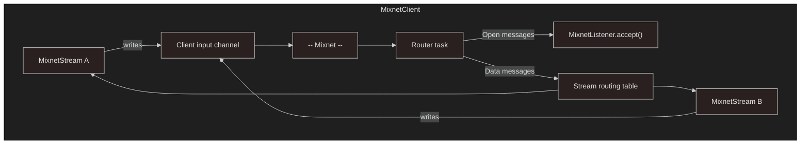

# Stream Architecture

import { Callout } from 'nextra/components'

{/* Canonical source: sdk/rust/nym-sdk/src/mixnet/stream/ARCHITECTURE.md */}

## Overview

The stream subsystem gives each `MixnetClient` the ability to hold many concurrent byte channels (`AsyncRead + AsyncWrite`) to different remote peers, multiplexed over a single client connection.



## Wire protocol

Every stream message has a fixed 10-byte header prepended to the payload:

```
[Version: 1 byte][StreamId: 8 bytes][MessageType: 1 byte][payload ...]
```

- **Version** — protocol version (`1`). Unknown versions are rejected.
- **StreamId** — random `u64` generated by the dialer, used to multiplex streams.
- **MessageType** — `Open` (0) or `Data` (1).

There is no `Close` message type — see [Known Limitations](#known-limitations) for why.

## Stream mode

Stream mode is activated lazily on the first call to `open_stream()` or `listener()`. This is a **one-way transition**:

1. The client's message receiver is handed off to a background router task
2. `stream_mode` flag is set to `true`
3. Message-based methods (`send_plain_message`, `wait_for_messages`) are disabled and return errors

There is no switching back without disconnecting and creating a new client.

## Opening and accepting streams

**Opening (outbound):**
1. `open_stream(recipient, surbs)` generates a random `StreamId`
2. An `Open` message is sent through the Mixnet to the recipient
3. A `MixnetStream` is returned, ready for writing and reading

**Accepting (inbound):**
1. `listener.accept()` waits for an `Open` message from a remote peer
2. A `MixnetStream` is created with the dialer's `sender_tag` for anonymous replies
3. The stream is ready for bidirectional I/O

## Cleanup

- **On `drop`** — the stream deregisters from the routing table. No close message is sent over the wire.
- **Idle timeout** — streams idle for longer than the configured timeout (default: 30 minutes) are automatically cleaned up. Configure with [`MixnetClientBuilder::with_stream_idle_timeout()`](https://docs.rs/nym-sdk/latest/nym_sdk/mixnet/struct.MixnetClientBuilder.html).

## Known limitations

<Callout type="warning">
**No message ordering yet.** The mixnet does not currently guarantee message ordering. Messages on a stream can arrive out of order. This means:
- Large writes that span multiple Sphinx packets may arrive shuffled
- There is no `Close` message -- a close could arrive before the final data
- Protocols that depend on byte ordering (HTTP, TLS, protobuf) may not work correctly over streams yet

Message ordering is planned for a future release.
</Callout>

<Callout type="warning">
**No protocol discriminator.** There is currently no way to distinguish stream messages from regular Mixnet messages. Sending to a non-stream client will deliver bytes with the stream header prepended. A protocol discriminator is planned for a future release.
</Callout>

## Internal details

For the full implementation details (router task, `StreamMap`, `PollSender` usage, base-client type rationale), see the [architecture documentation in the source tree](https://docs.rs/nym-sdk/latest/nym_sdk/mixnet/stream/) or the `ARCHITECTURE.md` file next to the module code.
