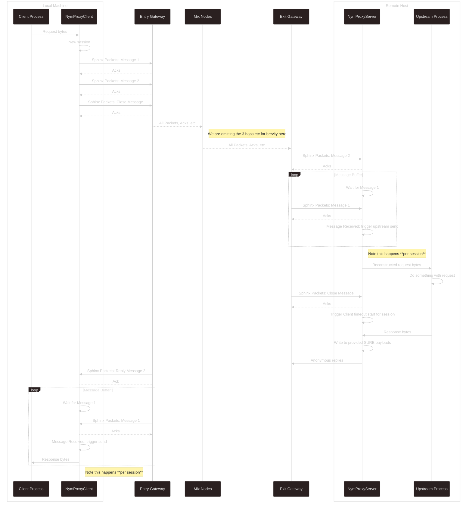

# TcpProxy Module
import { Callout } from 'nextra/components';
import { CodeVerified } from '../../../components/code-verified'

<Callout type="error">
  **This module is unmaintained.** The TcpProxy is no longer actively developed in favour of the [Stream module](./stream), which provides `AsyncRead + AsyncWrite` streams directly over the Mixnet without the TCP socket overhead. Existing users should plan to migrate to streams when possible. The TcpProxy will continue to work but will not receive new features or bug fixes.
</Callout>

The Stream module offers the same key benefit (familiar I/O patterns on top of the Mixnet) with a simpler API. Streams multiplex connections on a single client, eliminate the localhost socket overhead, and now include sequence-based message reordering. There is no remaining reason to choose TcpProxy over Streams for new projects.

---

`NymProxyClient` and `NymProxyServer` proxy TCP traffic through the Mixnet. Both run in a background thread and expose a configurable `localhost` socket that you read and write to like any other TCP connection.

> Non-Rust/Go developers who want to experiment with this module can start with the [standalone binaries](../tools/standalone-tcpproxy).

## Examples

| Example | Source |
|---|---|
| Single connection | [`tcp_proxy_single_connection.rs`](https://github.com/nymtech/nym/blob/develop/sdk/rust/nym-sdk/examples/tcp_proxy_single_connection.rs) |
| Multiple connections | [`tcp_proxy_multistream.rs`](https://github.com/nymtech/nym/blob/develop/sdk/rust/nym-sdk/examples/tcp_proxy_multistream.rs) |

```bash
cargo run --example tcp_proxy_single_connection
cargo run --example tcp_proxy_multistream
```

## API reference

- [API reference on docs.rs](https://docs.rs/nym-sdk/latest/nym_sdk/tcp_proxy/): architecture overview, client/server examples, and type documentation

## Tutorial

<CodeVerified />

Set up the project:

```sh
cargo init nym-tcp-proxy
cd nym-tcp-proxy
rm src/main.rs
```

Add dependencies to `Cargo.toml`:

```toml
[dependencies]
nym-sdk = { git = "https://github.com/nymtech/nym", rev = "97068b2" }
nym-network-defaults = { git = "https://github.com/nymtech/nym", rev = "97068b2" }
nym-bin-common = { git = "https://github.com/nymtech/nym", rev = "97068b2", features = ["basic_tracing"] }
tokio = { version = "1", features = ["full"] }
anyhow = "1"
blake3 = "=1.7.0"  # required pin — see https://nymtech.net/docs/developers/rust/importing

[[bin]]
name = "proxy_server"
path = "src/bin/proxy_server.rs"

[[bin]]
name = "proxy_client"
path = "src/bin/proxy_client.rs"
```

### Server

The server connects to the Mixnet and forwards incoming traffic to a local TCP service (e.g. a web server on port 8000).

```rust
use nym_sdk::tcp_proxy::NymProxyServer;

#[tokio::main]
async fn main() -> anyhow::Result<()> {
    nym_bin_common::logging::setup_tracing_logger();

    let mut server = NymProxyServer::new(
        "127.0.0.1:8000",           // upstream address (host:port)
        "./proxy-server-config",    // config directory for persistent keys
        None,                       // env file (None = mainnet)
        None,                       // gateway (None = auto-select)
    ).await?;

    println!("Proxy server address: {}", server.nym_address());
    server.run_with_shutdown().await?;
    Ok(())
}
```

### Client

The client opens a localhost TCP socket and tunnels all traffic through the Mixnet to the server.

```rust
use nym_sdk::tcp_proxy::NymProxyClient;
use nym_sdk::mixnet::Recipient;
use nym_network_defaults::setup_env;
use tokio::io::{AsyncReadExt, AsyncWriteExt};
use tokio::net::TcpStream;

#[tokio::main]
async fn main() -> anyhow::Result<()> {
    nym_bin_common::logging::setup_tracing_logger();
    // Load mainnet network defaults into env vars (required by NymProxyClient's internal ClientPool)
    setup_env(None::<String>);

    let server_addr: Recipient = std::env::args()
        .nth(1).expect("Usage: proxy_client <SERVER_NYM_ADDRESS>")
        .parse()?;

    let client = NymProxyClient::new(
        server_addr,
        "127.0.0.1",  // listen host
        "8070",       // listen port
        60,           // close timeout (seconds)
        None,         // env file (None = mainnet)
        1,            // client pool size
    ).await?;

    let proxy = tokio::spawn(async move { client.run().await });

    // Wait for the pool to create a client and the proxy to be ready.
    // The first startup takes ~10-15s while the client connects to the Mixnet.
    println!("Waiting for proxy to be ready...");
    tokio::time::sleep(std::time::Duration::from_secs(15)).await;

    let mut stream = TcpStream::connect("127.0.0.1:8070").await?;
    stream.write_all(b"GET / HTTP/1.0\r\nHost: localhost\r\n\r\n").await?;

    let mut response = Vec::new();
    stream.read_to_end(&mut response).await?;
    println!("Response:\n{}", String::from_utf8_lossy(&response));

    drop(stream);
    proxy.abort();
    Ok(())
}
```

### Run it

Start an upstream TCP service (e.g. a simple HTTP server):

```sh
python3 -m http.server 8000
```

In a second terminal, start the proxy server:

```sh
RUST_LOG=info cargo run --bin proxy_server
```

Copy the Nym address it prints, then in a third terminal:

```sh
RUST_LOG=info cargo run --bin proxy_client -- <SERVER_NYM_ADDRESS>
```

The response will take 30–60 seconds to arrive as it traverses the Mixnet in both directions.

## Architecture

Each sub-module handles Nym clients differently:
- **`NymProxyClient`** relies on the [Client Pool](./client-pool) to create clients and keep a reserve. If incoming TCP connections outpace the pool, it creates an ephemeral client per connection. One client maps to one TCP connection.
- **`NymProxyServer`** has a single Nym client with a persistent identity.

### Sessions & message ordering

Messages are wrapped in a session ID per connection, with individual messages given an incrementing message ID. Once all messages are sent, the client sends a `Close` message to notify the server that there are no more outbound messages for this session.

> Session management and message IDs are necessary since *the Mixnet guarantees message delivery but not message ordering*: in the case of trying to e.g. send gRPC protobuf through the Mixnet, ordering is required so that a buffer is not split across Sphinx packet payloads, and that the 2nd half of the frame is not passed upstream to the parser before the 1st half.

The key data structure:

```rust
pub struct ProxiedMessage {
    message: Payload,
    session_id: Uuid,
    message_id: u16,
}
```

### Full request/response flow



## Troubleshooting

### Lots of `duplicate fragment received` messages

`WARN` level logs about duplicate fragments are caused by Mixnet-level packet retransmission, where both the original and the retransmitted copy arrive at the destination. This is expected behaviour, not a bug in the client or TcpProxy module.
