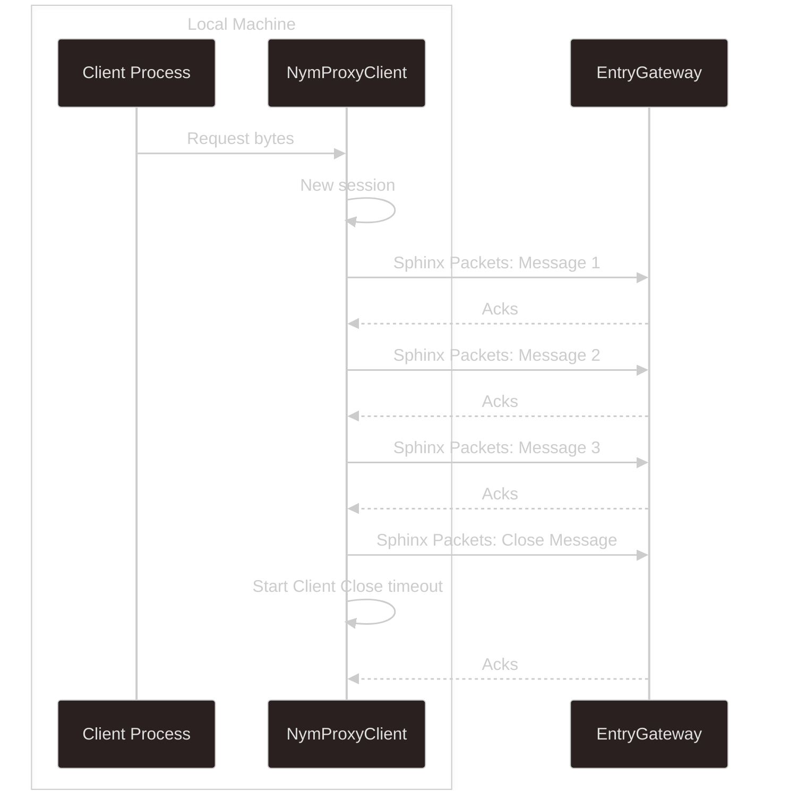
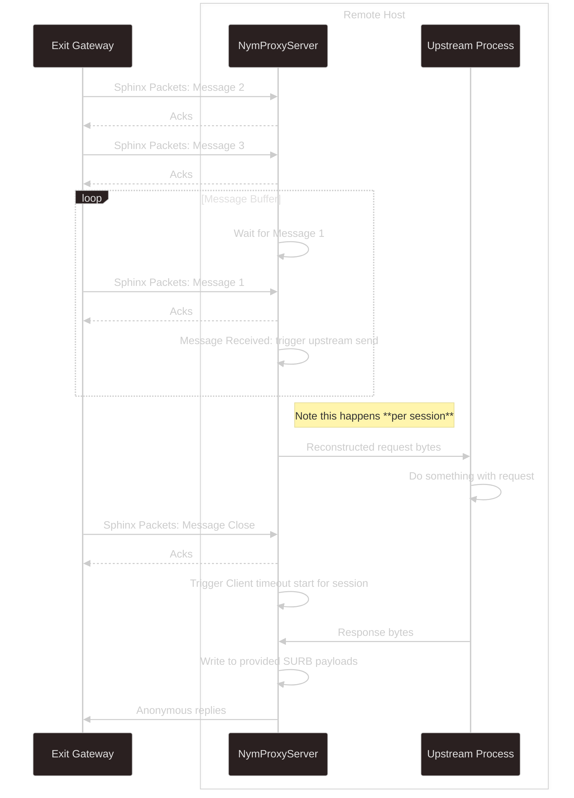
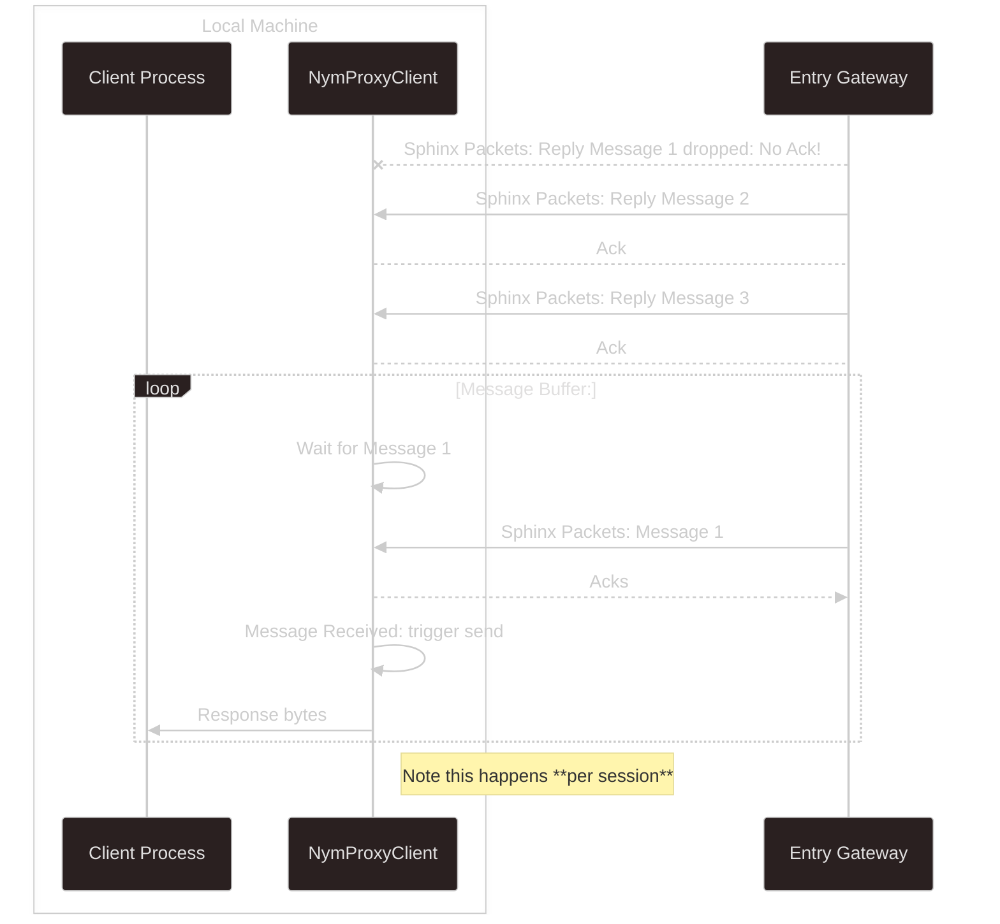
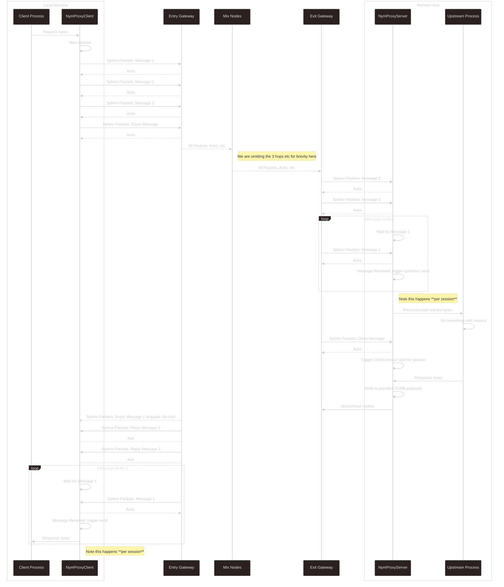

import { Callout } from 'nextra/components'

# Architecture

## Motivations
The motivation behind the creation of the `TcpProxy` module is to allow developers to interact with the Mixnet in a way that is far more familiar to them: simply setting up a connection with a transport, being returned a socket, and then being able to stream data to/from it, similar to something like the Tor [`arti`](https://gitlab.torproject.org/tpo/core/arti/-/tree/main/crates/arti-client) client.

<Callout type="info" emoji="ℹ️">
  This is an initial version of the module which we are releasing to developers to experiment with. If you run into problems or any functionality that is missing, do reach out on Matrix and let us know.

  Furthermore we will be working on optimisations to the module over time - most of this will occur under the hood (e.g. implementing a configurable connection pool for the `ProxyClient`), but all updates will occur according to SemVer, so don't worry about breaking changes!
</Callout>

## Clients
Each of the sub-modules exposed by the `TcpProxy` deal with Nym clients in a different way.
- the `NymProxyClient` creates an ephemeral client per new TCP connection, which is closed according to the configurable timeout: we map one ephemeral client per TCP connection. This is to deal with multiple simultaneous streams. In the future, this will be superceded by a connection pool in order to speed up new connections.
- the `NymProxyServer` has a single Nym client with a persistent identity.

## Sessions & Message Ordering
We have implemented session management and message ordering, where messages are wrapped in a session ID per connection, with individual messages being given an incrememting message ID. Once all the messages have been sent, the `NymProxyClient` then sends a `Close` message as the last outgoing message. This is to notify the `NymProxyServer` that there are no more outbound messages for this session, and that it can trigger the session timeout.

The reason we need to implement session management and message IDs is due to the fact that the Mixnet guarantees message delivery but not message ordering: in the case of trying to e.g. send gRPC protobuf through the Mixnet, ordering is required so that a buffer is not split across Sphinx packet payloads, and that the 2nd half of the frame is not passed upstream to the gRPC parser before the 1st half, even if it is received first.

Lets step through a full request/response path between a client process communicating with a remote host via the proxies:

### Outgoing Client Request
The `NymProxyClient` instance, once initialised and running, listens out for incoming TCP connections on its localhost port.

On receiving one, it will create a new session ID and packetise the incoming bytes into messages of the following structure:

```rust
pub struct ProxiedMessage {
    message: Payload,
    session_id: Uuid,
    message_id: u16,
}
```

> This code can be found [here](https://github.com/nymtech/nym/blob/develop/sdk/rust/nym-sdk/src/tcp_proxy/utils.rs#L147C1-L152C2)

And then send these to the Nym address of the `NymProxyServer` instance. Not much to see here regarding message ordering, as the potential for reordering only starts once packets are travelling through the Mixnet.



### Server Receives Request & Responds

Here is a diagrammatic representation of a situation in which the request arrives out of order, and how the message buffer deals with this so as not to pass a malformed request upstream to the process running on the same remote host:



> Note that this is per-session, with a session mapped to a single TCP connection. Both the `NymProxyClient` and `Server` are able to handle multiple concurrent connections.

### Client Receives Response

The `ProxyClient` deals with incoming traffic in the same way as the `ProxyServer`, with a per-session message queue:



### Full Flow Diagram

