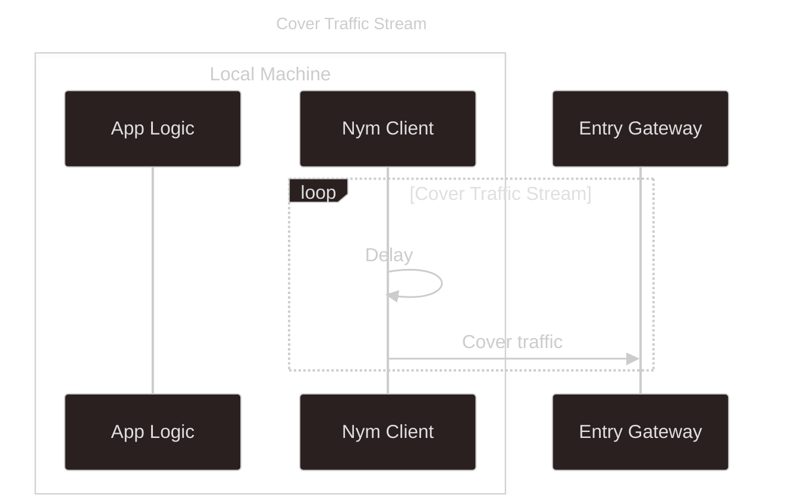
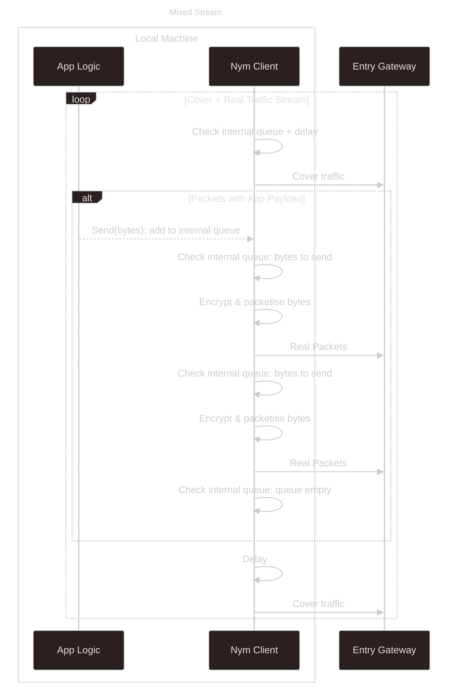

import { Callout } from 'nextra/components'

# What a Nym client is

A Nym client works differently from an ordinary network client, something like an HTTP or UDP client, despite the shared name. The difference determines how you integrate with it.

An ordinary client sends when your application has something to send, and is quiet otherwise. The timing and volume of its traffic follow what the user does, and a network observer can use that pattern to identify the user.

A Nym client sends traffic at a constant average rate. Once it connects to an Entry Gateway, it sends [Sphinx packets](/network/cryptography/sphinx) whether or not your application has anything to send. Most of these are [cover traffic](/network/mixnet-mode/cover-traffic): encrypted packets with no real payload. When your application sends something, the client puts your data into the stream in place of cover packets. An observer sees the same constant stream either way.

The client holds this stream open whether or not you send anything, and your data travels inside it.

<Callout type="info">
  This is the base mixnet client. The SDK modules and packages build on it and handle some of the behaviour below for you, but underneath they all send Sphinx packets on this constant stream.
</Callout>

- On the base client, `send()` does not wait for a reply, and usually does not transmit straight away. Some abstractions add their own handling; the [Stream module](/developers/rust/stream), for example, confirms the receiver is up before it sends.
- The base client holds no connection to a peer, and pairs no response with a request. The SDK packages add connection state and correlation on top: SOCKS5, the Stream module, and the smolmix-based family (`mix-fetch`, `mix-websocket`, `mix-dns`) that reconstruct TCP, UDP, TLS, HTTP, WebSocket, and DNS over it.
- The client uses the same bandwidth idle as under load, in every package, because the stream is constant. See [what Nym cannot do](/developers/limitations) for the figures.
- Reaching an ordinary internet service over Nym (TCP, UDP, TLS, HTTP, WebSocket, DNS) runs a second protocol stack on top of the client. See [Not request/response](#not-requestresponse-you-tunnel-through-it).

<Callout type="info">
  This page describes the client as a concept, independent of language or package. All Nym clients use the same core ([`client-core`](https://github.com/nymtech/nym/tree/develop/common/client-core)): the native [`nym-sdk`](/developers/rust) `MixnetClient`, the browser and wasm packages, and the [standalone clients](/developers/clients).
</Callout>

## The client and its gateway

When your client starts, it registers with one Entry Gateway and holds a single connection to it open. That connection defines the client's identity and its mailbox.

The gateway's key becomes part of your Nym address, which has the form `identity.encryption@gateway`: your two public keys, then the gateway that holds your messages. An ordinary client is reached at an IP address and port. A Nym client is reached through its gateway, and the address carries no IP. See [addressing](/network/reference/addressing) for the format.

The gateway is also your mailbox. It holds packets addressed to you and delivers them over the open connection while your client is online, and stores them while it is offline. The client dials out to the gateway and never accepts an inbound connection, so everything reaches it through the gateway.

## The always-on stream

The client paces its output as a [Poisson process](https://www.probabilitycourse.com/chapter11/11_1_2_basic_concepts_of_the_poisson_process.php): the gap before each packet is drawn from an exponential distribution, so the gaps are individually unpredictable but hold a known average rate. For a given average rate, the exponential distribution has maximum entropy, so an observer gains the least information about when real traffic left the client.

Two separate streams of Sphinx packets leave the client, each a Poisson process at its own rate:

| Stream | Contents | Default average rate |
|---|---|---|
| Loop cover stream | Cover traffic only | one packet every ~200 ms (~5 packets/s) |
| Main stream | Real packets, with cover filling every empty slot | one packet every ~20 ms (~50 packets/s) |

The [loop cover stream](/network/mixnet-mode/cover-traffic#loop-traffic) sends packets addressed back to your own client, so each one travels a full path through the mixnet and returns. The main stream carries your application's traffic: on each tick the client sends a queued real packet if one is available, otherwise a cover packet. The gateway sees a packet on every tick, so it cannot distinguish an idle client from a busy one. The figures, and the throughput ceiling they set, are on [what Nym cannot do](/developers/limitations).

Sphinx packets are a fixed size (see [packet anatomy](/network/deep-dives/packet-anatomy)), so an observer learns nothing from a packet's length. The only difference between a real packet and a cover packet is whether the payload is empty, which only the final recipient can determine.

<Callout type="info">
  Two Poisson processes run in the mixnet. This page describes the first: the client pacing its own output. The second runs inside every [Mix Node](/network/mixnet-mode/mixing#why-exponential-delays): each node holds each packet for an exponentially distributed delay before forwarding, which reorders packets and breaks timing links. The client controls the first. Mix Nodes control the second.
</Callout>

### What `send()` actually does

Calling `send()`, or piping a message to a standalone client, puts your message into an internal queue. The client encrypts it, splits it into fixed-size packets, and emits those packets on the main stream's next available slots. A return from `send()` means the message reached the queue. It does not mean the packets have left your machine, and it does not mean anyone received them.

Two consequences follow for your code:

- Keep the client alive until its queue has drained. Dropping a client while real payloads are still queued discards them. With the SDKs, disconnect the client so the queue flushes first. The [troubleshooting guide](/developers/rust/mixnet/troubleshooting) covers this failure mode.
- Do not treat a return from `send()` as delivery. To know a message arrived, the recipient has to tell you over a separate reply, which the client does not correlate for you. See [Not request/response](#not-requestresponse-you-tunnel-through-it).

## The processes the client runs

The client runs three long-running processes. Two send, and one receives. They start when the client connects to its gateway and run until it shuts down, passing packets between each other over internal channels.

### Send: the main stream

The main stream turns your messages into packets and paces them onto the wire. A message goes through four steps:

1. **Fragmentation.** The client pads the message and splits it into fixed-size fragments. Each fragment becomes one Sphinx packet, so a large message becomes many packets and a small one is padded to a full packet. See [packet anatomy](/network/deep-dives/packet-anatomy) for the sizes.
2. **Encryption and packetisation.** The client wraps each fragment in [layered Sphinx encryption](/network/cryptography/sphinx), one layer per hop, so each hop strips only its own layer and learns nothing about the rest of the path.
3. **Route and delay selection.** The client chooses the packet's path through the mixnet and assigns each hop a delay drawn from an exponential distribution. The delays are sealed inside the packet header for the [Mix Nodes](/network/mixnet-mode/mixing) to apply.
4. **Pacing.** Prepared packets wait in a queue. On each tick of the stream's Poisson schedule, the client emits one packet: a queued real packet if one is available, otherwise a cover packet. The gateway sees a packet on every tick, whether or not you are sending.

### Send: the loop cover stream

A second process sends cover traffic on its own Poisson schedule, independent of the main stream. Each packet is addressed back to your own client, so it travels a full path through the mixnet and returns. Cover traffic therefore comes from two places: this stream, and the main stream filling its empty slots. Both are Sphinx packets the gateway cannot tell apart from real traffic.

### Receive: reassembly

The receiving process takes packets back from the gateway and turns them into messages. Packets arrive out of order, because the per-hop delays reorder them.

1. **Split.** The client separates incoming packets into acknowledgements and data packets. Acknowledgements drive retransmission; see [acknowledgements](/network/reference/acks).
2. **Drop cover.** The client discards cover packets it recognises, including the loop cover packets it sent itself.
3. **Decrypt.** The client decrypts each data packet with the appropriate key.
4. **Reassemble.** The client holds fragments in a buffer and places each at its position until every fragment of a message has arrived, then concatenates them in order. A message that never completes is discarded after a timeout.
5. **Deliver.** The client hands the completed message to your application on the receive channel.

Reordering and gaps are normal. Retransmission covers dropped packets, and the reassembly buffer covers out-of-order arrival.

### Where this lives in the code

The client core is [`common/client-core`](https://github.com/nymtech/nym/tree/develop/common/client-core); packet construction and reassembly live in [`common/nymsphinx`](https://github.com/nymtech/nym/tree/develop/common/nymsphinx). [`BaseClientBuilder::start_base`](https://github.com/nymtech/nym/blob/develop/common/client-core/src/client/base_client/mod.rs) spawns the three processes and wires them together with channels.

- **Send, main stream.** [`OutQueueControl`](https://github.com/nymtech/nym/blob/develop/common/client-core/src/client/real_messages_control/real_traffic_stream.rs) paces the stream, emitting a real or cover packet on each Poisson tick. Packet preparation is [`MessagePreparer` and `FragmentPreparer`](https://github.com/nymtech/nym/blob/develop/common/nymsphinx/src/preparer/mod.rs) with the [chunking scheme](https://github.com/nymtech/nym/tree/develop/common/nymsphinx/chunking); the route comes from [`random_route_to_egress`](https://github.com/nymtech/nym/blob/develop/common/topology/src/lib.rs) and the per-hop delays from [`generate_hop_delays`](https://github.com/nymtech/nym/blob/develop/common/nymsphinx/routing/src/lib.rs).
- **Send, loop cover stream.** [`LoopCoverTrafficStream`](https://github.com/nymtech/nym/blob/develop/common/client-core/src/client/cover_traffic_stream.rs).
- **Receive, reassembly.** [`ReceivedMessagesBufferController`](https://github.com/nymtech/nym/blob/develop/common/client-core/src/client/received_buffer.rs), with [`MessageReconstructor`](https://github.com/nymtech/nym/blob/develop/common/nymsphinx/chunking/src/reconstruction.rs) handling out-of-order fragments.

## Why it is built this way

Each process defends against a specific traffic-analysis attack. Removing any one weakens that defence.

| Design choice | What it defeats | Documented in |
|---|---|---|
| Fixed-size Sphinx packets and padding | Linking sender to receiver by matching packet sizes | [Sphinx](/network/cryptography/sphinx), [packet anatomy](/network/deep-dives/packet-anatomy) |
| Layered encryption, source-routed by the sender | Content and route linkage; no single hop knows both ends of the path | [Sphinx](/network/cryptography/sphinx) |
| Per-hop exponential delays at each Mix Node | Flow correlation by timing; input order stops predicting output order | [Packet mixing](/network/mixnet-mode/mixing) |
| Poisson pacing of the client's own output | Correlation between your application's activity and the packets you emit | [Cover traffic](/network/mixnet-mode/cover-traffic), [mixing](/network/mixnet-mode/mixing) |
| Constant cover traffic filling idle slots | Volume and on/off correlation; an idle client looks identical to a busy one | [What cover traffic defeats](/network/mixnet-mode/cover-traffic#what-cover-traffic-defeats) |

The design follows the [Loopix](/network/mixnet-mode/loopix) academic work, which Nym extends. The latency and throughput limits it sets are on [what Nym cannot do](/developers/limitations).

## Not request/response: you tunnel through it

The client's native operation is one-way. It encrypts your bytes, hands them to the gateway, and returns once the packets are queued. Received messages arrive later on a separate channel, with nothing linking them to what you sent. There is no request paired with a response, because pairing them would reintroduce the timing correlation that the Poisson pacing removes.

### How replies work: SURBs

The recipient never learns your address, so it cannot reply on its own. [Single-use reply blocks (SURBs)](/network/mixnet-mode/anonymous-replies) make replies possible.

When you send a message, you can attach a batch of SURBs, which are pre-built encrypted return routes. The recipient stores them against an opaque tag rather than your address, and uses one to send bytes back. The reply follows that return route and arrives on your receive channel like any other message. The recipient never learns who you are.

Request/response is something the application builds on top of two primitives: one-way send, and optional attached reply SURBs. The client does not provide it.

### Tunnelling real network protocols

To run TCP, UDP, TLS, HTTP, WebSocket, or DNS over Nym, a layer on top of the client re-adds what the base client omits: connection state, ordering, retransmission, TLS sessions, and the pairing of a response to its request. Each tool in the Nym stack does this.

| Tool | What it re-adds on top of the client | Exit service |
|---|---|---|
| [SOCKS5 module](/developers/rust/socks5) and [standalone `nym-socks5-client`](/developers/clients/socks5) | A per-connection id, an ordered reassembly buffer, and response routing back to the right connection | [Network Requester](/network/infrastructure/exit-services#network-requester) |
| [`smolmix`](/developers/smolmix) and the [`mix-tunnel`](/developers/mix-tunnel) family ([`mix-fetch`](/developers/mix-fetch), [`mix-websocket`](/developers/mix-websocket), [`mix-dns`](/developers/mix-dns)) | A full userspace TCP/IP stack (smoltcp) for TCP and UDP, plus a TLS stack (rustls). `mix-fetch` does HTTP/HTTPS, `mix-websocket` does WS/WSS, `mix-dns` does DNS over UDP | [IP Packet Router](/network/infrastructure/exit-services#ip-packet-router) |
| [Stream module](/developers/rust/stream) | `AsyncRead + AsyncWrite` channels over the message client, with its own framing and reorder buffer | None; client to client, both ends run a Nym client |

For example, to make one HTTPS request, `smolmix` runs a userspace TCP/IP stack and a TLS session over the mixnet, because the base client provides packet delivery and nothing else. Which exit each tool uses, and how to pin one, is on [exit security](/developers/exit-security).

## One core, many packages

Every SDK module, Rust crate, and npm package uses the same [`client-core`](https://github.com/nymtech/nym/tree/develop/common/client-core). They differ in three ways: the runtime (native Rust or a browser Web Worker), the interface they expose (raw messages, a byte stream, or a `fetch` replacement), and the exit service they use to leave the mixnet, if they leave it at all. The always-on stream, Poisson pacing, cover traffic, and SURB handling are the same in all of them. [Overview: choosing a package](/developers) covers which client suits your integration and environment.

## What this means for your code

These points apply when you use the client directly, through raw messages (the [Rust SDK Mixnet module](/developers/rust/mixnet) or the [raw-messaging TypeScript client](/developers/typescript)). The higher-level packages ([`mix-fetch`](/developers/mix-fetch), [SOCKS5](/developers/rust/socks5), the [Stream module](/developers/rust/stream), [`smolmix`](/developers/smolmix)) add the expected networking-protocol structure on top and handle most of this for you. The same behaviour holds underneath.

- `send()` is fire-and-forget. It returns when your message is queued, not when it is delivered, and nothing correlates a reply to it for you.
- Keep the client alive until it has flushed, and disconnect it on shutdown, or you lose queued messages.
- Choose your abstraction. Raw messages mean you build your own framing and correlation. The [Stream module](/developers/rust/stream) gives you an ordered byte stream. A tunnel ([SOCKS5](/developers/rust/socks5), [`mix-fetch`](/developers/mix-fetch)) gives you request/response over a real protocol.
- To reach a clearnet service you need an exit. Which one your package uses, and what it can see, is on [exit security](/developers/exit-security).
- Latency and throughput are bounded by design. See [what Nym cannot do](/developers/limitations).

## Read more

- [Sphinx](/network/cryptography/sphinx) and [packet anatomy](/network/deep-dives/packet-anatomy): the packet format the client produces.
- [Cover traffic](/network/mixnet-mode/cover-traffic) and [packet mixing](/network/mixnet-mode/mixing): the timing defences.
- [Anonymous replies](/network/mixnet-mode/anonymous-replies): how SURBs work in full.
- [Loopix](/network/mixnet-mode/loopix): the design this client is based on.
- [Exit security](/developers/exit-security): which exit your package uses and how to control it.
- [What Nym cannot do](/developers/limitations): the latency and throughput limits.
