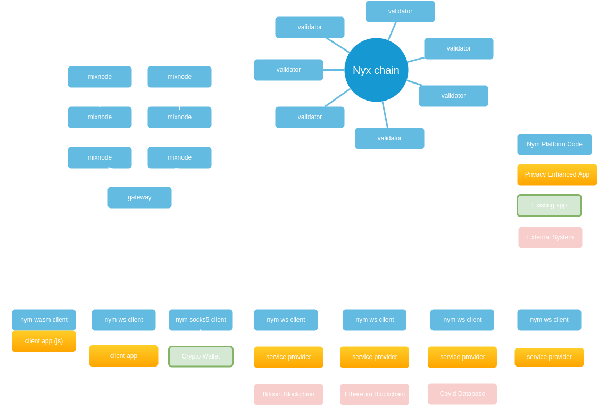

# Network Components

The Nym platform knits together several privacy technologies, integrating them into a system of cooperating networked nodes in order to provide network-level privacy and metadata anonymity.

The core components are:
* a **mixnet**, which encrypts and mixes Sphinx packet traffic so that it cannot be determined who is communicating with whom. Our mixnet is based on a modified version of the **Loopix TODO LINK** design. 
* **Sphinx**, a way of transmitting armoured, layer-encrypted information packets which are indistinguishable from each other at a binary level.
* various **Nym clients** LINK which manage sending and receiving Sphinx packets, encrypting/decrypting traffic, and providing cover traffic TODO LINK to hide 'real' traffic timing. 
* a privacy enhancing signature scheme called **zk-nym**, based on the Coconut and Ecash schemes. This allows a shift in thinking about resource access control, from an identity-based paradigm based on _who you are_ to a privacy-preserving paradigm based on _right to use_.
* A CosmWasm-enabled blockchain called **Nyx**, the home of the various smart contracts used by the mixnet.

TODO REDO DIAGRAM

