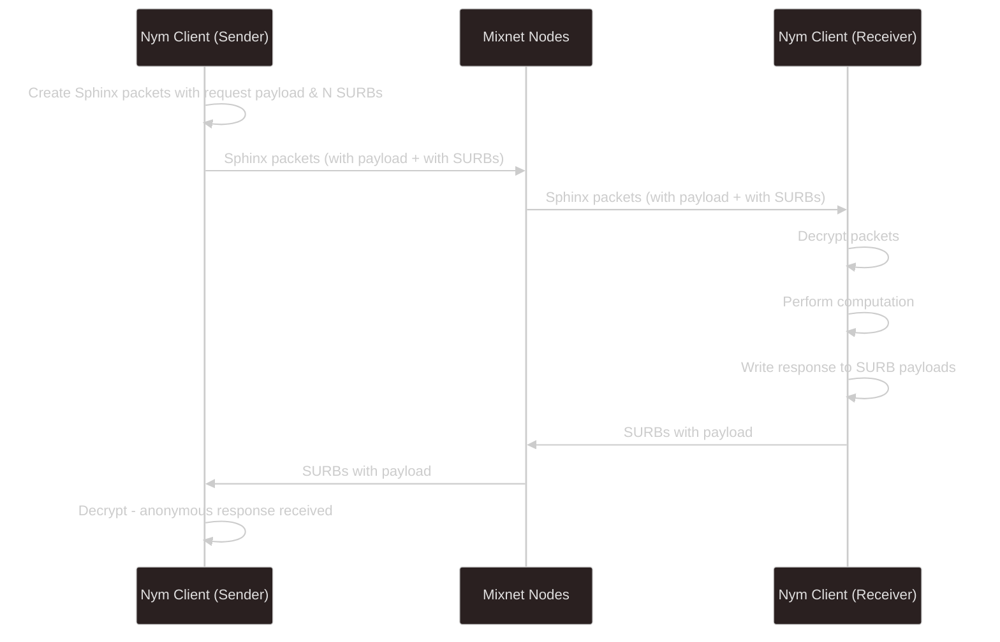
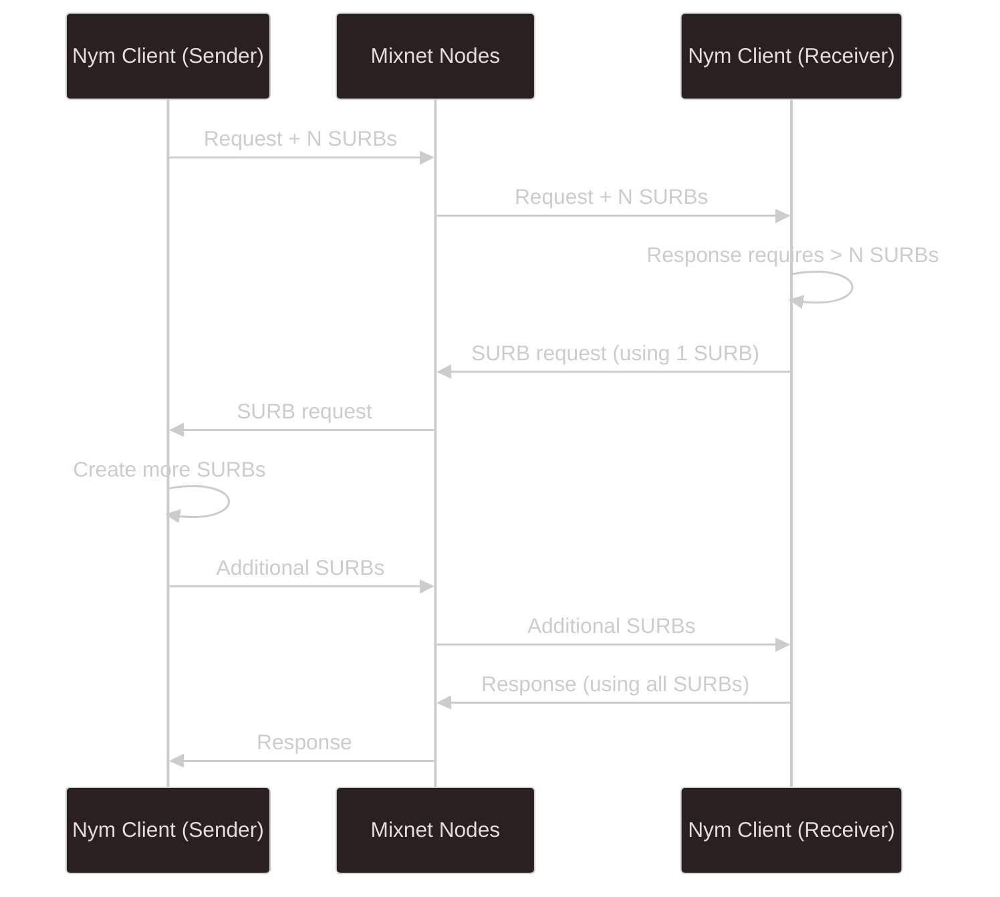

import { Callout } from 'nextra/components'

# Anonymous Replies with SURBs

SURBs (Single Use Reply Blocks) enable **anonymous bidirectional communication**—a receiver can reply to a sender without learning the sender's identity.

## The Problem

In a typical mixnet scenario:
- Alice wants to send a message to Bob
- Bob needs to reply
- If Bob sends directly to Alice's address, he learns it

This defeats the purpose of anonymous communication.

## The Solution: SURBs

> SURBs are pre-computed Sphinx packet headers encoding a mixnet route that ends in the participant that created the SURB. A sender can generate one or more SURBs and include them in their Sphinx message to a recipient.
>
> — [Nym Whitepaper](https://nym.com/nym-whitepaper.pdf) §4.5

Alice creates SURBs—encrypted routing headers—and sends them to Bob along with her message. Bob can attach his reply to these headers and send the resulting packets into the mixnet. The packets travel through the encoded route back to Alice, but **Bob never learns Alice's address or any routing information**.

## How SURBs Work

### Creation (Sender Side)

Alice creates a SURB containing:
1. Encrypted routing headers for a path back to herself
2. The address of the first hop (her Entry Gateway)
3. A cryptographic key to encrypt the reply payload

```
┌─────────────────────────────────────────────────────────────┐
│                         SURB                                │
├─────────────────────────────────────────────────────────────┤
│ First hop address (Entry Gateway ID)                        │
├─────────────────────────────────────────────────────────────┤
│ Encrypted routing headers (Mix1 → Mix2 → Mix3 → Exit → Me) │
├─────────────────────────────────────────────────────────────┤
│ Reply encryption key                                        │
└─────────────────────────────────────────────────────────────┘
```

The routing headers are layered-encrypted, just like outbound Sphinx packets.

### Usage (Receiver Side)

Bob receives Alice's message plus SURBs:
1. Writes his reply as the payload
2. Attaches the SURB headers
3. Sends to the first hop address

Bob only sees the first hop—he cannot determine:
- The route through the mixnet
- The final destination (Alice's address)
- Any per-hop latency information

### Delivery

The SURB packet travels through the mixnet:
1. Each node decrypts its layer, as with any Sphinx packet
2. The packet is mixed with other traffic
3. Finally arrives at Alice's Gateway
4. Alice decrypts using her private key

## Single Use Property

Each SURB can only be used **once**:
- Prevents replay attacks
- Ensures forward secrecy
- Means multiple SURBs needed for extended conversations

<Callout type="warning">
SURBs are currently valid indefinitely, but future updates will limit validity to key rotation epochs. Build applications assuming SURBs have limited lifetime.
</Callout>

## MultiSURBs

For replies larger than a single packet, Alice sends multiple SURBs:



## SURB Replenishment

If Bob's reply is too large for the provided SURBs:



## Sender Tags

For sessions with multiple messages, a **sender tag** differentiates conversations:

- Randomly generated alphanumeric string
- Sent with SURBs to identify the conversation
- Not linked to sender identity in any way
- Allows receiver to manage SURBs for concurrent conversations

## Tradeoffs

**More SURBs upfront:**
- Fewer round trips needed
- More computation for sender
- May waste SURBs if reply is small

**Fewer SURBs upfront:**
- Less initial computation
- May require SURB replenishment round trips
- More latency for large replies

## Known Attack: SURB Flooding

A malicious receiver could:
1. Request many SURBs from a sender
2. Hoard them
3. Send all back simultaneously
4. Attempt to correlate traffic patterns at sender's Gateway

Mitigations:
- This requires active participation (not passive observation)
- Once zk-nyms are enabled, costs money to execute
- Requires ability to monitor the sender's Gateway
- Limited information gained even if successful

## Future: SURB Lifetimes

When node key rotation and replay protection are fully implemented:
- SURBs will expire at epoch boundaries
- The key epoch duration is configurable
- Applications should handle SURB expiration gracefully

This increases security at the cost of requiring more frequent SURB exchange for long-running conversations.

## Comparison to Tor Onion Addresses

| Feature | Tor .onion | Nym SURBs |
|---------|------------|-----------|
| Use count | Unlimited | Single use |
| Setup | Service must run | Created per-message |
| Validity | Indefinite | Epoch-limited |
| Reply latency | Low | Higher (mixing) |
| Traffic analysis resistance | Limited | Strong |
