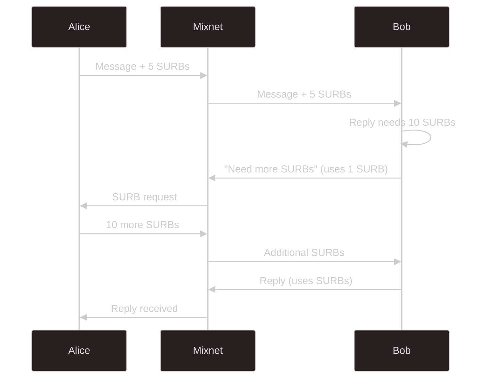

# Anonymous Replies

SURBs (Single Use Reply Blocks) enable anonymous bidirectional communication. A receiver can reply to a sender without learning the sender's identity or address.

## The problem

In a typical mixnet scenario, Alice sends a message to Bob and wants a reply, but if Bob sends directly to Alice's Nym address, he learns it. This defeats the purpose of anonymous communication; Bob now knows Alice's identity for future contact, and due to how Nym's [addressing scheme](/network/reference/addressing.md) works, this means that Bob knows which Gateway node Alice's client is using.

## How SURBs work

Alice creates SURBs (encrypted routing headers) and includes them with her message to Bob. Each SURB contains a complete route back to Alice, encrypted so that Bob cannot read it. Bob attaches his reply to a SURB and sends the resulting packet into the mixnet. It travels through the encoded route and arrives at Alice, but Bob never learns where it went.

A SURB contains the address of the first hop (Alice's Entry Gateway), encrypted routing headers for the path back to Alice, and a key to encrypt the reply payload. The routing headers are layered like a Sphinx packet; each hop can only see the next destination.

## Single use

Each SURB can only be used once. This prevents replay attacks and ensures forward secrecy. For conversations requiring multiple exchanges, Alice sends multiple SURBs with her initial message.

SURB validity is tied to key rotation. Node keys rotate on an odd/even schedule with a default validity of 24 epochs (roughly 25 hours at the current 1-hour epoch length). After that window, the routing keys a SURB was built with are no longer accepted. Clients automatically purge stale SURBs and request fresh ones. Reply keys also expire after 24 hours independently of rotation cycles.

## SURB replenishment

If Bob's reply is larger than the available SURBs can carry, he uses one SURB to request more. Alice receives the request, generates additional SURBs, and sends them to Bob. This adds round-trip latency but ensures conversations can continue regardless of reply size.

## Sender tags

For sessions with multiple messages, Alice includes a randomly generated sender tag with her SURBs. This helps Bob organize SURBs from multiple conversations without revealing anything about Alice's identity; the tag is random and unlinkable to her address.

## Security considerations

There's a known attack where a malicious receiver hoards SURBs and sends them all back simultaneously, attempting to correlate traffic patterns at the sender's Gateway. This attack requires active participation (not just passive observation), and provides limited information even if successful. It's not a passive surveillance technique; the attacker must be specifically targeting you and willing to spend resources.

## Comparison to Tor onion addresses

Tor's onion addresses allow indefinite replies but require the recipient to run a hidden service. SURBs are single-use but require no service; they're generated on-demand per message. SURBs also benefit from the mixnet's timing protection, which onion addresses don't have.
