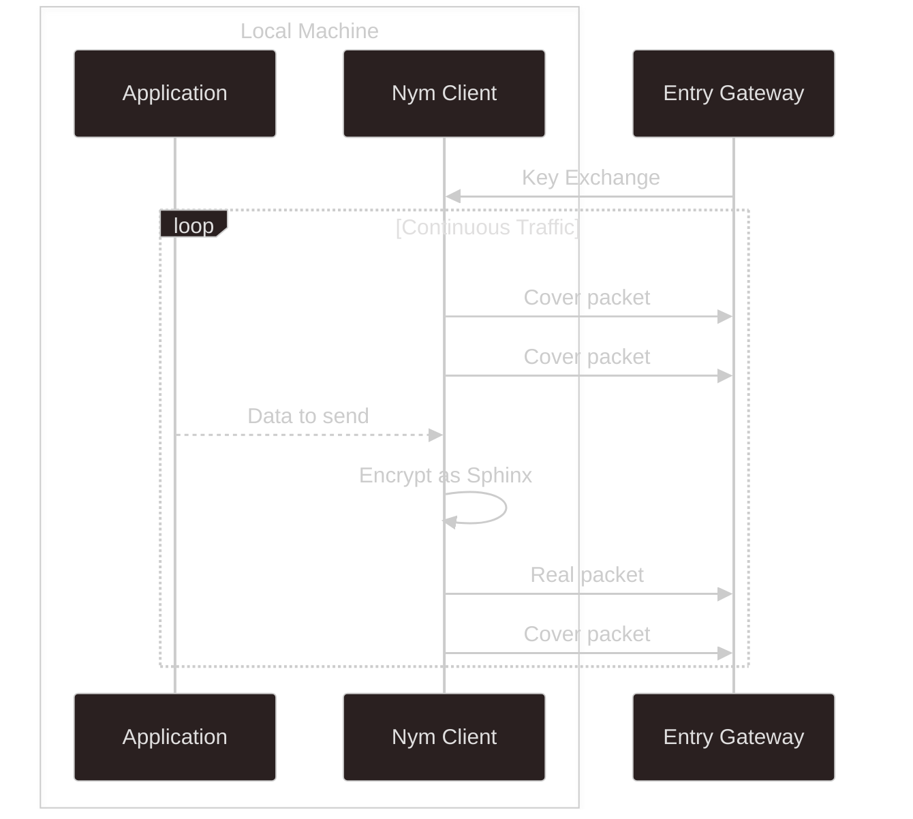
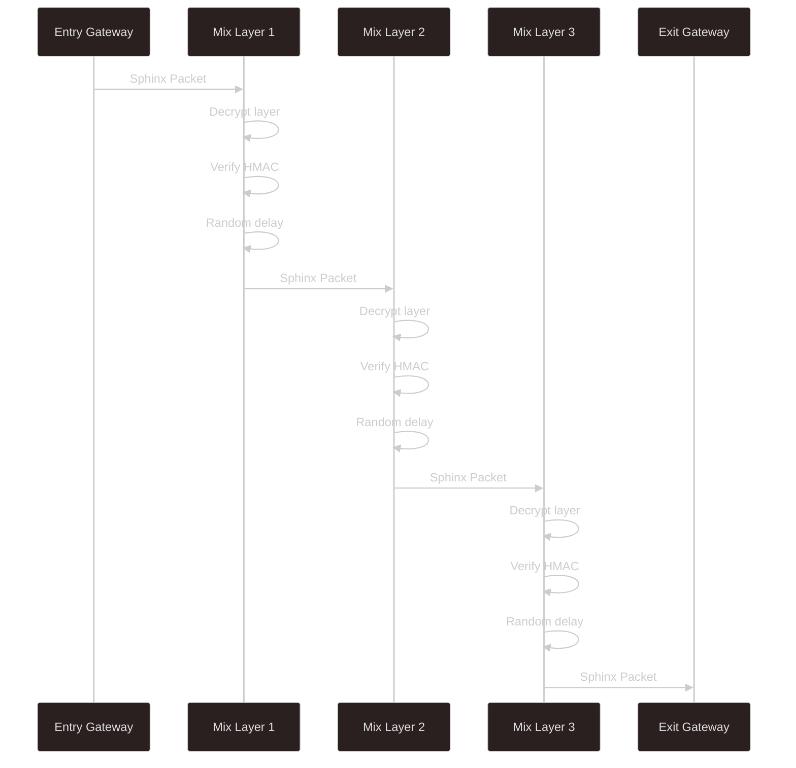
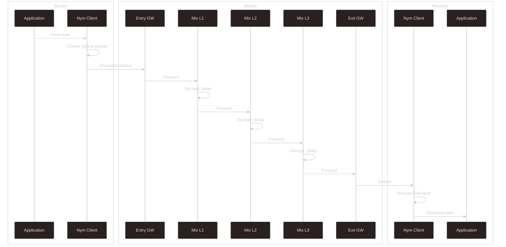

import { Callout } from 'nextra/components'

# Traffic Flow

This page walks through how packets travel through the mixnet, from sending client to destination.

<Callout type="info">
This describes the 5-hop mixnet flow. For the 2-hop dVPN mode, see [dVPN Protocol](/network/dvpn-mode/protocol).
</Callout>

## Overview

The Nym mixnet uses source routing: the sender chooses the complete route before sending. This means the sender constructs a Sphinx packet with layered encryption, where each layer contains routing information for one hop.

## Client to Entry Gateway

On connection, the Nym client registers with a particular Entry Gateway. This Gateway becomes part of the client's Nym address and is where incoming messages are delivered.

The client continuously sends packets to the Entry Gateway over a WebSocket connection. This stream includes both real messages and cover traffic at a constant rate. When the application has data to send, the client encrypts it as Sphinx packets and slots them into the stream. When there is no data, cover packets flow instead.

## Through the Mix Nodes

The Entry Gateway forwards packets into the three Mix Node layers. At each hop, the node decrypts its layer of the Sphinx packet to learn the next destination, verifies the HMAC to ensure integrity, applies a random delay, and forwards to the next hop.

The delay is critical. Without it, timing would correlate inputs to outputs. With exponential random delays, packets are reordered and the timing relationship is destroyed.

## Exit Gateway to Destination

The Exit Gateway handles the final hop. For traffic destined for external services, it decrypts the packet and forwards to the destination, then packages responses back into Sphinx packets for the return journey.

For traffic destined for another Nym client, the Exit Gateway delivers to that client's registered Gateway, which holds the message until the recipient comes online.

## The complete picture

Putting it together, a packet travels through five hops with encryption removed and delays applied at each Mix Node layer:

## External services

When sending to an external service rather than another Nym client, the Exit Gateway acts as a proxy. It extracts the destination from the decrypted packet, makes the request on your behalf, and routes responses back through the network. The destination service sees the Exit Gateway's IP, not yours.

## Peer-to-peer

For applications where all parties run Nym clients, traffic stays entirely within the mixnet. Both sides enjoy full privacy protection, and [SURBs](/network/mixnet-mode/anonymous-replies) enable anonymous bidirectional communication without either party learning the other's address.
