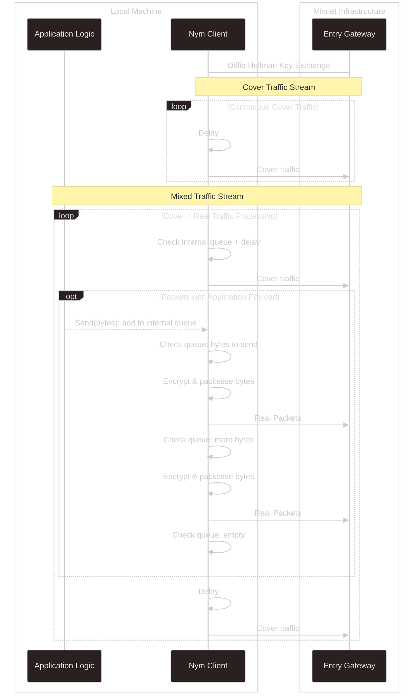
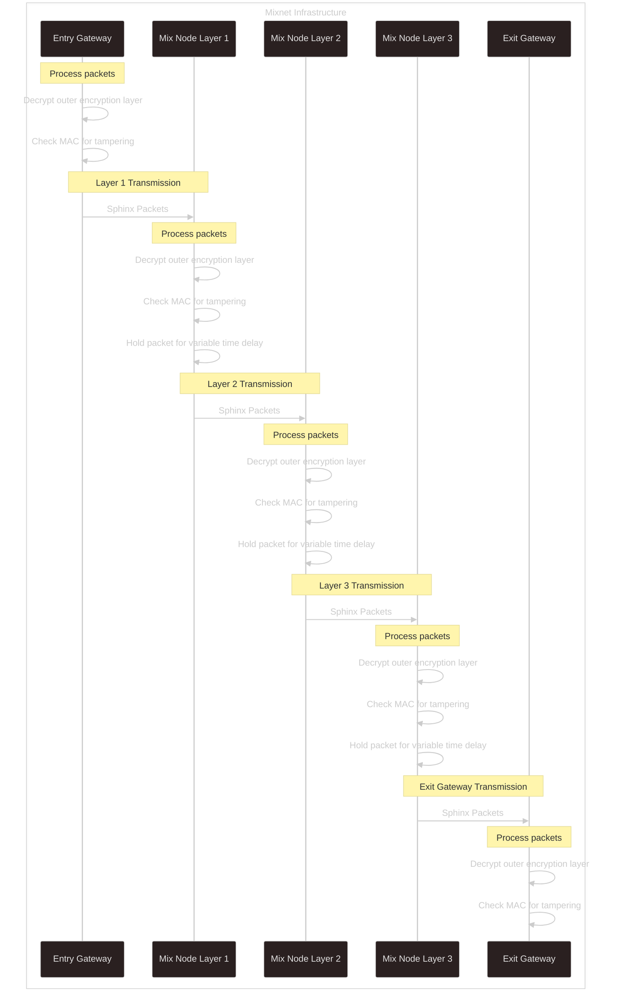
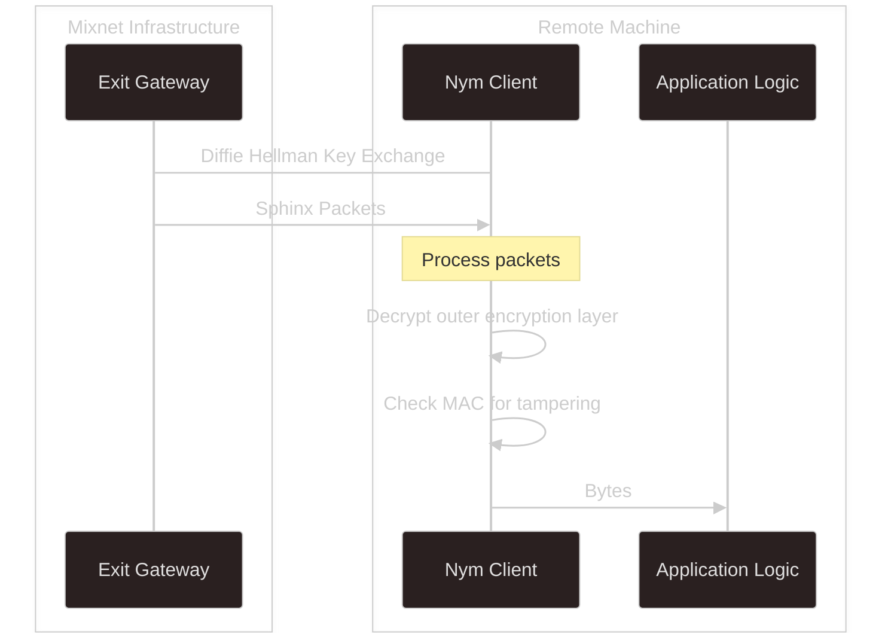
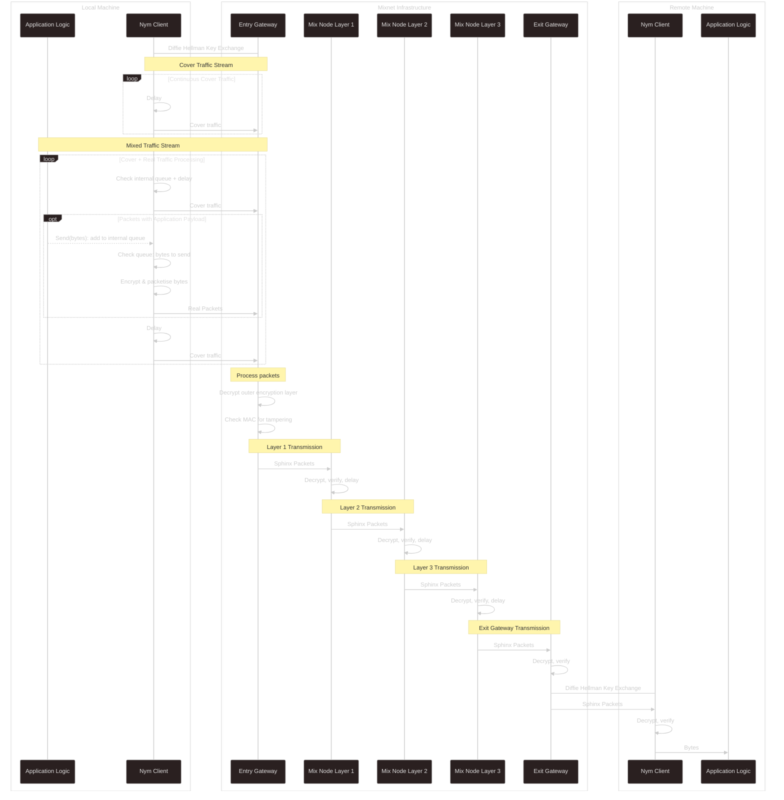

import { Callout } from 'nextra/components'

# Traffic Flow

This page provides a detailed breakdown of how packets travel through the mixnet, from sending client to destination.

<Callout type="info">
This describes the 5-hop mixnet flow used in NymVPN's mixnet mode and via the Nym SDKs. For the 2-hop dVPN mode, see [dVPN Protocol](../dvpn-mode/protocol).
</Callout>

## Overview

> Nym uses a source-routed decryption mixnet ... in source routing, the sender of a message chooses the route that the message will traverse before reaching its final destination.
>
> — [Nym Whitepaper](https://nym.com/nym-whitepaper.pdf) §4

Traffic flows through 5 hops:
1. Entry Gateway
2. Mix Node Layer 1
3. Mix Node Layer 2
4. Mix Node Layer 3
5. Exit Gateway

## Sending Client → Entry Gateway

Nym Clients register with a particular Entry Gateway on startup, which partially defines their [Nym address](../reference/addressing).

Once connected, clients **continuously send traffic** into the mixnet—both real packets and [cover traffic](./cover-traffic) at a rate defined by a Poisson process.

When sending application data, the client:
1. Queues the data internally
2. Packetizes and encrypts as [Sphinx packets](../cryptography/sphinx)
3. Performs Diffie-Hellman key exchange with the Entry Gateway
4. Sends packets over WebSocket, interleaved with cover traffic

## Entry Gateway → Mix Nodes → Exit Gateway

As packets traverse the mixnet, each receiving node:
1. Verifies the MAC of the incoming Sphinx packet
2. Decrypts its layer, revealing the next destination
3. (Mix Nodes only) Applies a [random delay](./mixing)
4. Forwards via TCP to the next hop

## Exit Gateway → Receiving Client

The final hop involves:
1. Exit Gateway decrypts and verifies the packet
2. If the recipient is online, delivers immediately
3. If offline, stores for up to 24 hours

The receiving client then:
1. Decrypts the final Sphinx layer
2. Extracts the payload
3. If [SURBs](./anonymous-replies) are attached, stores them for anonymous replies

## Complete Flow

Putting it all together:

## External Service Communication

When traffic is destined for an external service (not another Nym client), the Exit Gateway:
1. Receives the decrypted payload
2. Forwards to the external destination
3. Awaits response
4. Packages response into Sphinx packets for return

This allows Nym to proxy traffic to arbitrary internet services while protecting the client's metadata.

## Peer-to-Peer Communication

For P2P applications where all parties run Nym clients:
- Traffic stays entirely within the mixnet
- No need to contact external servers
- Both parties enjoy full mixnet privacy
- SURBs enable anonymous bidirectional communication
