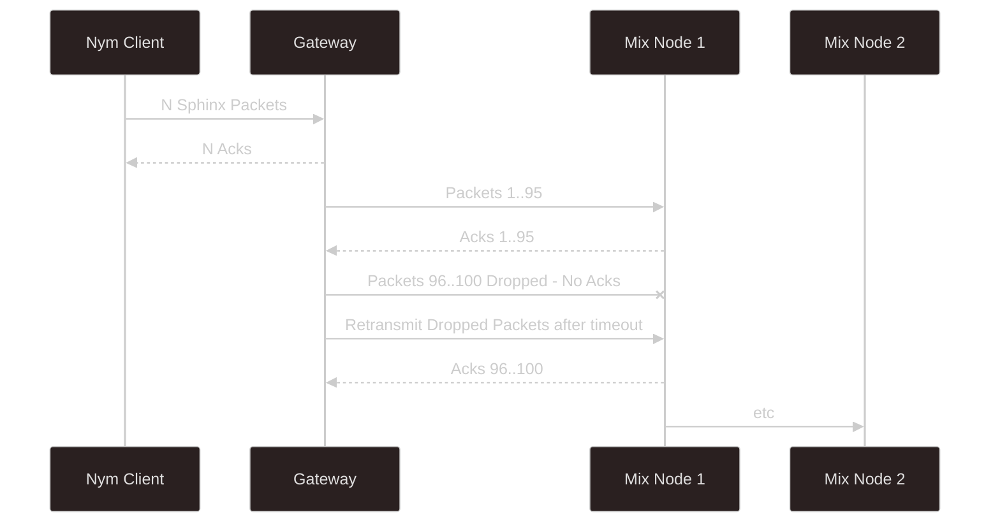

# Acknowledgements & Retransmission

The Nym Network uses acknowledgements (acks) to ensure reliable packet delivery.

## Overview

When a packet is successfully received at each hop, the receiving node sends an acknowledgement back to the sender. If no ack is received within a timeout period, the packet is retransmitted.

## How It Works

## Mechanism

1. **Sender transmits packet** to the next hop
2. **Receiver processes packet** and sends ack
3. **Sender waits** for ack within timeout period
4. **If ack received**: Mark packet as delivered
5. **If no ack**: Retransmit the packet

## Automatic Handling

This mechanism is handled entirely by the Nym binaries:

- Developers don't need to implement acks
- Node operators don't need to configure retransmission
- The system handles packet loss transparently

## Example

If a client sends 100 packets to a Gateway:
- Gateway acknowledges 95 packets
- 5 packets had no acknowledgement
- Client automatically retransmits those 5 packets
- Gateway acknowledges the retransmitted packets

## Benefits

### Reliability

- Ensures all packets eventually arrive
- Handles network congestion and temporary failures
- No manual intervention required

### Transparency

- Application layer sees reliable delivery
- Underlying packet loss is hidden
- Consistent behavior across the network

## Performance Considerations

- Acks add some overhead to network traffic
- Timeout periods are tuned for typical network conditions
- Retransmission adds latency only for dropped packets

## Scope

Acknowledgements operate hop-by-hop:
- Client ↔ Entry Gateway
- Entry Gateway ↔ Mix Nodes
- Mix Nodes ↔ Mix Nodes
- Mix Nodes ↔ Exit Gateway

End-to-end delivery confirmation (application level) is separate and handled via [SURBs](../mixnet-mode/anonymous-replies) for anonymous communication.
