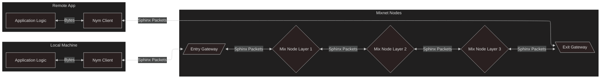

# Mixnet Traffic Flow Overview

> Nym uses a source-routed decryption mixnet, with users obtaining the node’s public keys and contact information from the Nym blockchain. In source routing, the sender of a message chooses the route that the message will traverse before reaching its final destination.
>
> ...
>
> Nym uses the Sphinx packet format to encapsulate and anonymously route data payloads. Senders prepare Sphinx messages by encrypting them multiple times in reverse routing order. First, a message is encrypted for the recipient; then, for the last mix node in the path; then, for its predecessors in the path, ending with the outermost encryption, which corresponds to the mix node in the first layer. The complete Sphinx packet is finally encrypted with a key shared with the gateway, which forwards decrypted Sphinx packets to the mixnet.
>
> [Nym Whitepaper](https://nymtech.net/nym-whitepaper.pdf) §4

The Nym mixnet re-orders encrypted, indistinguishable [Sphinx](cryptography/sphinx) packets as they travel through the network.

Traffic to send through the mixnet is broken up into uniformly-sized packets, encrypted in the Sphinx packet format according to the route the packet will take, and sent through the mixnet to be mixed among other real traffic and fake - but identical - cover traffic.

At each 'hop' (i.e. as a packet is forwarded from one node in the sequence to another) a layer of decryption is removed from the Sphinx packet, revealing the address of the next hop, and another Sphinx packet. The packet is then held by the node for a variable amount of time, before being forwarded on to the next node in the route.

Traffic always travels through the nodes of the mixnet like such:

From your Nym client, your traffic is sent as Sphinx packets to:
* the gateway your client has registered with,
* a mix node on layer 1 of the Mixnet,
* a mix node on layer 2 of the Mixnet,
* a mix node on layer 3 of the Mixnet,
* the recipient's gateway, which forwards it finally to...
* the recipient's Nym client, which communicates with an application.

As each node receives the packet, they are able to decrypt the packet, perform a validity check, and then pass the packet along (in the case of Mix Nodes, after a delay).

> If the recipient's Nym client is offline at the time then the packets will be held by the Gateway their Nym client has registered with until they come online.

Whatever is on the 'other side' of the mixnet from your client, all traffic will travel this way through the mixnet. If you are sending traffic to a service external to Nym (such as a chat application's servers) then your traffic will be sent from the recieving Nym client to an application that will proxy it 'out' of the mixnet to these servers, shielding your metadata from them. P2P (peer-to-peer) applications, unlike the majority of apps, might want to keep all of their traffic entirely 'within' the mixnet, as they don't have to necessarily make outbound network requests to application servers. They would simply have their local application code communicate with their Nym clients, and not forward traffic anywhere 'outside' of the mixnet.
