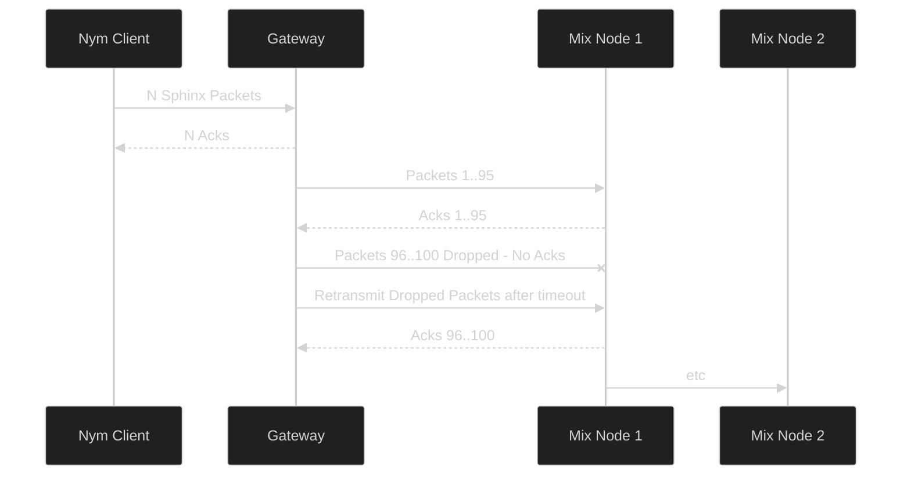

# Acks & Package Retransmission
Whenever a hop is completed, the receiving node will send back an acknowledgement ('ack') so that the sending node knows that the packet was received. If it does not receive an ack after sending, it will resend the packet, as it assumes that the packet was dropped for some reason. This is done under the hood by the binaries themselves, and is never something that developers and node operators have to worry about dealing with themselves.

Packet retransmission means that if a client sends 100 packets to a gateway, but only receives an acknowledgement ('ack') for 95 of them, it will resend those 5 packets to the gateway again, to make sure that all packets are received. All nodes in the mixnet support packet retransmission.

