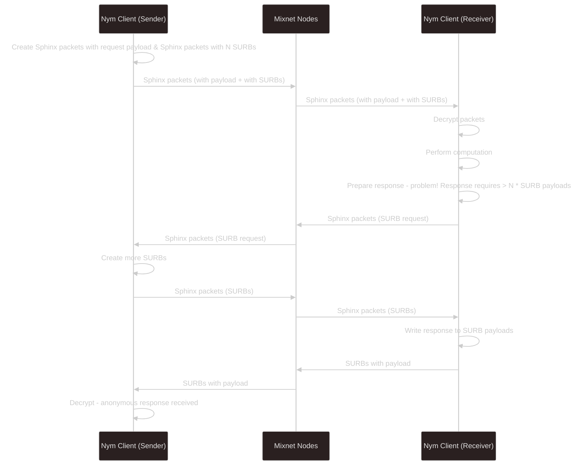

import { Callout } from 'nextra/components'

# Anonymous Replies with SURBs

> SURBs are pre-computed Sphinx packet headers encoding a mixnet route that ends in the participant that created the SURB. A sender can generate one or more SURBs and include them in their Sphinx message to a recipient. The recipient can use the SURBs as Sphinx headers to send back replies – or acknowledgements – that anonymously reach back the original sender after going through the mixnet.
>
> SURBs are the Sphinx equivalent of "onion addresses" in Tor, with the caveat that a SURB can only be used once (to prevent replay attacks) and within its epoch of validity (the mix node public keys used to prepare the SURB are only valid for a limited period). SURB headers are encrypted by the sender, so the recipient sending it back cannot infer from it any information about the message route, the per-hop latency, or the sender’s address, which is encoded in the innermost (last) routing layer of the SURB. SURBs ('Single Use Reply Blocks') allow clients to reply to incoming messages anonymously.
>
> ...
>
> A SURB effectively contains: (1) the encrypted headers of a Sphinx message that, if sent to the mixnet, will be routed back to the original sender; (2) the address of the first-layer mix node where the message should be sent; and (3) a cryptographic key to encrypt the reply payload.
> [Nym Whitepaper](https://nymtech.net/nym-whitepaper.pdf) §4.5

As outlined in the [concepts](../concepts/anonymous-replies) section, SURBs are layer encrypted sets of Sphinx headers detailing a reply path ending in the sending client's [Nym address](../traffic/addressing-system). Clients receiving messages with SURBs attached are able to write a payload to the provided headers without ever learning about anything other than the first hop back into the Mixnet - the Gateway they (the sender of the reply) are currently registered with.

Put simply, client A sends client B a request of some kind. Before sending the request through the Mixnet, it creates a number of SURBs and sends those along with the request. Client B writes the response to the request to the payload of the SURBs, and then sends these through the Mixnet. Since Sphinx packets are multiply route-encrypted, the first destination of the packet is the `nym-node` running as an Entry Gateway that client B has registered with already, so no information regarding either the path through the Mixnet or the destination of the SURBs (aka the Nym address of client A) is revealed to client B.

## Anatomy of a SURB
Diagramatic representation coming soon™️.

## Sender Tags
For a session between two clients, the sending client generates a random alphanumeric string, referred to as a `sender tag` which is sent along with the SURBs to the receiver of its message(s). The `sender tag` is generated randomly, and does not refer in any way to any identifiers of the sending client.

This is done so that receiving clients have some way of differentiating incoming SURBs from multiple clients and can split them into different 'buckets' in order to facilitate concurrent anonymous replies.

## Replenishing SURBs
Since each SURB is just a pre-computed Sphinx packet header, and Sphinx packets only have a finite payload size, then the size of a possible reply for the amount of SURBs sent with a request is `# SURBs * payload size in bytes`. However it is often the case that replies may be variable in size and larger than the alloted payload size, and/or the sending client did not want to compute many Sphinx headers to send with its initial request.

As such, when a client is running out of SURBs to use for replying, it will use a SURB to send a request to the initial sending client. This request is a request for more SURBs to be sent to it.

TODO mermaid diagram

There is a balance to be struck between the amount of SURBs to compute to send along with messages (aka the sending client A spending computation resources) and not sending enough SURBs initially, thus having to wait for a SURB to be sent from the receiving client B to client A requesting more SURBs be sent, which themselves have to be then sent through the Mixnet to client B to be written to and sent back through the Mixnet again.

If you are able to spend the extra resources upfront and send a lot of SURBs, fewer trips through the Mixnet are required for traffic to go back and forth. However, bear in mind that SURBs in the future will have a finite lifespan (see the section below) so precomputing a very large number to send with the initial message (assuming you are expecting a large reponse, or several messages back and forth) will not work. Furthermore, sending huge amounts of SURBs might open your app up to [possible attacks](#anatomy-of-a-surb).

## SURB Lifetimes
<Callout type="warning">
  At the time of writing, SURBs themselves are valid indefinitely, but clients purge their local DB of SURBs that are older than a day on restart. SURBs are valid between topology changes over epochs as `nym-nodes` have a single static publick key, so unless a node goes offline, SURBs will still work even after a topology change.

  We still have a few features to add to the Mixnet to add some extra security which will dramatically limit the amount of time SURBs are valid for, but will increase the overall security of the network, so do **not** build with the current status in mind. Instead, check out the information below, and build with this in mind.
</Callout>

Once node key rotation (part of the larger [forward secrecy](https://en.wikipedia.org/wiki/Forward_secrecy) work) and [replay protection](https://www.kaspersky.com/resource-center/definitions/replay-attack) is implemented, SURBs will only be valid for the length of the key epoch (aka for the length of time a `nym-node` retains a particular public key between rotations). The length of the key epoch is still to be decided.

Although this means that there will probably be more back-and-forth between clients sending large volumes of traffic, this will make the network more secure overall.

## Known Attacks Using SURBs
There is a known attack in which a malicious service provider / client continually requests that a sending client sends more and more SURBs to them, accruing a large number of them. The attacker then sends all SURBs back to the sending clients at once in order to try and see permutations in the traffic exiting the Mixnet to the sending client, in order to work out which Gateway they are using as their Entry Gateway.

This attack however relies upon the attacker already being able to actively scan all `nym-node`s running as Gateways and capture that traffic, as well as (once the [zk-nym scheme]() is enabled, spend money to send that traffic through the Mixnet. Furthermore, this is an _active attack_ and requires a client to be either be running a malicious service, or be in a position to request multiple bundles of SURBs from clients via some service.
