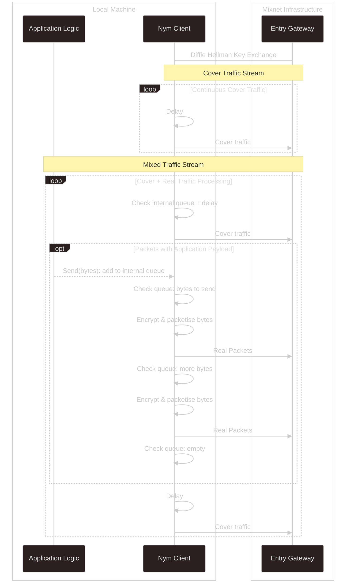
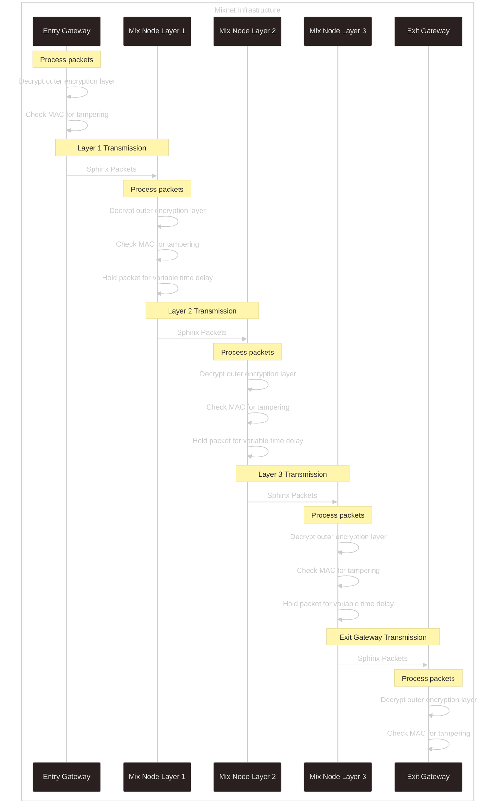
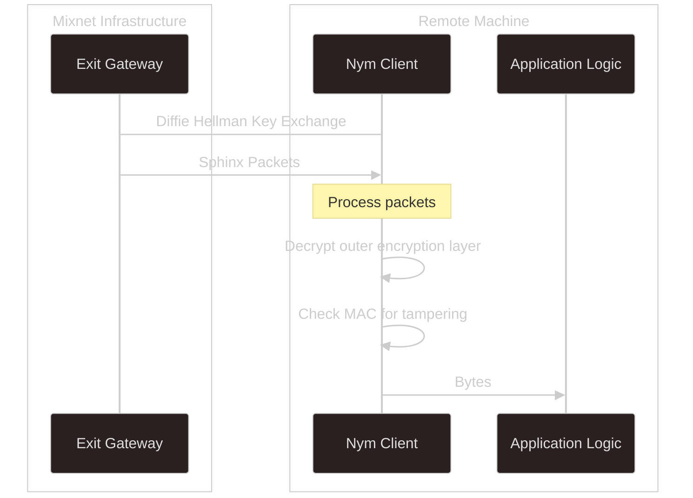
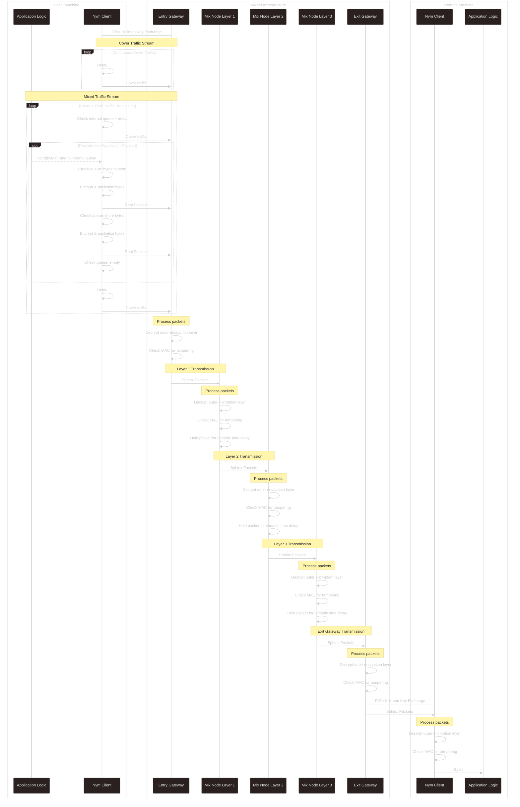

# Packet Flow Breakdown
## Sending Client → Entry Gateway
Nym Clients, on startup, register with a particular node to use as an Entry Gateway. This partially defines their [Client Address](./addressing-system).

Once connected, Clients **are constantly sending traffic into the Mixnet**; as well as the packets that are sent from an application wanting to use the Mixnet, Clients send [cover traffic](../concepts/cover-traffic) at a constant rate defined by a Poisson process.

On accepting bytes from a locally running process, Nym Clients:
- Send the data to the internal queue.
- Packetise and encrypt the data as the payload of Sphinx packets. Encryption is done according to route. Routing is done on a per-packet basis.
- Perform a Diffie Hellman Key Exchange with their Entry Gateway.
- Open a Websocket connection with their Entry Gateway.
- Slot Sphinx packets containing data payloads in between outgoing cover traffic packets and send these down the Websocket.

## Entry Gateway → Mix Nodes → Exit Gateway
As packets move through the Mixnet, receiving nodes will:
- Verify the MAC address of incoming Sphinx packets.
- Forward the inner packet they have decrypted onto its next desination hop, via TCP.

Mix Nodes, as their name suggests, perform the 'packet mixing' by adding a randomised delay before forwarding on the packets, so they no longer travel FIFO through each layer of Mix Nodes.

## Exit Gateway → Receiving Client
The final hop of Mixnet traffic involves:
- The Exit Gateway for the packet route (the Entry Gateway that the receiving Nym Client registered with on startup) performing the decryption and MAC check.
- The Exit Gateway forwards the Sphinx packet on to the Nym Client if it is online. If the Client is not online, the Gateway holds the packet for up to 24 hours.

The receiving Nym Client will then decrypt the final Sphinx packet layer and have access to the decrypted packet payload, and [SURB](./anonymous-replies) header information for anonymous replies.

## Whole Flow

