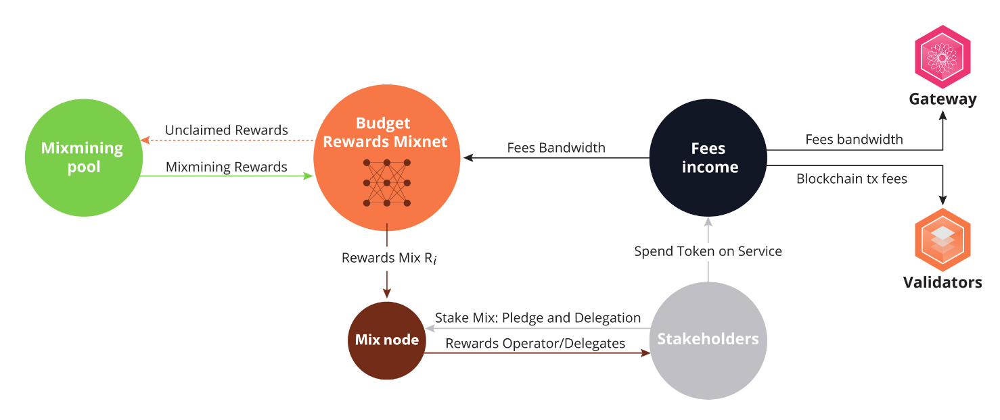

- [x] TODO section of whitepaper 

# Validators

> The validator setup and maintenance guide has moved to the [Operator Guides book](https://nymtech.net/operators/nodes/validator-setup.html).

> We are currently working towards building up a closed set of reputable validators. You can ask us for coins to get in, but please don't be offended if we say no - validators are part of our system's core security and we are starting out with people we already know or who have a solid reputation.

Validators secure the Nyx blockchain via Proof of Stake consensus. The Nyx blockchain records the ledger of NYM transactions and executes the smart contracts for distributing NYM rewards. The Nyx validators are run via the `nyxd` binary ([codebase](https://github.com/nymtech/nyxd)), maintaining a CosmWasm- and IBC-enabled blockchain. 

The blockchain plays a supporting but fundamental role in the mixnet: the `NYM` token used to incentivise node operators is one of two native tokens of the chain, and the chain is where the [Mixnet](../nyx/mixnet-contract.md) and [Vesting](../nyx/vesting-contract.md) smart contracts are deployed. 

## Further Reading 
* Detailed info on Nyx Validators and token flow can be found in [Nym Reward Sharing for Mixnets document](https://nymtech.net/nym-cryptoecon-paper.pdf) in section 2.3 and 2.4.
* For more detailed calculation, read our blog post [Nym Token Economics update](https://blog.nymtech.net/nym-token-economics-update-fedff0ed5267). 
* More info on staking can be found [here](https://blog.nymtech.net/staking-in-nym-introducing-mainnet-mixmining-f9bb1cbc7c36). 
* [Here](https://blog.nymtech.net/want-to-stake-in-nym-here-is-how-to-choose-a-mix-node-to-delegate-nym-to-c3b862add165) is more info on how to choose a mix node for delegation. 
* Our [quarterly update](https://blog.nymtech.net/quarterly-token-economic-parameter-update-b2862948710f) on token economics from July 2023.
* [Nym Whitepaper](https://nymtech.net/nym-whitepaper.pdf) section 3.1 