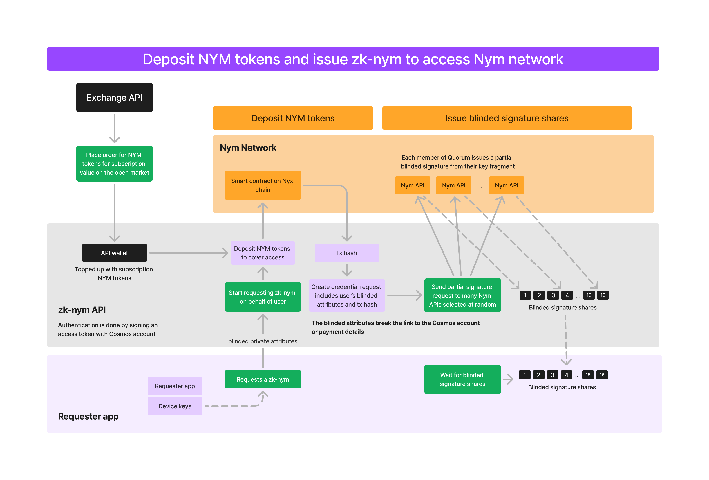
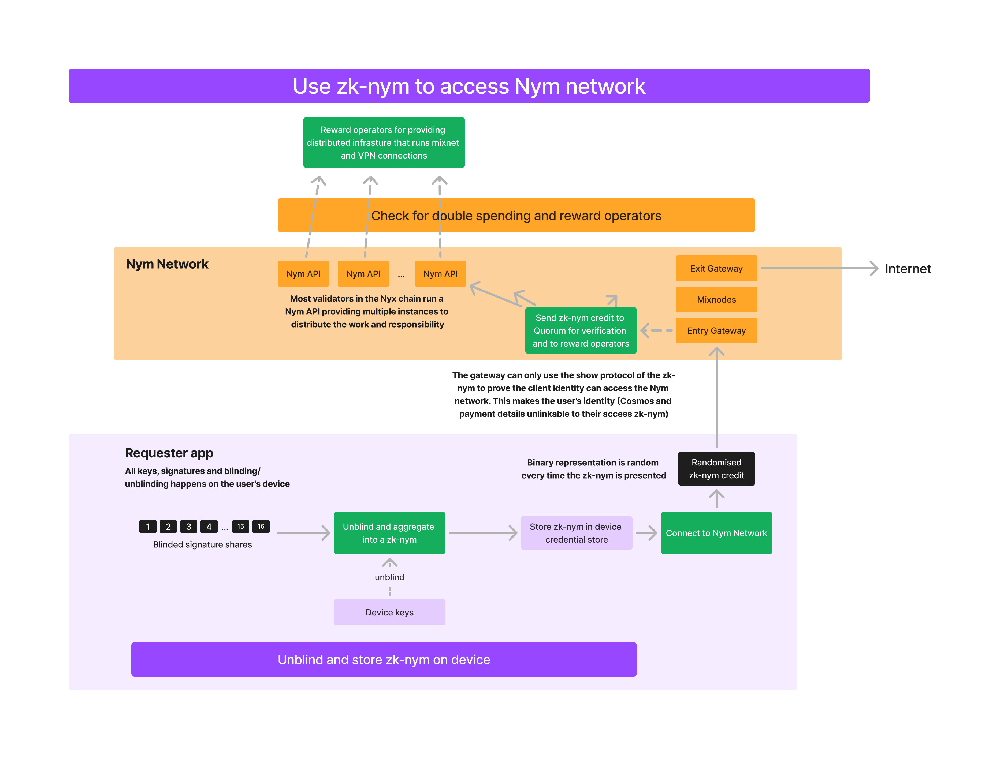

# Generating and using zk-nym anonymous credentials

```admonish info
The first use-case of zk-nyms is for anonymously proving the right to use the Nym mixnet for privacy.

The Nym mixnet is - at the time of publication - free for everyone. However, soon™ it will be required for each connecting client to present a valid credential - a zk-nym - to their ingress Gateway to access the Mixnet.

Accessing zk-nym credentials will vary depending on use:
- Individual developers building on the mixnet will be able to get zk-nym credentials via something like a faucet.
- Larger application integrations will have their own 'under the hood' credential generation and distribution scheme to generate access credentials on behalf of their users automatically.
- NymVPN users will have a variety of payment methods avaliable to them. The vast majority, if not all of the steps outlined on this page, will happen under the hood from their perspective. _More on this soon_.
```

Generation of zk-nyms involves the following actors / pieces of infrastructure:
- **Requester needing a zk-nym** for example a single user using the NymVPN app, or  a company purchasing zk-nyms to distribute to their app users, in the instance of an app integrating a Mixnet client via one of the SDKs. The Requester is represented by a Bech32 address on the Nyx blockchain.
- [NymAPI](https://nymtech.net/operators/nodes/nym-api.html) instances working together on signature generation and spent credential validation, referred to as the **NymAPI Quorum**. Members of the Quorum are a subset of the Nyx chain Validator set (other tasks they perform include a multisig used for triggering reward payouts to the Network Infrastructure Node Operators and maintaining the global Bloom Filter for double-spend protection).
- **OrderAPI**: an API creating crypto/fiat <> NYM swaps and then depositing the NYM tokens in a smart contract managed by the NymAPI Quroum for payment verification. Implementation details of the API will be released in the coming months.

Generation happens in 3 distinct stages:
- Key Generation & payment
- Issue credential
- Generate unlinkable zk-nyms for Nym Network access

From the perspective of the Requester most of this happens under the hood, but results in the creation and usage of an **unlinkable, rerandomisable anonymous proof-of-payment credential** - a zk-nym - with which to access the Mixnet without fear of doxxing themselves via linking app usage and payment information. The user experience is further enhanced by the fact that a single credential can be split into multiple small zk-nyms, meaning that a Requester may buy a large chunk of bandwidth but 'spend' this in the form of multiple zk-nyms with different ingress Gateways. Whilst this happens under the hood, what it affords the Requester is an ease of experience in that they have to 'top up' their bandwidth less and are able to chop and change ingress points to the Nym Network as they see fit, akin to the UX of most modern day VPNs and dVPNs.

## Key Generation & Payment
- First, a Cosmos [Bech32 address](https://docs.cosmos.network/main/build/spec/addresses/bech32) is created for the Requester. This is used to identify themselves when interacting with the OrderAPI via signed authentication tokens. This is the only identity that the OrderAPI is able to see, and is not able to link this to the zk-nyms that will be generated. This identity never leaves the Requester’s device and there is no email or any personal details needed for signup. If a Requester is simply 'topping up' their subscription, the creation of the address is skipped as it already exists.
- The Requester also generates an ed25519 keypair: this is used to identify and authenticate them in the case of using zk-nyms across several devices as an individual user. However, this is never used in the clear: these keys are used as private attribute values within generated credentials which are verified via zero-knowledge.
- The Requester can then interact with various payment backends to pay for their zk-nyms with crypto, fiat options, or natively with NYM tokens.
- Payment options will trigger the OrderAPI. This will:
  - Create a swap for <PAYMENT_AMOUNT> <> NYM tokens.
  - Deposit these tokens with the NymAPI Quorum via a CosmWasm smart contract deployed on the Nyx blockchain.
- The Requester sends a request to each member of the Quorum requesting a zk-nym credential. This request is signed with their private key and includes the transaction hash of the NYM deposit into the deposit contract, performed either by themselves or the OrderAPI.

<!-- diagram that shows clearly how on the one hand, the Bech32 address is used to identify user towards the OrderAPI for payments, and on the other hand shows how the ed25519 keypair is for identification and authentication for using zk-nym creds -->

## Issue zk-nym
At this point, NYM tokens have been deposited into the smart contract controlled by the Quorum's multisig and a zk-nym credential has been requested. Next, each member of the Quorum who responds to the Requester's request for a zk-nym checks the validity and returns a PSC signed with part of the master key (since this is a threshold cryptsystem, not all members of the Quroum must respond to create a zk-nym, only enough to pass the threshold). The process looks like this:

- Members of the Quroum performs several checks to verify the request is valid:
  - They verify the signature sent as part of the request is valid and that the request was made in the last 48 hours.
  - They verify that the amount requested matches the amount deposited in the transation, the hash of which was signed by the Requester's ed25519 key and sent as part of the request.
- Members then create a partial blinded signature - a 'partial signed credential' ('PSC') - from their fragment of the master key generated and split amongst them at the beginning of the Quroum in the initial DKG ceremony.
  - The member also creates a `key:value` entry in their local cache with the transaction hash as the key, and the PSC + encrypted signature as the value. This is used later for zk-nym validation and is cleaned after a predefined timeout.
- These PSCs are given back to the Requester after setting up a secure channel via DH key exchange, with each replying Quorum member also sending their public key for verification that the returned PSC was signed by them.

Once the Requester has received > threshold number of PSCs they can assemble them into a credential signed by the master key. The Requester never learns this master key (it is a private attribute) but the credential can be verified by the Quroum as being valid by checking for a proof that the credential's private attribute - the value of the master key - is valid.





## Spend zk-nym to Access Mixnet
- Once the credential has been aggregated from the PSCs returned from > threshold of Quorum members, smaller 'zk-nym credits' can be generated from it, accounting for smaller chunks of bandwidth which can be 'spent' with ingress Gateways. This occurs entirely offline, on the device of the zk-nym Requester. See pages on the scheme's [unlinkability](unlinkability.md) and [rerandomisation and incremental spending](./rerandomise.md) features for further information on this.
- This zk-nym credit is later presented to the Quorum by the Gateway that collected it, which is used to calculate reward percentages given to Nym Network infrastructure operators by the Quorum, with payouts triggered by their multisig wallet. Both ingress Gateways and the Quorum use spent zk-nym credits when engaging in [double spending protection](./double-spend-prot.md).



