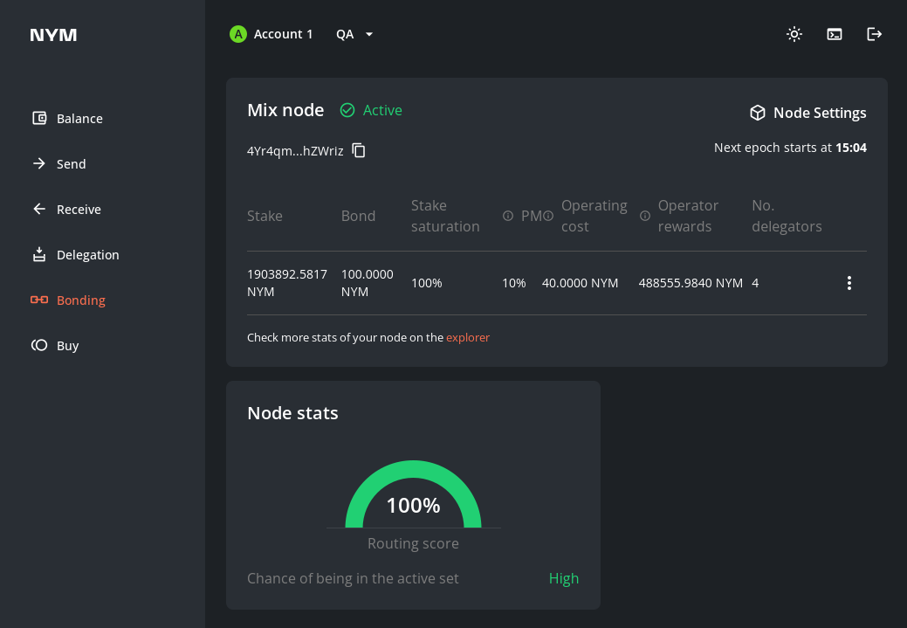

# Manual Node Upgrade

> Any syntax in `<>` brackets is a user's unique variable. Exchange with a corresponding name without the `<>` brackets.

**Upgrading your node is a straight forward two-step process:**

#### 1. Updating the binary and `~/.nym/<NODE>/<YOUR_ID>/config/config.toml` on your VPS
#### 2. Updating the node information in the [mixnet smart contract](https://nymtech.net/docs/nyx/mixnet-contract.html). This is the information that is present on the [mixnet explorer](https://explorer.nymtech.net).

## Step 1: Upgrading your binary

Follow these steps to upgrade your node binary and update its config file:
1. Pause your node process.
    - if you see the terminal window with your node, press `ctrl + c`
    - if you run it as `systemd` service, run: `service <NODE> stop`
2. Replace the existing `<NODE>` binary with the newest binary (which you can either [compile yourself](../binaries/building-nym.md) or [download](../binaries/pre-built-binaries.md).
3. [Re-run with the same values](setup.md#initialise--run) as you used initially for your `<NODE>`. **This will just update the config file, it will not overwrite existing keys**.
    - if your node is *not automated*, just `run` your `<NODE>` with `./<NODE> run --id <ID>`.
    - if you *automated* your node with systemd (recommended) run:
```sh
systemctl daemon-reload # to pickup the new unit file

service <NODE> start && journalctl -f -u <NODE>.service # to monitor log of you node
```

If you prefer to automate the process, try to setup your flow with [Nymvisor](nymvisor-upgrade.md).

## Step 2: Updating your node information in the smart contract

Follow these steps to update the information about your `<NODE>` which is publicly available from the [`nym-api`](https://validator.nymtech.net/api/swagger/index.html) and information displayed on the [Mixnet explorer](https://explorer.nymtech.net).

You can either do this graphically via the Desktop Wallet, or the CLI.

### Updating node information via the Desktop Wallet (recommended)

1. Navigate to the `Bonding` page and click the `Node Settings` link in the top right corner:



2. Update the fields in the `Node Settings` page (usually the field `Version` is the only one to change) and click `Submit changes to the blockchain`.


### Updating node information via the CLI

If you want to bond your `<NODE>` via the CLI, then check out the [relevant section in the Nym CLI](https://nymtech.net/docs/tools/nym-cli.html#upgrade-a-mix-node) docs.

```admonish info
If you run a Gateway, visit [Nym Harbour Master](https://harbourmaster.nymtech.net/) to get all the probe info about your node directly from API.
```

## Upgrading your validator

Upgrading from `v0.31.1` -> `v0.32.0` process is fairly simple. Grab the `v0.32.0` release tarball from the [`nyxd` releases page](https://github.com/nymtech/nyxd/releases), and untar it. Inside are two files:

- the new validator (`nyxd`) v0.32.0
- the new wasmvm (it depends on your platform, but most common filename is `libwasmvm.x86_64.so`)

Wait for the upgrade height to be reached and the chain to halt awaiting upgrade, then:

* copy `libwasmvm.x86_64.so` to the default LD_LIBRARY_PATH on your system (on Ubuntu 20.04 this is `/lib/x86_64-linux-gnu/`) replacing your existing file with the same name.
* swap in your new `nyxd` binary and restart.

You can also use something like [Cosmovisor](https://github.com/cosmos/cosmos-sdk/tree/main/tools/cosmovisor) - grab the relevant information from the current upgrade proposal [here](https://nym.explorers.guru/proposal/9).

Note: Cosmovisor will swap the `nyxd` binary, but you'll need to already have the `libwasmvm.x86_64.so` in place.

### Common reasons for your validator being jailed

The most common reason for your validator being jailed is that your validator is out of memory because of bloated syslogs.

Running the command `df -H` will return the size of the various partitions of your VPS.

If the `/dev/sda` partition is almost full, try pruning some of the `.gz` syslog archives and restart your validator process.
