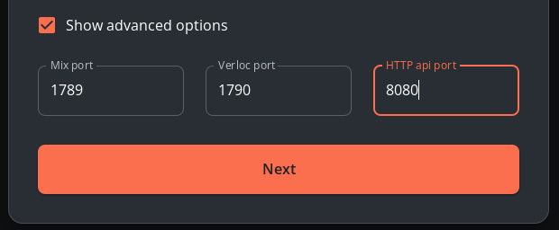

# Bonding Nym Node

```admonish caution
If you unbond your Nym Node that means you are leaving the mixnet and you will lose all your delegations (permanently). You can join again with the same identity key, however, you will start with **no delegations**.
```

Nym Mixnet operators are rewarded for their work every epoch (60 minutes). To prevent centralisation, [Nym API](nym-api.md) is ran by distributed validators on Nyx blockchain.

You are asked to `sign` a transaction and bpnd your node to Nyx blockchain so that the Mixnet smart contract is able to map your nym address to your node. This allows us to create a nonce for each account and defend against replay attacks.

**Before you bond your `nym-node` make sure you went through all the previous steps**

1. [Build](../binaries/building-nym.md) or [download](../binaries/pre-built-binaries.md) `nym-node` binary
2. [Configure VPS](vps-setup.md) correctly
3. [Prepare Nym wallet](wallet-preparation.md)
4. [Setup & Run](setup.md) the node
5. [Configure](configuration.md) the node (Optionally setup automation, WSS, reversed proxy)

```admonish warning
Do not bond your node to the API if the previous steps weren't finished. Bad connectivity, closed ports, or other poor setup will result in your node getting blacklisted.
```

## Bond via the Desktop wallet (recommended)

You can bond your `nym-node` via the Desktop wallet.

1. Open your wallet, and head to the `Bond` page, then select the node type `Mixnode` and input your node details. Press `Next`.
  - To find out your `nym-node` details, run `./nym-node bonding-information --id <ID>`
  - To get a correct host address, run `echo "$(curl -4 https://ifconfig.me)"`

2. Open the box called `Show advanced options` and make sure all your ports are set correctly, like the values in this table:

| Node type              | Port name                           | Correct port value |
| :--                    | :--                                 | :--                |
| Mixnode                | Mix port                            | `1789`             |
| Mixnode                | Verloc port                         | `1790`             |
| Mixnode                | HTTP api port (picture below) | `8080`             |
| Gateway (entry & exit) | Mix port                            | `1789`             |
| Gateway (entry & exit) | Client WS API port                  | `9000`             |

- If you bonding `nym-node --mode mixnode` through *Bond mixnode* desktop wallet menu, change manually *HTTP api port* value from deprecated `8000` to `8080` - a generic `nym-node` HTTP port (for all modes).



3. Enter the `Amount`, `Operating cost` and `Profit margin` and press `Next`.

4. You will be asked to run a `sign` command with your `nym-node` - copy and paste the long signature as the value of `--contract-msg` and run it.

```
./nym-node sign --contract-msg <PAYLOAD_GENERATED_BY_THE_WALLET>
```

5. Copy the resulting signature string and paste it into the wallet nodal, press `Next` and confirm the transaction:

```sh
# This is just an example, copy the one from your process
>>> The base58-encoded signature is:
2bbDJSmSo9r9qdamTNygY297nQTVRyQaxXURuomVcRd7EvG9oEC8uW8fvZZYnDeeC9iWyG9mAbX2K8rWEAxZBro1
```


*This image is just an example, copy-paste your own base58-encoded signature*

6. Your node will now be bonded and ready to recieve traffic, latest at the beginning of the next epoch (at most 1 hour)


If everything worked, you'll see your node running on the either the [Sandbox testnet network explorer](https://sandbox-explorer.nymtech.net) or the [mainnet network explorer](https://explorer.nymtech.net), depending on which network you're running.


## Bond via the CLI (power users)

If you want to bond your Mix Node via the CLI, then check out the [relevant section in the Nym CLI](https://nymtech.net/docs/tools/nym-cli.html#bond-a-mix-node) docs.
