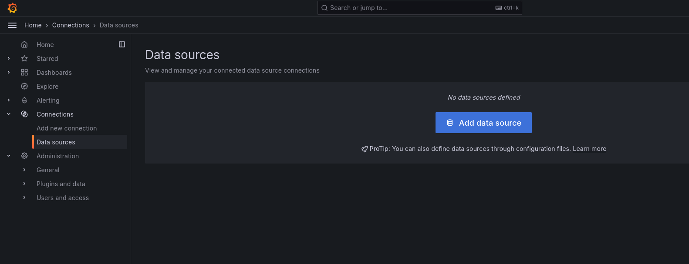
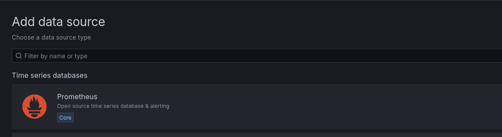
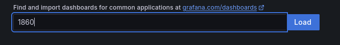

# Prometheus & Grafana

The combination of Prometheus and Grafana is a stack used by Nym team for internal monitoring as well as by core community operators like [ExploreNym](https://github.com/ExploreNYM/vps-monitor) or [No Trust Verify](https://status.notrustverify.ch/d/CW3L7dVVk/nym-mixnet?orgId=1).

<!-- Write about adventages of this setup -->

## Prometheus

[Prometheus](https://prometheus.io) is a free and open-source monitoring systems. It allows operators to have their metrics, events, and alerts under full control. This ecosystem offers multiple advantages:

- collects and records metrics from servers, containers, and applications
- provides a [flexible query language (PromQL)](https://prometheus.io/docs/prometheus/latest/querying/basics/)
- multiple modes visualization tools
- an alerting mechanism that sends notifications

Prometheus collects and stores its metrics as time series data, i.e. metrics information is stored with the timestamp at which it was recorded, alongside optional key-value pairs called labels.

## Grafana

[Grafana](https://grafana.com/docs/grafana/latest/) is an open-source analytics and interactive front end. It is widely used for its easy to manage dashboards with visualizations like graphs, charts and alerts, all connected to live data sources.

## Setup Guides

### ExploreNym Templates

```admonish warning
This setup and the scripts included were not written by Nym developers. As always do your own audit before installing any scripts on your machine and familiarize yourself with the security risks involved when opening ports or allowing http acces.
```

This is a guide to setup and run [ExploreNYM](https://explorenym.net/)'s monitoring flow called [`self-hosted-monitor`](https://github.com/ExploreNYM/self-hosted-monitor) as a local metric system utilising [Prometheus](https://github.com/ExploreNYM/self-hosted-monitor/blob/main/prometheus.sh) and [Grafana](https://github.com/ExploreNYM/self-hosted-monitor/blob/main/grafana.sh) together with [Node Exporter](https://github.com/ExploreNYM/self-hosted-monitor/blob/main/node-exporter.sh) and [Nginx](https://github.com/ExploreNYM/self-hosted-monitor/blob/main/nginx-certbot.sh).

According to ExploreNYM the system requirements of the monitor stack are 2 CPU. 4 GB RAM, 20 GB of free disk space.

#### Setup of the monitoring part

This can be setup on another VPS than the node if desired. We recommend to try to set this up on the same VPS as your node as we expect the machine to be strong enough to handle the node with enough capacity reserve for monitor.

1. Install git
```sh
apt install git
```

2. Clone the repository to `~/self-hosted-monitor`
```sh
git clone https://github.com/ExploreNYM/self-hosted-monitor ~/self-hosted-monitor
```

3. Give permissions to [prometheus.sh](https://github.com/ExploreNYM/self-hosted-monitor/blob/main/prometheus.sh) script and run it to setup Prometheus
```sh
chmod +x ~/self-hosted-monitor/prometheus.sh && ~/self-hosted-monitor/prometheus.sh
```

4.  Give permissions to [grafana.sh](https://github.com/ExploreNYM/self-hosted-monitor/blob/main/grafana.sh) script and run it to setup Grafana
```sh
chmod +x ~/self-hosted-monitor/grafana.sh && ~/self-hosted-monitor/grafana.sh
```

5. Open port `3000` to allow access to Grafana
```sh
sudo ufw allow 3000
```

6. You can access Grafana at `http://<YOUR_IP_ADDRESS>:3000` if you have an registered domain and prefer to use  it with `https` add the step 7.

7. Give permissions to [nginx-certbot.sh](https://github.com/ExploreNYM/self-hosted-monitor/blob/main/nginx-certbot.sh) script and run it to setup Nginx and Certbot
```sh
chmod +x ~/self-hosted-monitor/nginx-certbot.sh && ~/self-hosted-monitor/nginx-certbot.sh
```

#### Setup of the part to be monitored

If you run monitoring and node on different VPS, this step needs to be done on the VPS with the running node. In case you do it on the same VPS, skip directly to step 9.

8. Install git
```sh
apt install git
```

9. Clone the repository to `~/self-hosted-monitor`
```sh
git clone https://github.com/ExploreNYM/self-hosted-monitor ~/self-hosted-monitor
```
10. Give permissions to [node-exporter.sh]() script and run it to setup Node exporter.
```sh
chmod +x ~/self-hosted-monitor/node-exporter.sh && ~/self-hosted-monitor/node-exporter.sh
```

#### Setup Grafana Dashboard

11. Open a browser at `http://<YOUR_IP_ADDRESS>:3000` or `https://<YOUR_DOMAIN>:3000`, entry username `admin` and password `admin` and setup new credentials on prompt

12. Setup Data source by opening the menu -> `Connections` -> `Data sources` -> `+ Add new data source` -> `Prometheus`




13. In the field *Connection* next to `Prometheus server URL` enter `http://localhost:9090` (regardless if you accessing Grafana via `http` or `https` as this is for internal connection on the server). When you are done in the bottom `Save & Test`

14. In the menu open `Dashboards` -> `+ Create dashboard` -> `Import dashboard`


15. ID field -> enter `1860` -> `Load`



16. In *Import dashboard* page select Prometheus in the bottom and finally `Import`


17. Now you have your Prometheus panels in Grafana dashboard, we are going to share a quick way to load the live metrics very soon

### Full Own Setup

We are working on an entirely manual setup and will publish it in the coming days.

<!--
TODO:
- change point 17 with a solution to load the metrics data to grafana/prometheus
- finalize the self setup bellow and uncomment

### Prometheus Setup (step-by-step)

This entire installation shall be done with `root` privileges. If you not `root`, start with `su` command before the following steps.

1. Get the latets system updates
```sh
apt update
```

2. Create a system user for Prometheus
```sh
groupadd --system prometheus
useradd -s /sbin/nologin --system -g prometheus prometheus
```

3. Create directories for Prometheus
```sh
mkdir /etc/prometheus
mkdir /var/lib/prometheus
```

4. Download and extract Prometheus
```sh
wget https://github.com/prometheus/prometheus/releases/download/v{{prometheus_latest_version}}/prometheus-{{prometheus_latest_version}}.linux-amd64.tar.gz
tar vxf prometheus-{{prometheus_latest_version}}.linux-amd64.tar.gz
```
In case of errors, check Prometheus [release page](https://github.com/prometheus/prometheus/releases/) and get the correct binary for your system.

5. Navigate to Prometheus directory and configure Prometheus
```sh
# change directory
cd prometheus-{{prometheus_latest_version}}.linux-amd64

# move the binary files
mv prometheus /usr/local/bin
mv promtool /usr/local/bin

# set owner
chown prometheus:prometheus /usr/local/bin/prometheus
chown prometheus:prometheus /usr/local/bin/promtool

# move the config files
mv consoles /etc/prometheus
mv console_libraries /etc/prometheus
mv prometheus.yml /etc/prometheus


# set owner
chown prometheus:prometheus /etc/prometheus
chown -R prometheus:prometheus /etc/prometheus/consoles
chown -R prometheus:prometheus /etc/prometheus/console_libraries
chown -R prometheus:prometheus /var/lib/prometheus
```

6. Open the main Prometheus config file `prometheus.yml`
```sh
nano /etc/prometheus/prometheus.yml
```

7. Paste the block below to your config `prometheus.yml`, change the line `credentials` and save it (`ctrl` + `x`)
    - `credentials` value can be found in your node `config.toml` config file under `[http]` header
```yaml
# my global config
global:
  scrape_interval: 15s # Set the scrape interval to every 15 seconds. Default is every 1 minute.
  evaluation_interval: 15s # Evaluate rules every 15 seconds. The default is every 1 minute.
  # scrape_timeout is set to the global default (10s).

# Alertmanager configuration
alerting:
  alertmanagers:
    - static_configs:
        - targets:
          # - alertmanager:9093

# Load rules once and periodically evaluate them according to the global 'evaluation_interval'.
rule_files:
  # - "first_rules.yml"
  # - "second_rules.yml"

# A scrape configuration containing exactly one endpoint to scrape:

scrape_configs:
  # The job name is added as a label `job=<job_name>` to any timeseries scraped from this config.
  - job_name: "prometheus"
    authorization:
      credentials: <METRICS_KEY_SET_ON_THE_NODE>

    static_configs:
      - targets: ["localhost:9090"]

    file_sd_configs:
    - files:
      - /tmp/prom_targets.json
```

8. Create Prometheus systemd service by saving the block below to as `/etc/systemd/system/prometheus.service`:

```sh
nano /etc/systemd/system/prometheus.service
```

```sh
[Unit]
Description=Prometheus
Wants=network-online.target
After=network-online.target

[Service]
User=prometheus
Group=prometheus
Type=simple
ExecStart=/usr/local/bin/prometheus \
    --config.file /etc/prometheus/prometheus.yml \
    --storage.tsdb.path /var/lib/prometheus/ \
    --web.console.templates=/etc/prometheus/consoles \
    --web.console.libraries=/etc/prometheus/console_libraries

[Install]
WantedBy=multi-user.target
```

9. Reload, enable, start and check Prometheus service
```sh
systemctl daemon-reload
systemctl enable prometheus
systemctl start prometheus
systemctl status prometheus

# to observe journal log, run
journalctl -f -u prometheus
```

10. Open port for Prometheus web interface
```sh
ufw allow 9090/tcp
```
11. Finally you can access Prometheus on `localhost:9090` or `<IP_ADDRESS>:9090`

Further reading on Prometheus functionalities:
- [Alerting overview](https://prometheus.io/docs/alerting/latest/overview/)
- [Exporters and Integration](https://prometheus.io/docs/instrumenting/exporters/)

-->
## References and further reading

* [Prometheus release page](https://prometheus.io/download/)
* [Prometheus documentation](https://prometheus.io/docs/introduction/overview/)
* Installation [guide to install Prometheus](https://www.cherryservers.com/blog/install-prometheus-ubuntu) on Ubuntu by cherryservers
* [Grafana installation guide](https://grafana.com/docs/grafana/latest/setup-grafana/installation/debian/)
* Nym's script [`prom_targets.py`](https://github.com/nymtech/nym/blob/promethus-is-our-friend/scripts/prom_targets.py) - a python program to request data from API and can be plugged to this stack
