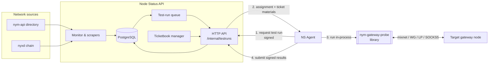
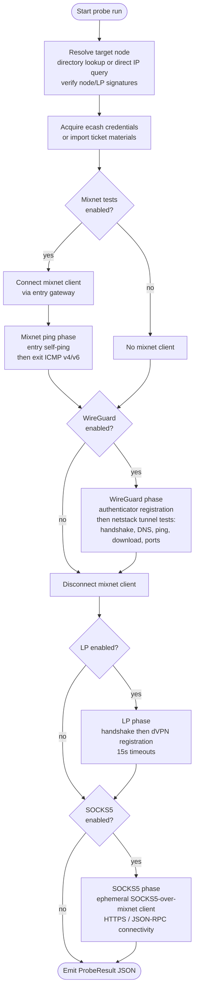
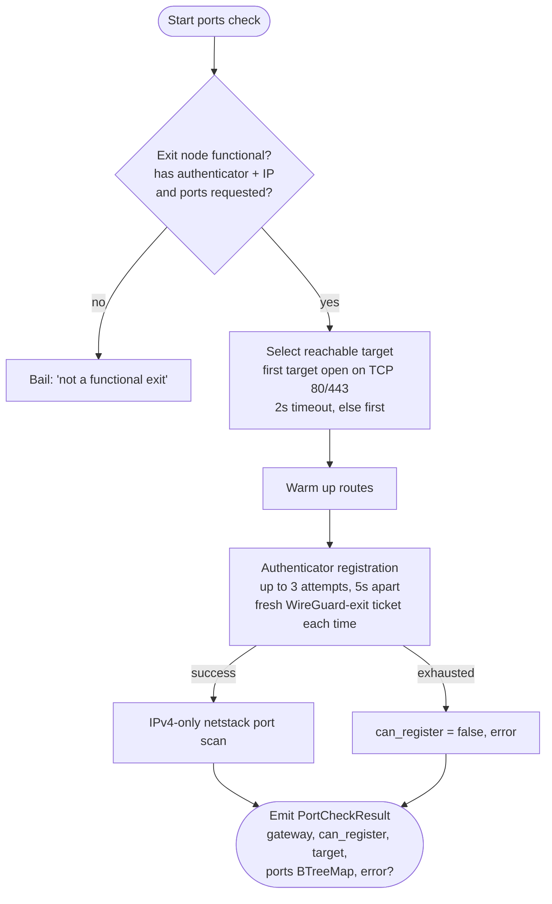
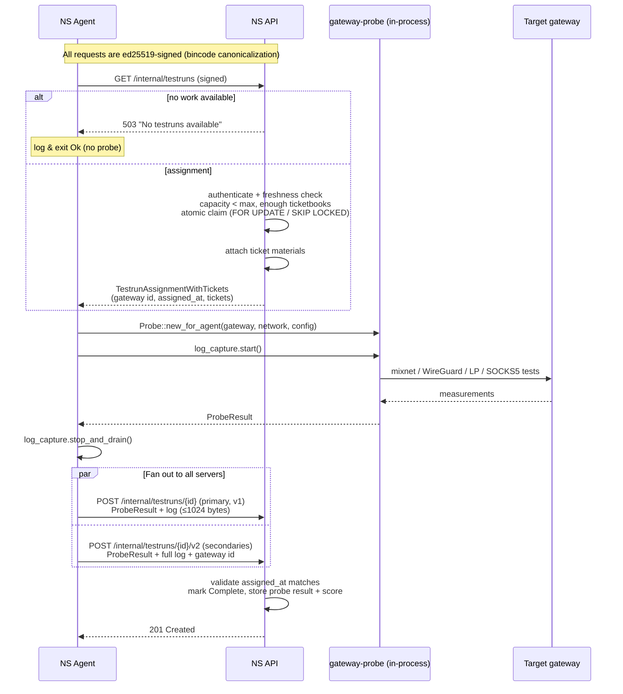

# The Nym Gateway Probe

## What it is

`nym-gateway-probe` is the measurement engine of the Nym network's **audit tooling**. It is a Unix-only Rust tool — usable both as a standalone CLI and as an embedded library — that connects to a Nym gateway node and verifies that the node is correctly configured and actually functional across the transports it advertises.

It is one part of a larger auditing system built around the **Node Status API (NS API)**:

- The **NS API** (`nym-node-status-api`) scrapes the directory and chain, keeps a snapshot of every gateway in PostgreSQL, and decides which gateways need auditing. It queues *test runs*.
- The **NS agent** (`nym-node-status-agent`) is a worker that pulls a test run from the NS API and drives the probe.
- The **gateway probe** (this crate) does the actual testing and produces a structured result.

The probe checks a gateway in the two roles it can play in the network:

- **Mixnet mode** — is the node a working mixnet **entry** and/or **exit** gateway? (Sphinx routing through the mixnet, exit IP routing.)
- **dVPN mode** — can the node serve as a dVPN gateway? (WireGuard-over-mixnet tunnelling, and Lewes Protocol / LP registration.)

On top of the configuration checks it runs a set of **functional tests**:

- **Pings** — entry self-ping through the mixnet and ICMP echo (v4/v6) out through the exit.
- **Connectivity checks** — SOCKS5 network-requester connectivity (HTTPS/JSON-RPC), and WireGuard tunnel reachability.
- **DNS resolution** — resolving hostnames through the WireGuard tunnel.
- **Basic file-download performance** — a download over the WG tunnel, measuring duration and size.
- **TCP port reachability** — checking the exit-policy port set is open through the WG tunnel (the "ports check").

The probe emits its findings as JSON: a `ProbeResult` for a normal run, or a `PortCheckResult` for a ports check.

---

## Where the probe sits in the audit system

The agent links the probe as a **library** and calls it in-process — it does *not* spawn the probe binary as a subprocess. Operators can also run the probe binary directly, bypassing the NS API entirely.

---

## Run modes

The probe is selected via one of four subcommands, each mapping to a distinct internal run path:

| Subcommand | Target | Directory lookup | Notes |
|---|---|---|---|
| `run` | Bonded gateway (by identity key) | via `nym-api` | Standard operator/agent run |
| `run-local` | Unannounced gateway (by IP) | direct HTTP query to the node | **No mixnet tests** — no mixnet client is connected |
| `run-ports` | Bonded gateway | via `nym-api` | WG exit-policy TCP port scan; `--check-all-ports` uses the full build-time port list |
| `run-agent` | Bonded gateway | via `nym-api` | Used by the NS agent; forces test mode `All`, uses ephemeral storage and imported ticket materials |

Global options: `--config-env-file` selects the network environment; `--no-log` disables tracing. Results are pretty-printed as JSON to **stdout**; errors go to **stderr** with a non-zero exit. The binary only runs on Unix.

### Test modes

A `TestMode` gates which phases actually run (default `Core`):

| Test mode | Mixnet ping | WireGuard | LP | SOCKS5 |
|---|:---:|:---:|:---:|:---:|
| `core` (alias `mixnet`) | ✅ | ✅ | — | — |
| `all` | ✅ | ✅ | ✅ | ✅ |
| `wg-mix` | — | ✅ | — | — |
| `wg-lp` | — | ✅ | ✅ | — |
| `lp-only` | — | — | ✅ | — |
| `socks5-only` | — | — | — | ✅ |

`wg-mix` still needs a connected mixnet client (WireGuard registers through the authenticator over the mixnet), it just does not run the mixnet ping phase: `needs_mixnet()` covers `core`, `wg-mix` and `all`, while `mixnet_tests()` covers only `core` and `all`.

Agent runs force `all`, so an agent-driven audit exercises every transport.

---

## How the tests run: order and flow

A probe run resolves the target node, acquires or imports credentials, then executes the enabled test phases **in a fixed order**. The mixnet client is held open through the WireGuard phase and must be **disconnected before** the LP and SOCKS5 phases (those establish their own connections).

### What each phase tests

**1. Node resolution & credentials.**
For bonded gateways the probe fetches the described-nodes directory from `nym-api` and checks the node has the required role (entry role for entry lookups, exit capability for exit lookups). It requires at least one host IP and, when the node advertises LP, **verifies the LP signature against the node identity**. For unannounced nodes (`run-local`) it queries the node's HTTP API directly, requiring health "up", a valid host-information signature, and the gateway role enabled. Credentials are either acquired via mnemonic/mock-ecash (acquiring mixnet-entry, wireguard-entry and wireguard-exit ticketbooks if the store is empty) or imported from ticket materials supplied by the agent.

**2. Mixnet ping (pings).**
Self-pings through the entry gateway first; a failure marks the entry as `fail_to_connect`. If an exit router is present, it sends ICMPv4 and ICMPv6 echo requests both to the exit's tun-device addresses and to external addresses (e.g. `8.8.8.8`, `2001:4860:4860::8888`), then listens for beacon replies and records which routes succeeded (`can_route_ip_v4`, `can_route_ip_external_v4`, and the v6 equivalents).

**3. WireGuard (connectivity, DNS, download, ports).**
Performs the authenticator registration handshake (supporting versions V2–V6), then runs the tunnel tests via the Go **netstack** library (on a blocking thread). It records: handshake success, metadata query, **DNS resolution**, **ping performance ratios**, and **basic file-download performance** (duration, size), for IPv4 and IPv6. `can_register` is decided by the handshake, not the netstack call. In port-check-only mode it runs IPv4 only and reports per-port reachability.

**4. Lewes Protocol (dVPN registration).**
Builds an LP registration client, performs the LP **handshake** under a 15s timeout (setting `can_connect`/`can_handshake`), then attempts **dVPN registration** under a 15s timeout (setting `can_register`). If LP is requested but the node has no LP data, it reports all flags false with `error = "no LP data"`.

**5. SOCKS5 (connectivity check).**
Builds an ephemeral SOCKS5-over-mixnet client pinned to the entry gateway (with minimum performance 0 and egress-epoch-role ignored so the tested node isn't filtered out), fetches its own topology, connects, and runs up to `test_count` HTTPS/JSON-RPC (`eth_chainId`) requests with endpoint fallbacks — early-exiting once failures exceed the cutoff — and reports success, HTTP status, and average latency. A connect failure returns `error_before_connecting`. SOCKS5 errors are non-fatal to the overall run.

### The ports-check flow (`run-ports` / agent ports check)

The ports check is a specialised WireGuard run that scans the exit-policy TCP port set:

---

## Results

Two output shapes, both JSON on stdout:

- **`ProbeResult`** — `{ node, used_entry, outcome }`, where `outcome` contains `as_entry`, `as_exit`, `wg`, `lp`, and `socks5` sub-results. Each sub-result carries the per-transport findings described above.
- **`PortCheckResult`** — `{ gateway, can_register, port_check_target, ports (port → open), error? }`. The port map is a `BTreeMap` for deterministic ordering, which keeps the signed submission stable.

When compiled with the `utoipa` feature, the result types expose OpenAPI schemas so the NS API can consume them directly.

---

## How the probe and NS API interact

The agent is the bridge between the two. Each agent invocation is a single request → run → submit cycle (an external loop reschedules it). All agent↔API traffic is **ed25519-signed**: the payload is bincode-serialized and signed, the agent's public key travels inside the payload, and the NS API verifies the signature and checks the key against its whitelist (`agent_key_list`).

### Key interaction rules

- **Assignment is gated.** The NS API only assigns a test run if the request is authenticated and *fresh* (timestamp within the freshness window, default 120s), the in-progress count is below `agent_max_count`, and there are enough ecash ticketbooks of every buffered type. It claims the **oldest queued** run for a bonded gateway (performance > 0) atomically with `FOR UPDATE ... SKIP LOCKED`, so two agents never get the same run.
- **Ticket materials pay for the tests.** The NS API's ticketbook manager keeps a buffer of threshold-signed ecash ticketbooks; on assignment it attaches materials the probe imports to pay for mixnet/WireGuard bandwidth during the run.
- **Log capture is bracketed.** The agent captures only the tracing output emitted between `start()` and `stop_and_drain()` — i.e. during the probe run — and submits it alongside the result.
- **Submission fans out with version asymmetry.** The primary server gets the v1 endpoint (log truncated to 1024 bytes); secondary servers get the v2 endpoint (full log + gateway identity key). Per-server failures are logged but don't abort the others.
- **Submission is validated.** The NS API only completes a run if it is in-progress and the submitted `assigned_at_utc` matches the stored assignment. On the v2 endpoint an unknown test-run id causes the API to create an "external" gateway + run before recording the result.
- **Ports checks are separate.** They use `GET /internal/testruns/ports-check` and `POST /internal/testruns/{id}/ports-check/v2`, run under a 90-minute hard timeout in the agent, and the API stores only the compact ports result (the probe log is not persisted for ports checks).

---

## See also

- OpenSpec capability specs: `openspec/specs/gateway-probe/`, `node-status-agent/`, `node-status-api-testruns/`, `node-status-api-ticketbook/`.
- Crate README: `nym-gateway-probe/README.md`.
