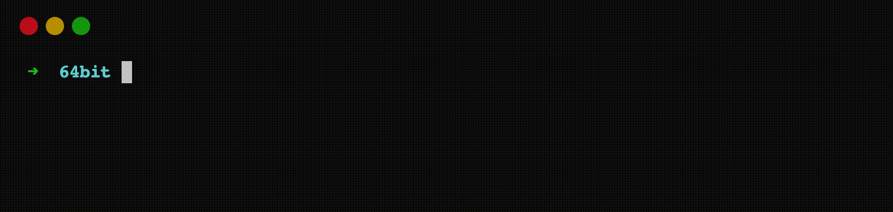

    
    <h3 align="center">nymvpn</h3>
    <h4 align="center">A Modern Serverless VPN</h4>
    

# nymvpn

nymvpn (pronounced Up VPN) app is WireGuard VPN client for Linux, macOS, Windows, and Android.
For more information please visit https://nymvpn.net

nymvpn desktop app is made up of UI, CLI and background Daemon.

# Serverless

nymvpn uses Serverless computing model, where a Linux based WireGuard server is provisioned on public cloud providers when app requests to connect to VPN. And server is deprovisioned when app requests to disconnect from VPN.

All of it happens with a single click or tap on the UI, or a single command on terminal.

# Install
App for Linux, macOS, Windows, and Android is available for download on [Github Releases](https://github.com/nymvpn/nymvpn-app/releases) or on website at https://nymvpn.net/download

# Code

## Organization

| Crate or Directory | Description |
| --- | --- |
| nymvpn-android | Standalone app for Android. |
| nymvpn-cli | Code for `nymvpn` cli. |
| nymvpn-config | Configuration read from env vars, `nymvpn.conf.toml` are merged at runtime in `nymvpn-config` and is source of runtime configuration for `nymvpn-cli`, `nymvpn-daemon`, and `nymvpn-ui`. |
| nymvpn-controller | Defines GRPC protobuf for APIs exposed by `nymvpn-daemon` to be consumed by `nymvpn-cli` and `nymvpn-ui`. |
| nymvpn-daemon | Daemon is responsible for orchestrating a VPN session. It takes input from nymvpn-cli or nymvpn-ui via GRPC (defined in `nymvpn-controller`) and make calls to backend server via separate GRPC (defined in `nymvpn-server`). When backend informs that a server is ready daemon configures network tunnel, see [NetworkDependency.md](./NetworkDependency.md) for more info. |
| nymvpn-entity | Defines data models used by nymvpn-daemon to persist data on disk in sqlite database. |
| nymvpn-migration | Defines database migration from which `nymvpn-entity` is generated. |
| nymvpn-packages| Contains resources to package binaries for distribution on macOS (pkg), Linux (rpm & deb), and Windows (msi). |
|nymvpn-server| Contains GRPC protobuf definitions and code for communication with backend server. |
| nymvpn-types | Defines common Rust types for data types used in various crates. These are also used to generate Typescript types for nymvpn-ui for seamless serialization and deserialization across language boundaries. |
|nymvpn-ui| A Tauri based desktop app. GPRC communication with daemon is done in Rust. Typescript code interact with Rust code via Tauri commands. |

## Building Desktop Apps

Please see [Build.md](./Build.md)

## Building Android App

Please see [nymvpn-android/README.md](./nymvpn-android/README.md)

# License

 Android app, and all Rust crates in this repository are [licensed under GPL version 3](./LICENSE).

Copyright (C) 2023  Nym Technologies S.A.

This program is free software: you can redistribute it and/or modify
it under the terms of the GNU General Public License as published by
the Free Software Foundation, either version 3 of the License, or
(at your option) any later version.
