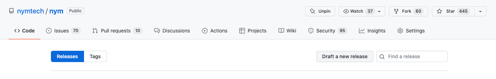
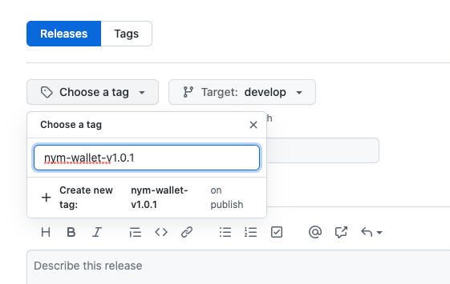
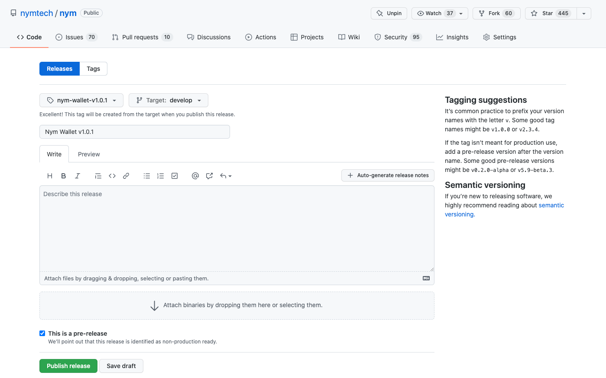
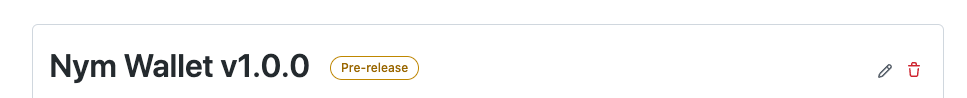
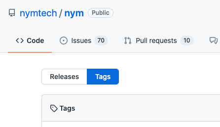
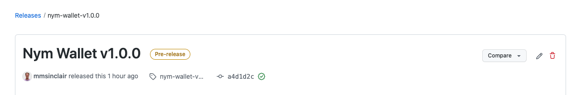

# Creating a new release

Go to the releases area of the Nym monoreop: https://github.com/nymtech/nym/releases.

Draft a new release:

Add a new tag that starts with `nym-wallet-`:

And choose `Create new tag`.

Check the branch is correct, tick `This is a pre-release` and click `Publish release`:

This will trigger the GitHub Actions that will build and sign the wallet release. Once they are done, they will upload
any output files as assets to this release.

# Troubleshooting

### Rebuild?

Sadly, you have to delete the release and start again. The GH Actions trigger on the creation of the release.

### Oh no, I've made a mistake and need to delete everything

Never fear! This is totally possible. First delete the **release** by clicking the trash icon in the top right:

Now delete the **tag** by going to tags:

Clicking on the tag header and then the trash icon:

Confirm and all is back to normal.

